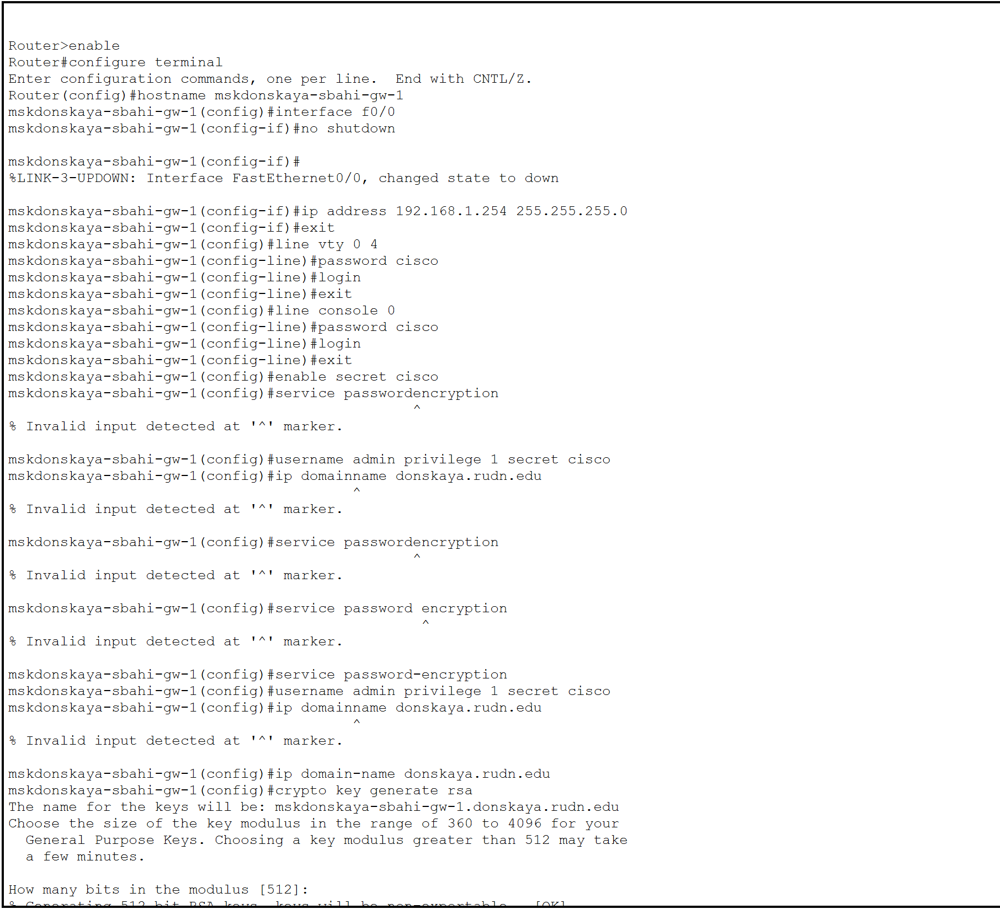
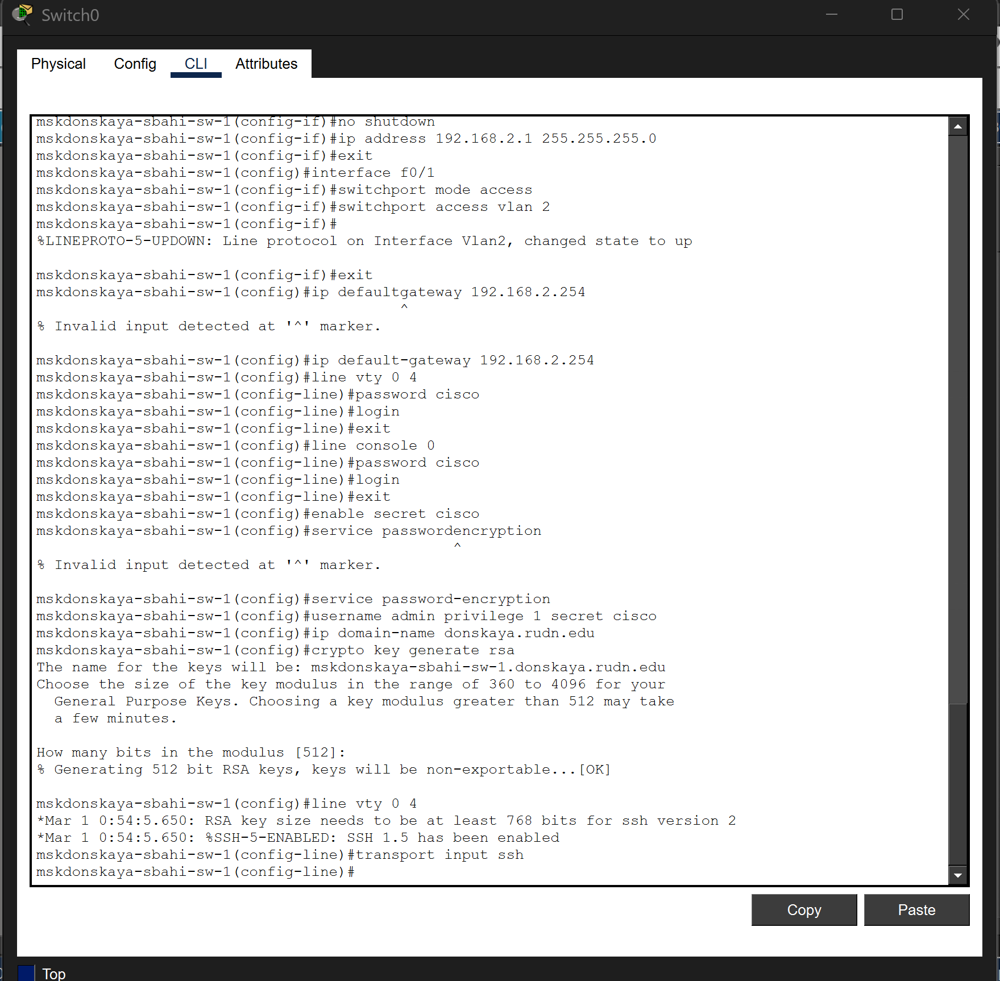
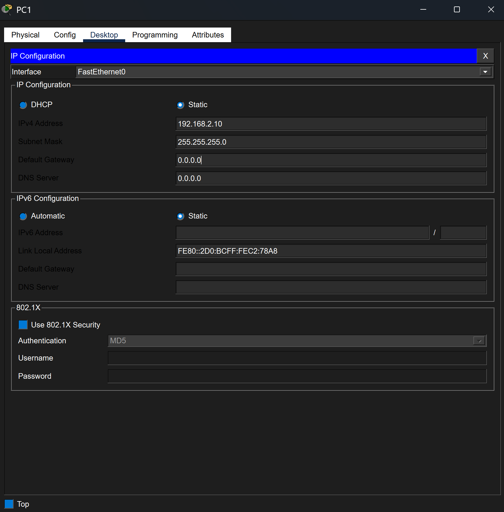
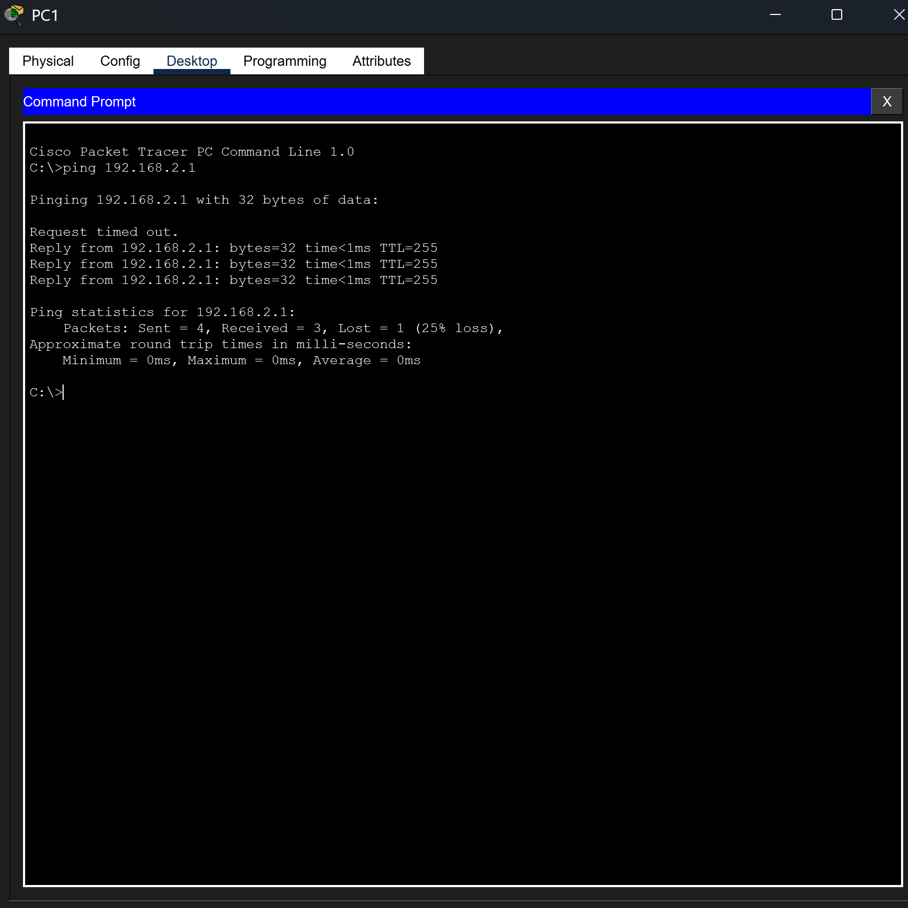

---
## Author
author:
  name: Бахи сиди али темассини
  degrees: Student (3 курс)
  orcid: ""
  email: 1032234211@rudn.ru
  affiliation:
    - name: Российский университет дружбы народов
      country: Российская Федерация
      postal-code: 117198
      city: Москва
      address: ул. Миклухо-Маклая, д. 6
## Title
title: Лабораторная работа №2
subtitle: Администрирование локальных сетей
license: CC BY
date: today
date-format: "YYYY-MM-DD" # Example: 2025-09-06
---

# Цель работы

## Цель работы

* Получить основные навыки по начальному конфигурированию оборудования Cisco.

# выполнения работы

## Размещение устройств в логической рабочей области

* Размещены маршрутизатор Cisco 2811, коммутатор Cisco 2960-24TT и два ПК
* PC0 подключён к маршрутизатору (FastEthernet0/0)
* PC1 подключён к коммутатору (FastEthernet0/1)
* PC0: 192.168.1.10/24
* Маршрутизатор: 192.168.1.254/24
* PC1: 192.168.2.10/24
* Коммутатор (VLAN2): 192.168.2.1/24

---

{#fig-2 width=70%}

## Настройка маршрутизатора (msk-donskaya-sbahi-gw-1)

* Переход в привилегированный режим
* Задано имя узла `msk-donskaya-sbahi-gw-1`
* Настроен FastEthernet0/0 — 192.168.1.254/24
* Интерфейс активирован (`no shutdown`)
* Настроены линии VTY и console с паролями
* Включено шифрование паролей
* Создан локальный пользователь
* Задано доменное имя
* Сгенерированы RSA-ключи
* Для VTY разрешён только SSH

---

{#fig-3 width=70%}

## Настройка коммутатора (msk-donskaya-sbahi-sw-1)

* Задано имя `msk-donskaya-sbahi-sw-1`
* Настроен интерфейс VLAN2 — 192.168.2.1/24
* VLAN2 активирован
* FastEthernet0/1 переведён в access
* Порт назначен в VLAN 2
* Указан шлюз по умолчанию 192.168.2.254
* Настроены линии VTY и console с паролями
* Включено шифрование паролей
* Создан локальный пользователь
* Задано доменное имя
* Сгенерированы RSA-ключи для SSH

---

{#fig-4 width=70%}

---

{#fig-4-1 width=70%}

## Настройка IPv4-параметров с PC0 на маршрутизатор

* Проверены параметры FastEthernet0
* IP-адрес: 192.168.1.10
* Маска: 255.255.255.0
* Шлюз: 192.168.1.254
* Параметры соответствуют настройкам маршрутизатора

---

{#fig-5 width=70%}

## Проверка сети  с PC0 на маршрутизатор

* Выполнена команда `ping 192.168.1.254`
* Потерь пакетов нет (0% loss)
* Связность подтверждена

---

{#fig-6 width=70%}

---

* Выполнено SSH-подключение `ssh -l admin 192.168.1.254`
* Получен доступ к CLI маршрутизатора
* Подтверждена корректная настройка SSH

{#fig-7 width=70%}

---

* Выполнено консольное подключение через Terminal
* Пройдена аутентификация
* Зафиксированы сообщения об изменении состояния FastEthernet0/0

--- 

{#fig-8 width=70%}

## Настройка IPv4-параметров с PC1 на коммутатор

* Настроен FastEthernet0
* IP-адрес: 192.168.2.10
* Маска: 255.255.255.0
* Узел в одной подсети с VLAN2 (192.168.2.1/24)

---

{#fig-9 width=70%}

## Проверка сети  с PC1 на коммутатор

* Выполнена команда `ping 192.168.2.1`
* Передано 4 пакета, получено 3
* 1 пакет потерян при инициализации ARP
* Связность подтверждена

---

{#fig-10 width=70%}

---

* Выполнено SSH-подключение `ssh -l admin 192.168.2.1`
* Получен доступ к CLI коммутатора
* Подтверждена корректная настройка SSH

---

{#fig-11 width=70%}

---

* Выполнено консольное подключение через Terminal
* Пройдена аутентификация
* Зафиксированы изменения состояния FastEthernet0/1 и VLAN2

---

{#fig-12 width=70%}

# Выводы

## Выводы

* Построена простая сетевая топология
* Выполнена базовая настройка IP-адресации и VLAN
* Настроены параметры удалённого доступа (SSH)
* Проверка `ping` подтвердила работоспособность сети
* Консольный и SSH-доступ функционируют корректно
* Базовая конфигурация устройств выполнена успешно
