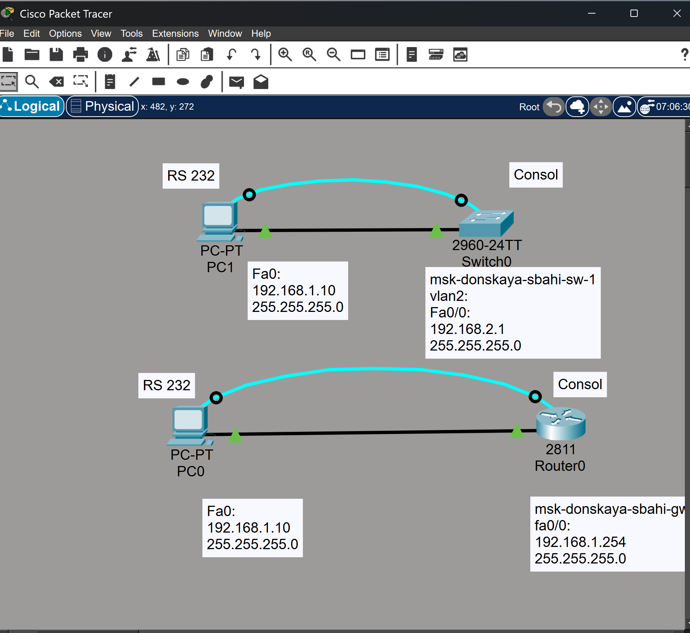
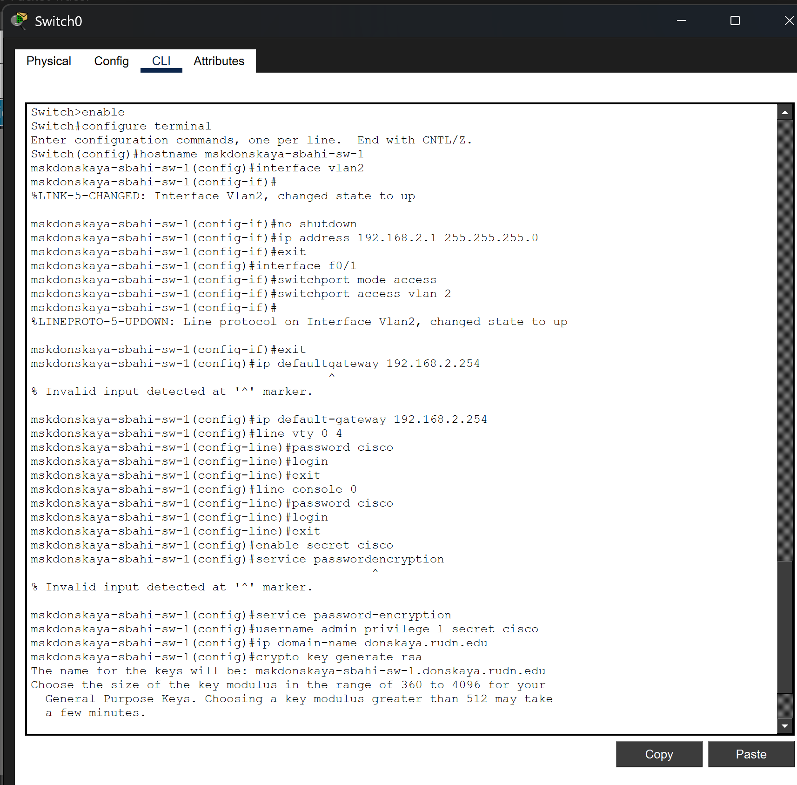
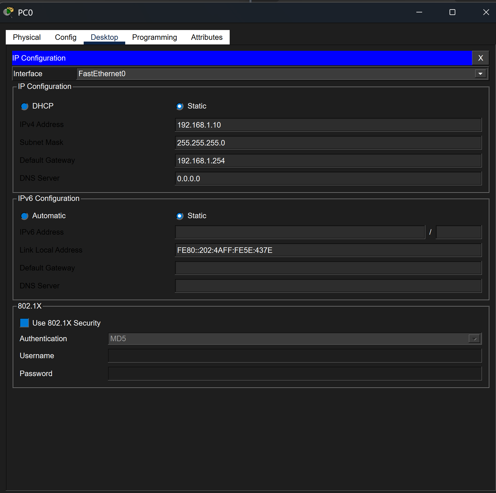
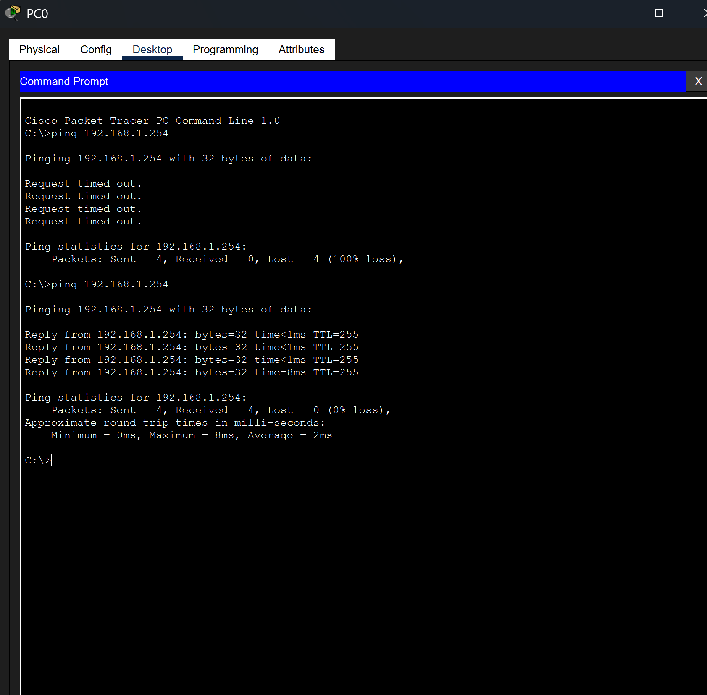
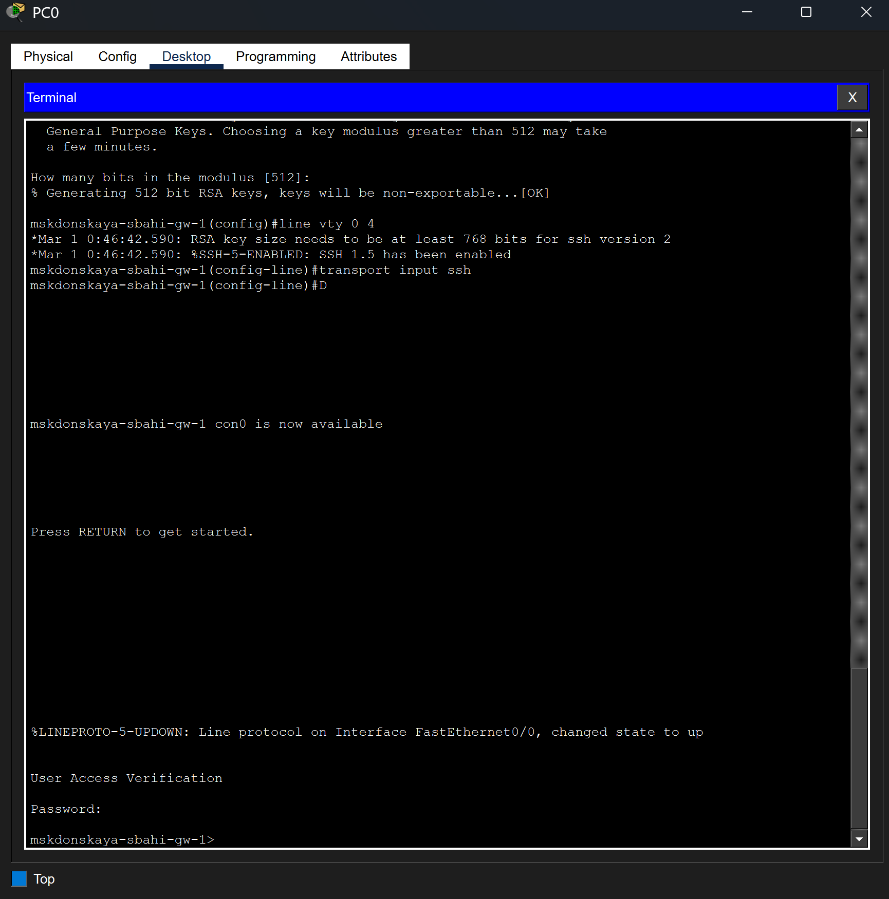
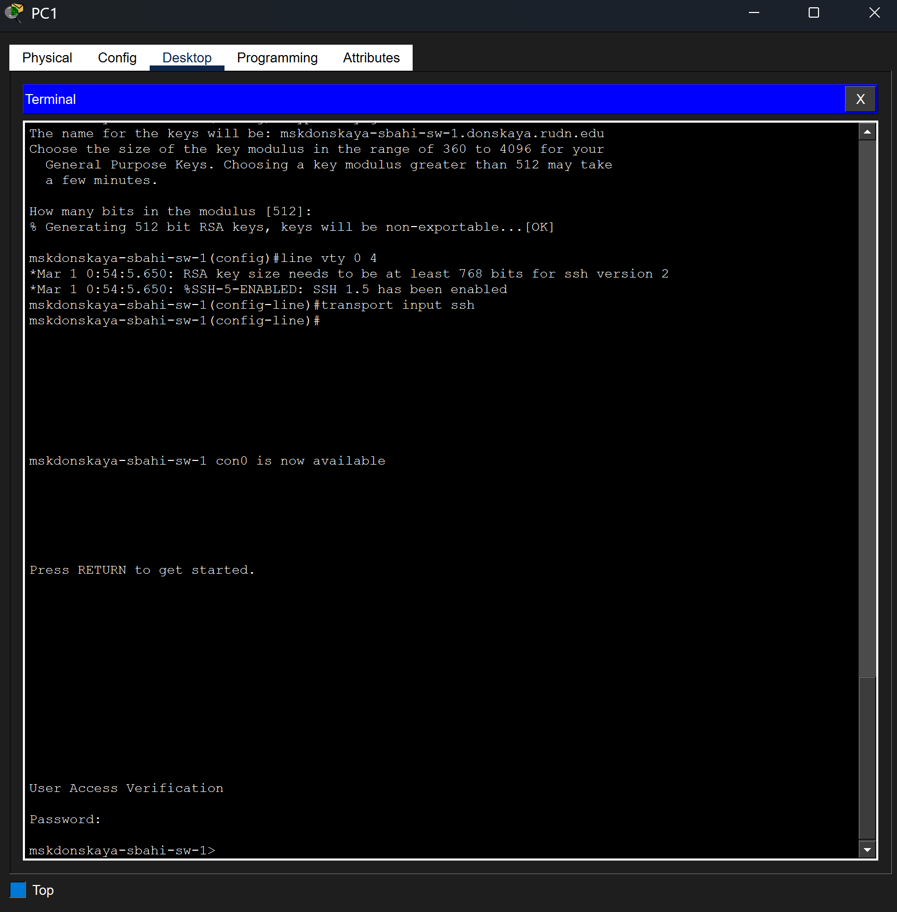

---
## Author
author:
  name: Бахи сиди али темассини
  degrees: Student (3 курс)
  orcid: ""
  email: 1032234211@rudn.ru
  affiliation:
    - name: Российский университет дружбы народов
      country: Российская Федерация
      postal-code: 117198
      city: Москва
      address: ул. Миклухо-Маклая, д. 6

## Title
title: "Отчёт по лабораторной работе №2"
subtitle: "Администрирование локальных сетей"
license: "CC BY"
---

# Цель работы

 Получить основные навыки по начальному конфигурированию оборудования
Cisco.

#  выполнения работы 

## Размещение устройств в логической рабочей области

В логической рабочей области Cisco Packet Tracer размещены маршрутизатор Cisco 2811, коммутатор Cisco 2960-24TT и два конечных устройства типа PC. Один ПК подключён к маршрутизатору через интерфейс FastEthernet0/0, второй — к коммутатору через порт FastEthernet0/1. Для PC0 задан IP-адрес 192.168.1.10/24, для маршрутизатора — 192.168.1.254/24. Для PC1 задан IP-адрес 192.168.2.10/24, для коммутатора (VLAN2) — 192.168.2.1/24 ([рис. @fig-2]).

{#fig-2 width=70%}

## Настройка маршрутизатора (msk-donskaya-sbahi-gw-1)

На маршрутизаторе выполнен переход в режим привилегированной конфигурации, задано имя узла `msk-donskaya-sbahi-gw-1`, настроен интерфейс FastEthernet0/0 с IP-адресом 192.168.1.254/24 и активирован командой `no shutdown`. Настроены линии VTY и консоли с паролем, включено шифрование паролей, создан локальный пользователь, задано доменное имя и сгенерированы RSA-ключи для SSH-доступа. Для линий VTY разрешён только протокол SSH ([рис. @fig-3]).

{#fig-3 width=70%}

## Настройка коммутатора (msk-donskaya-sbahi-sw-1)

На коммутаторе задано имя `msk-donskaya-sbahi-sw-1`, настроен интерфейс VLAN2 с IP-адресом 192.168.2.1/24 и активирован. Порт FastEthernet0/1 переведён в режим access и назначен в VLAN 2 ([рис. @fig-4]). Указан шлюз по умолчанию 192.168.2.254. Настроены линии VTY и консоли с паролями, включено шифрование паролей, создан локальный пользователь, задано доменное имя и сгенерированы RSA-ключи для организации SSH-доступа ([рис. @fig-4-1]).

{#fig-4 width=70%}

{#fig-4-1 width=70%}

## Настройка IPv4-параметров с PC0 на маршрутизатор

На PC0 в разделе Desktop выполнена проверка сетевых параметров интерфейса FastEthernet0. Заданы статические настройки: IP-адрес 192.168.1.10, маска 255.255.255.0, шлюз по умолчанию 192.168.1.254. Конфигурация соответствует параметрам интерфейса маршрутизатора ([рис. @fig-5]).

{#fig-5 width=70%}

## Проверка сети  с PC0 на маршрутизатор

Для проверки связности выполнена команда `ping 192.168.1.254` с PC0. Получены ответы от узла назначения без потерь пакетов (0% loss), что подтверждает корректную настройку IP-адресации и работоспособность канального и сетевого уровней между ПК и маршрутизатором ([рис. @fig-6]).

{#fig-6 width=70%}

Подключение к маршрутизатору по протоколу SSH выполнено с PC0 командой `ssh -l admin 192.168.1.254`. После ввода пароля предоставлен доступ к командной строке устройства `msk-donskaya-sbahi-gw-1>`, что подтверждает корректную настройку доменного имени, RSA-ключей и параметров VTY-линий ([рис. @fig-7]).

{#fig-7 width=70%}

Также выполнено подключение к маршрутизатору с использованием консольного кабеля через вкладку Terminal. После прохождения аутентификации получен доступ к CLI маршрутизатора. В журнале отображаются сообщения изменения состояния интерфейса FastEthernet0/0, что подтверждает активность физического соединения ([рис. @fig-8]).

{#fig-8 width=70%}

## Настройка IPv4-параметров с PC1 на коммутатор

На PC1 в разделе Desktop выполнена настройка интерфейса FastEthernet0. Заданы статические параметры IPv4: IP-адрес 192.168.2.10, маска 255.255.255.0. Узел находится в одной подсети с интерфейсом VLAN2 коммутатора (192.168.2.1/24) ([рис. @fig-9]).

{#fig-9 width=70%}

## Проверка сети  с PC1 на коммутатор
 
Проверка сетевой связности выполнена командой `ping 192.168.2.1` с PC1. Получены ответы от узла назначения, зафиксирована передача 4 пакетов, из которых 3 получены (1 потерян при инициализации ARP), что подтверждает работоспособность соединения с интерфейсом VLAN2 коммутатора ([рис. @fig-10]).

{#fig-10 width=70%}

Удалённое подключение к коммутатору выполнено по протоколу SSH командой `ssh -l admin 192.168.2.1`. После ввода пароля предоставлен доступ к CLI устройства `msk-donskaya-sbahi-sw-1>`, что подтверждает корректную настройку доменного имени, RSA-ключей и линий VTY ([рис. @fig-11]).

{#fig-11 width=70%}

Также выполнено подключение к коммутатору через консольный кабель с использованием вкладки Terminal. После прохождения процедуры аутентификации получен доступ к командной строке устройства. В журнале отображаются сообщения изменения состояния интерфейсов FastEthernet0/1 и VLAN2, что подтверждает активность соединения ([рис. @fig-12]).

{#fig-12 width=70%}

# Выводы

В ходе работы выполнено построение простой сетевой топологии в Cisco Packet Tracer с использованием маршрутизатора, коммутатора и двух конечных устройств. Произведена базовая настройка IP-адресации, интерфейсов и VLAN, а также параметров удалённого доступа.

Проверка связности с помощью команды `ping` подтвердила корректность сетевых настроек и работоспособность соединений в обеих подсетях. Подключение к маршрутизатору и коммутатору успешно выполнено через консольный интерфейс и по протоколу SSH, что подтверждает корректную настройку линий VTY, локальной аутентификации и криптографических ключей.

Таким образом, базовая конфигурация сетевых устройств и механизмов удалённого администрирования выполнена корректно, сетевое взаимодействие функционирует в соответствии с заданием.

# Ответы на контрольные вопросы:

1. Укажите возможные способы подключения к сетевому оборудованию.
   - Проводное подключение (Ethernet): наиболее распространенный метод подключения, который использует сетевой     кабель (обычно категории Ethernet) для соединения компьютера, маршрутизатора, коммутатора или другого сетевого устройства. 
   - Беспроводное подключение (Wi-Fi): используют радиоволновые соединения для передачи данных между устройствами. Wi-Fi обычно используется для подключения мобильных устройств, но также может использоваться для подключения компьютеров и другого сетевого оборудования.
   
2. Каким типом сетевого кабеля следует подключать оконечное оборудование пользователя к маршрутизатору и почему? 
   - Для подключения оконечного оборудования пользователя обычно используется кабель маршрутизатору к Ethernet. Существует несколько видов Ethernet-кабелей, но наиболее распространенным и рекомендуемым для этой цели является кабель категории 5e (Cat5e) или категории 6 (Cat6). Кабели Cat5e и Cat6 имеют несколько преимуществ, делающих их предпочтительными для подключения оконечного оборудования к маршрутизатору:
* Скорость и пропускная способность.
* Поддержка Gigabit Ethernet.
* Устойчивость к помехам.
* Будущая совместимость.

3. Каким типом сетевого кабеля следует подключать оконечное оборудование пользователя к коммутатору и почему? 
   - Для подключения оконечного оборудования пользователя к коммутатору также рекомендуется использовать кабель Ethernet. В зависимости от требований сети и возможностей коммутатора, можно использовать кабели различных категорий, но обычно предпочтительными являются кабели категории 5e (Cat5e) или категории 6 (Cat6) по тем же причинам, что и при подключении к маршрутизатору:
* Скорость и пропускная способность.
* Поддержка Gigabit Ethernet.
* Устойчивость к помехам.
* Будущая совместимость.

4. Каким типом сетевого кабеля следует подключать коммутатор к коммутатору и почему? 
   - Для подключения коммутатора к коммутатору также используются сетевые кабели Ethernet. Однако здесь обычно используются кабели определенной категории в зависимости от требований к сети и пропускной способности, а также от расстояния между коммутаторами. Наиболее распространенными кабелями для соединения коммутаторов являются кабели категории 5e (Cat5e), категории 6 (Cat6) и категории 6a (Cat6a).
   
Выбор кабеля зависит от нескольких факторов:
* Пропускная способность и расстояние.
* Будущие потребности.
* Бюджет.
* Совместимость с имеющейся инфраструктурой.

Таким образом, для подключения коммутатора к коммутатору наиболее подходящими кабелями являются Cat5e, Cat6 или Cat6a, в зависимости от требований к пропускной способности, расстоянию и бюджету.

5. Укажите возможные способы настройки доступа к сетевому оборудованию по паролю.
* Пароли на уровне устройства.
* AAA (Authentication, Authorization, Accounting).
* SSH (Secure Shell) или Telnet: SSH и Telnet - это протоколы удаленного управления, которые позволяют администраторам подключаться к сетевому оборудованию через сеть и вводить команды для настройки и управления
устройством. Часто они могут быть защищены паролем для обеспечения безопасного доступа.
* Web-based интерфейс управления.
* Локальные аккаунты.
* Протокол SNMP (Simple Network Management Protocol).
* Все эти методы позволяют администраторам обеспечить безопасный доступ к сетевому оборудованию по паролю, минимизируя риски несанкционированного доступа и обеспечивая конфиденциальность и целостность сетевых данных.

6. Укажите возможные способы настройки удалённого доступа к сетевому оборудованию. Какой из способов предпочтительнее и почему?
* SSH (Secure Shell): SSH предоставляет защищенное соединение с удаленным сетевым оборудованием через шифрование данных. Этот метод обеспечивает безопасность и конфиденциальность при передаче команд и данных по сети.
* Telnet: Telnet также предоставляет удаленный доступ к сетевому оборудованию, но не обеспечивает защиту данных,так
как информация передается в открытом виде. Использование Telnet не рекомендуется из-за небезопасности этого протокола.
* VPN (Virtual Private Network): VPN создает защищенное соединение через общую сеть, такую как интернет, что позволяет удаленным пользователям безопасно подключаться к сетевому оборудованию, как если бы они были внутри локальной сети.
* SSL VPN (Secure Socket Layer Virtual Private Network): SSL VPN предоставляет удаленным пользователям защищенный доступ к сетевому оборудованию через веб-браузер, используя SSL-шифрование для защиты данных.
* Модемный доступ: Многие сетевые устройства могут быть настроены для доступа через модемы, обеспечивая резервное подключение в случае проблем с основной сетью.
* Удаленное управление через веб-интерфейс: Некоторые удаленного предоставляют веб-интерфейс для управления, который позволяет администраторам настроить и управлять устройством через веб-браузер.

Предпочтительным методом для настройки удаленного доступа к сетевому оборудованию является использование SSH или VPN. Оба эти метода обеспечивают защищенноесоединение и
шифрование данных, что обеспечивает конфиденциальность и безопасность при удаленном доступе. SSH особенно удобен для доступа к командной строке устройства, в то время как VPN Таким образом, использование SSH VPN является предпочтительным для обеспечения безопасного удаленного доступа к сетевому оборудованию.
