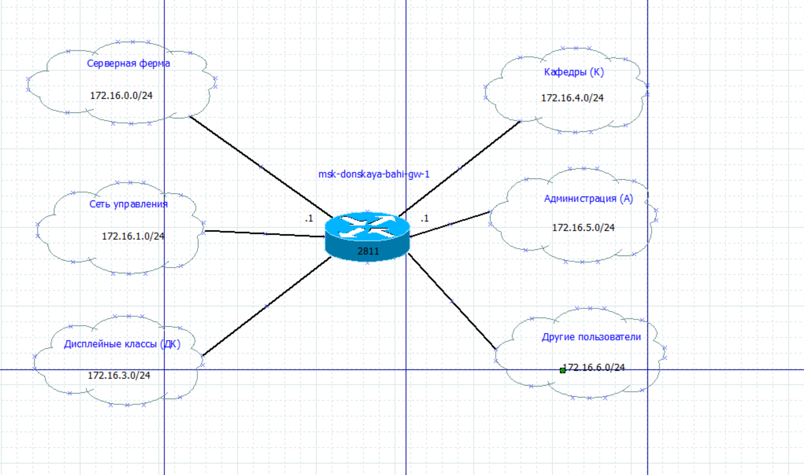
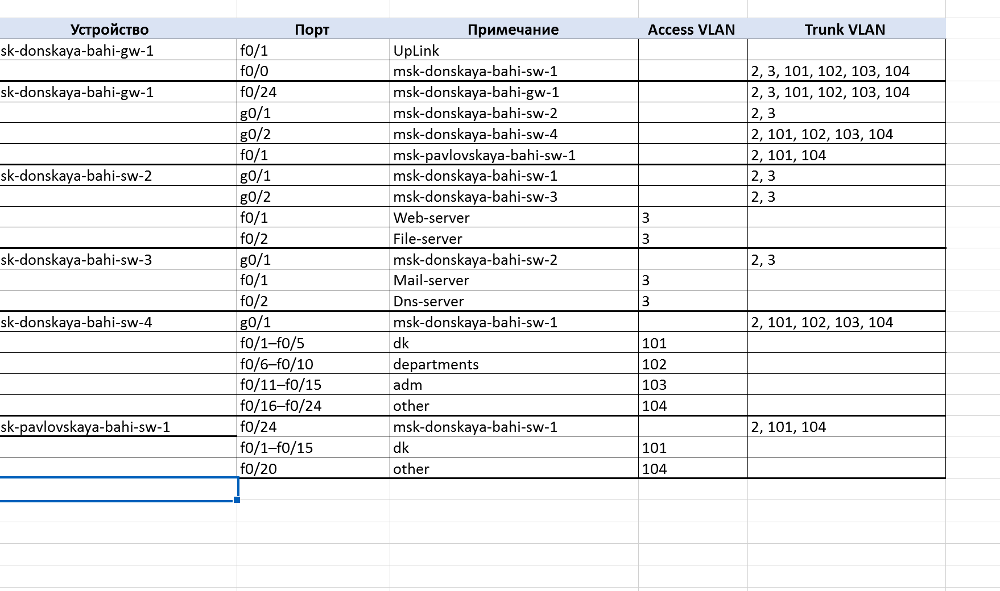
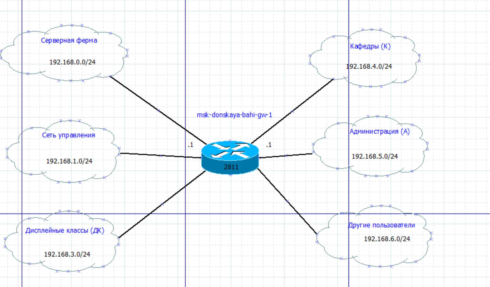

---
## Author
author:
  name: бахи сиди али темассини
  degrees: Student (3 курс)
  orcid: ""
  email: 1032234211@rudn.ru
  affiliation:
    - name: Российский университет дружбы народов
      country: Российская Федерация
      postal-code: 117198
      city: Москва
      address: ул. Миклухо-Маклая, д. 6
## Title
title: Лабораторная работа №3
subtitle: Администрирование локальных сетей
license: CC BY
date: today
date-format: "YYYY-MM-DD" # Example: 2025-09-06
---

# Информация

## Докладчик

:::::::::::::: {.columns align=center}
::: {.column width="70%"}

  * бахи сиди али темассини
  * Российский университет дружбы народов

:::
::: {.column width="30%"}

:::
::::::::::::::

# Ход работы

## Схема L1 (сеть 10.128.0.0.24)

{#fig:001 width=60%}

## Схема L2 (сеть 10.128.0.0.24)

{#fig:002 width=60%}

## Схема L3 (сеть 10.128.0.0.24)

{#fig:003 width=50%}

## Таблица VLAN (сеть 10.128.0.0.24)

{#fig:004 width=70%}

## Таблица IP (сеть 10.128.0.0.24)

{#fig:005 width=25%}

## Таблица портов (сеть 10.128.0.0.24)

{#fig:006 width=60%}

## Схема L1 (сеть 172.16.0.0/12)

{#fig:007 width=60%}

## Схема L2 (сеть 172.16.0.0/12)

{#fig:008 width=60%}

## Схема L3 (сеть 172.16.0.0/12)

{#fig:009 width=60%}

## Таблица VLAN (сеть 172.16.0.0/12)

{#fig:010 width=70%}

## Таблица IP (сеть 172.16.0.0/12)

{#fig:011 width=25%}

## Таблица портов (сеть 172.16.0.0/12)

{#fig:012 width=60%}

## Схема L1 (сеть 192.168.0.0/16)

{#fig:013 width=60%}

## Схема L2 (сеть 192.168.0.0/16)

{#fig:014 width=60%}

## Схема L3 (сеть 192.168.0.0/16)

{#fig:015 width=60%}

## Таблица VLAN (сеть 192.168.0.0/16)

{#fig:016 width=70%}

## Таблица IP (сеть 192.168.0.0/16)

{#fig:017 width=25%}

## Таблица портов (сеть 192.168.0.0/16)

{#fig:018 width=60%}

## Выводы

В ходе выполнения лабораторной работы познакомилась с принципами планирования локальной сети организации.

## Заголовок слайда

Спасибо за внимание!

