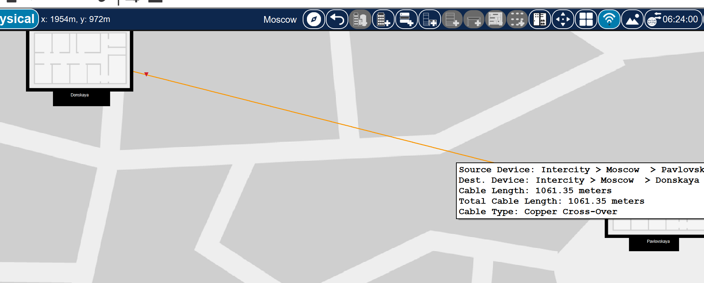
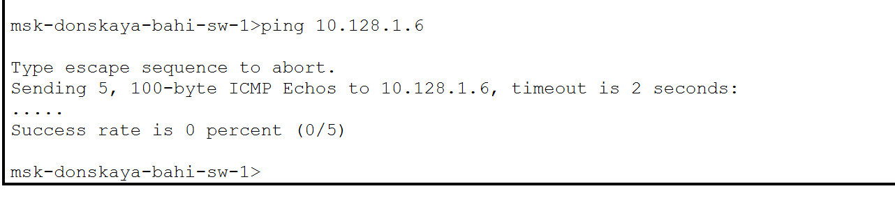
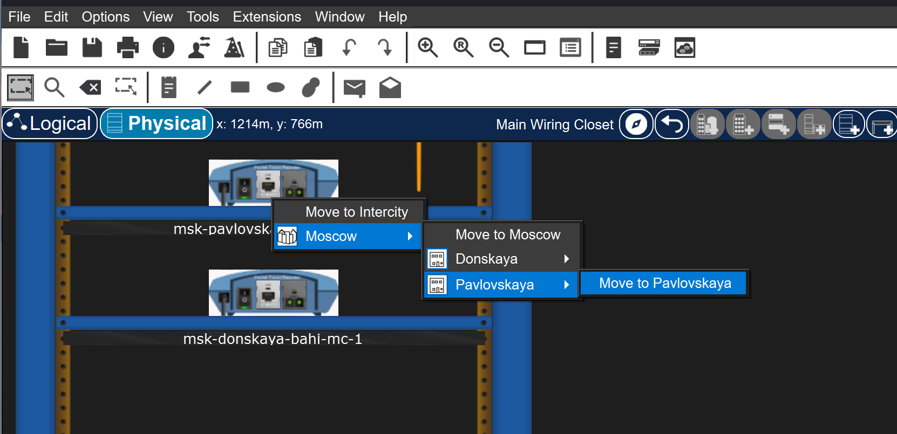
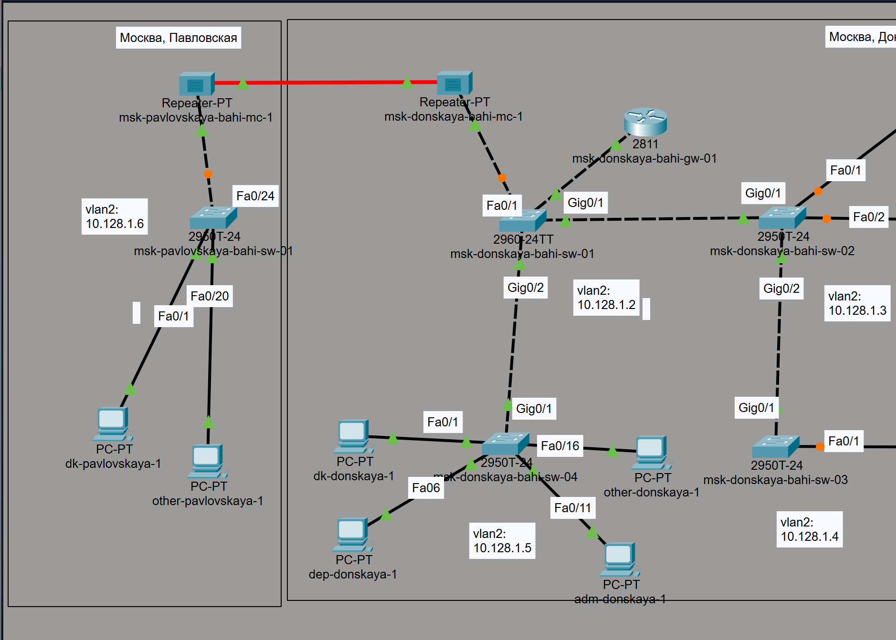

---
## Author
author:
  name: бахи сиди али темассини
  degrees: Student (3 курс)
  orcid: ""
  email: 1032234211@rudn.ru
  affiliation:
    - name: Российский университет дружбы народов
      country: Российская Федерация
      postal-code: 117198
      city: Москва
      address: ул. Миклухо-Маклая, д. 6
## Title
title: Лабораторная работа №7
subtitle: Администрирование локальных сетей
license: CC BY
date: today
date-format: "YYYY-MM-DD" # Example: 2025-09-06
---

# Информация

## Докладчик

:::::::::::::: {.columns align=center}
::: {.column width="70%"}

  * бахи сиди али темассини
  * Российский университет дружбы народов
  * [GitHub](https://github.com/sidiali2030)

:::
::: {.column width="30%"}

:::
::::::::::::::

# Цель работы

Получить навыки работы с физической рабочей областью Packet Tracer, а также учесть физические параметры сети

# Выполнение лабораторной работы

## Создание физической структуры сети

- Создание физической структуры сети
- Назначение города Moscow

{#fig-1 width=70%}

## Добавление зданий сети

- Добавление зданий Donskaya и Pavlovskaya
- Разделение сети на две территории

{#fig-2 width=70%}

## Размещение оконечных устройств

- Размещение оконечных устройств в здании Donskaya

{#fig-3 width=70%}

## Просмотр серверной стойки

- Открытие серверной стойки
- Просмотр коммутаторов и серверов

{#fig-4 width=70%}

## Перемещение устройств между зданиями

- Перемещение устройств Pavlovskaya в соответствующее здание

{#fig-5 width=70%}

## Проверка физической иерархии

- Проверка иерархии размещения устройств
- Подтверждение правильного распределения

{#fig-5-1 width=70%}

## Проверка соединения (ping)

- Проверка доступности узлов командой ping
- Соединение работает до учёта длины кабеля

{#fig-6 width=70%}

## Включение учёта длины кабеля

- Включение параметра Enable Cable Length Effects
- Учёт физических характеристик кабеля

{#fig-7 width=70%}

## Увеличение расстояния между зданиями

- Увеличение расстояния между зданиями
- Использование длинного медного кабеля

{#fig-8 width=70%}

## Потеря соединения

- Повторная проверка ping
- Соединение отсутствует

{#fig-9 width=70%}

## Добавление повторителей

- Добавление устройств Repeater-PT
- Подготовка к восстановлению соединения

{#fig-10 width=70%}

## Размещение повторителя

- Перемещение повторителя в здание Pavlovskaya

{#fig-11 width=70%}

## Построение итоговой топологии

- Построение итоговой схемы сети
- Соединение через два повторителя
- Использование оптоволоконного кабеля

{#fig-12 width=70%}

## Восстановление соединения

- Проверка доступности узлов
- Соединение восстановлено

{#fig-13 width=70%}

# Выводы

## Итоги работы

- Длина кабеля влияет на работоспособность сети
- Медный кабель ограничен по расстоянию
- Повторители и оптоволокно восстанавливают соединение
