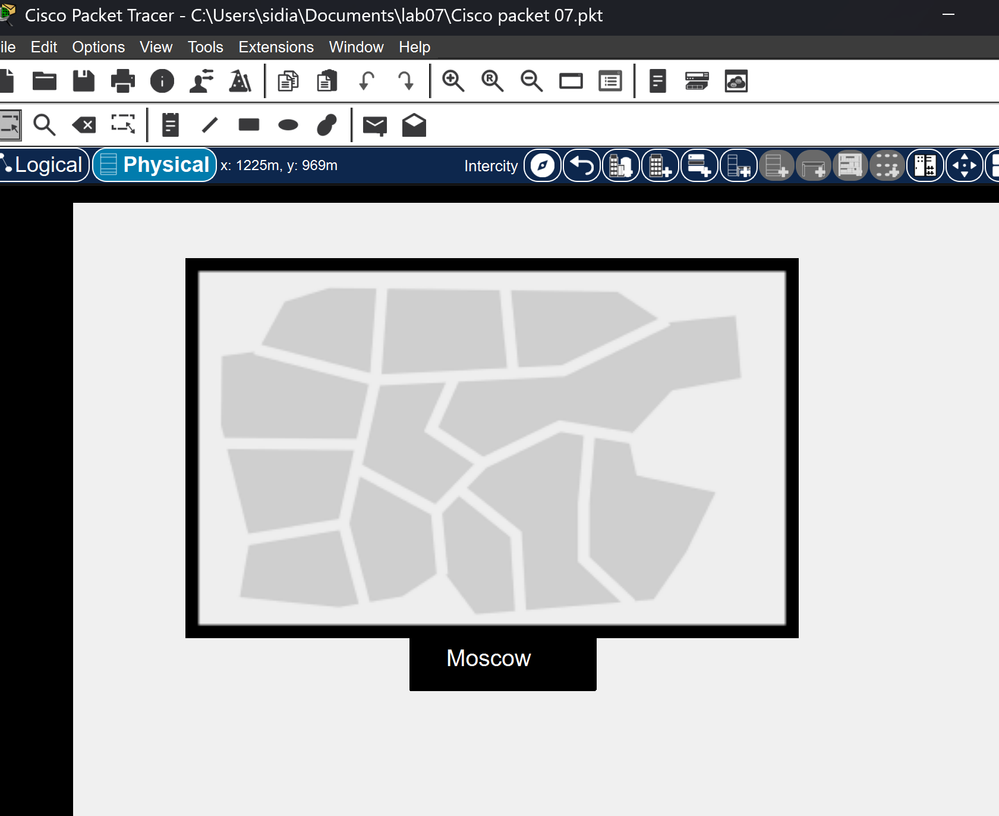
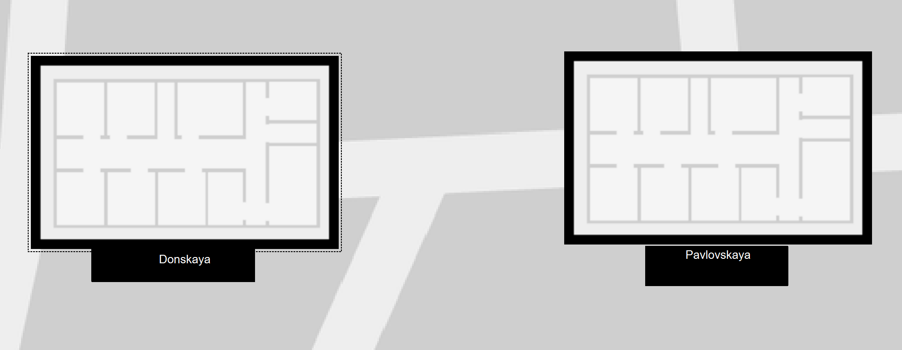
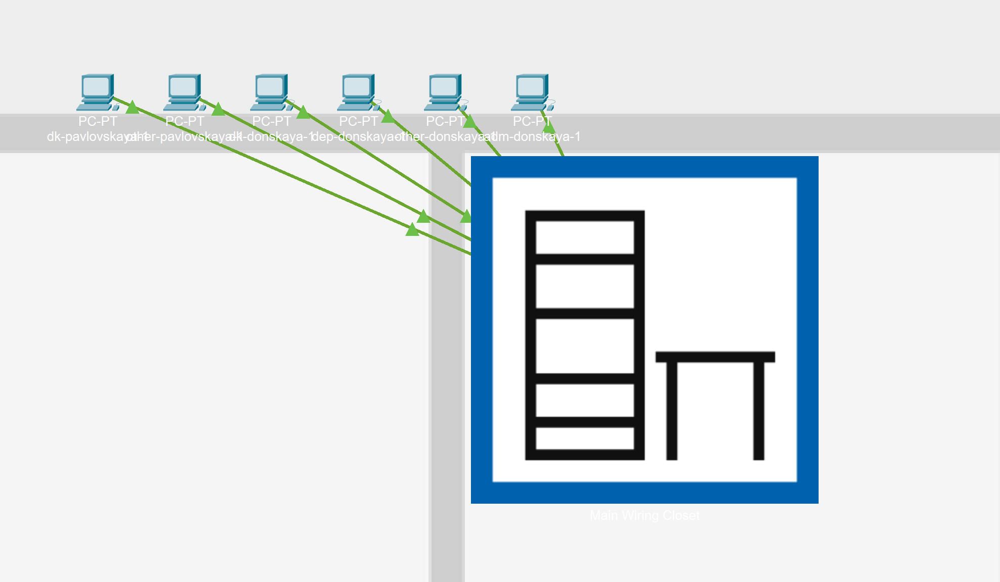
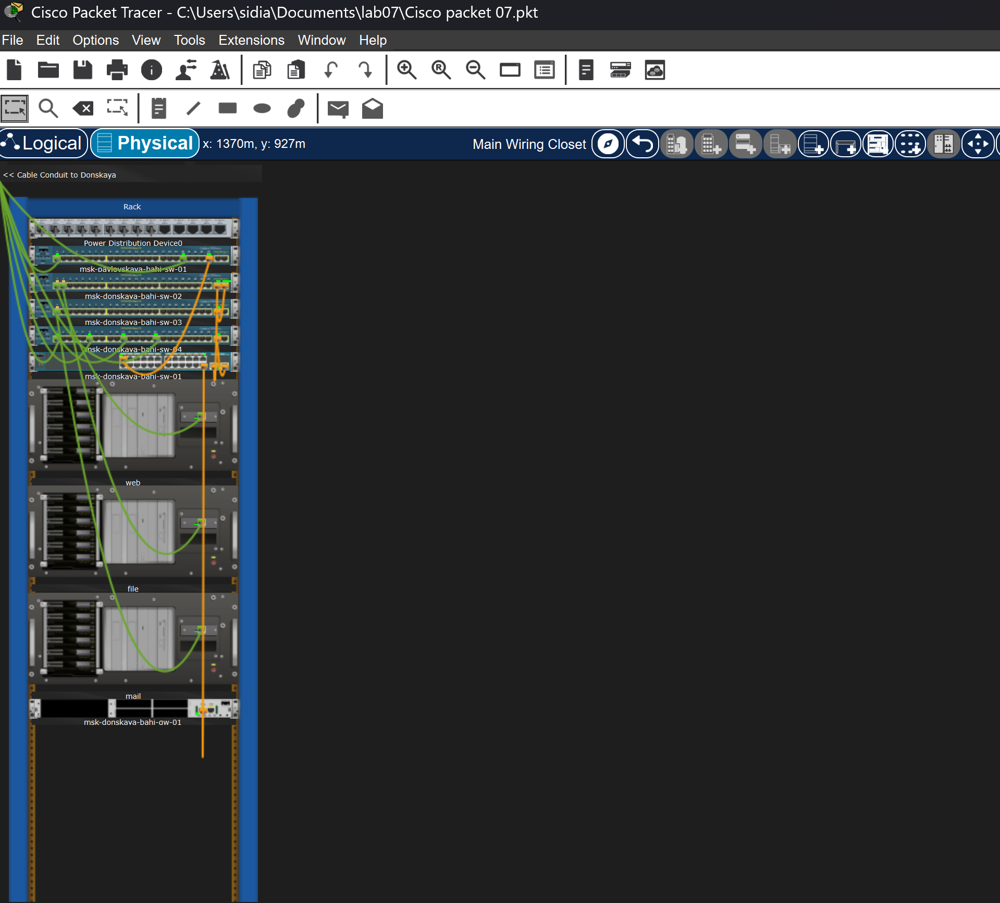
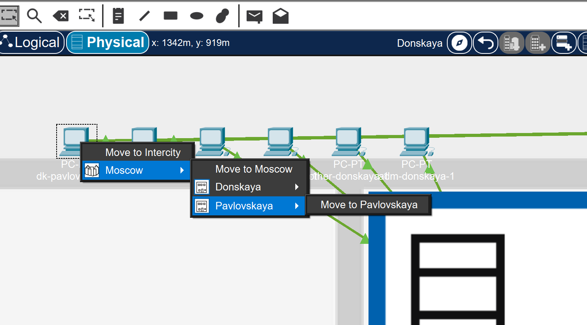
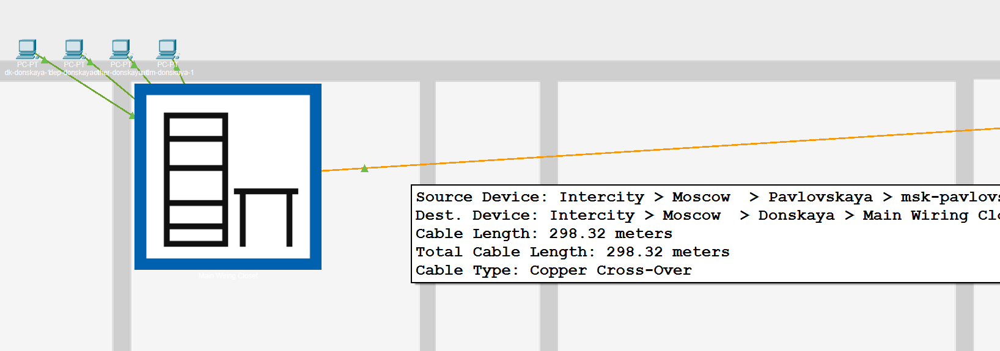
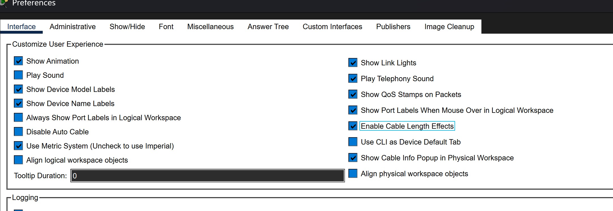
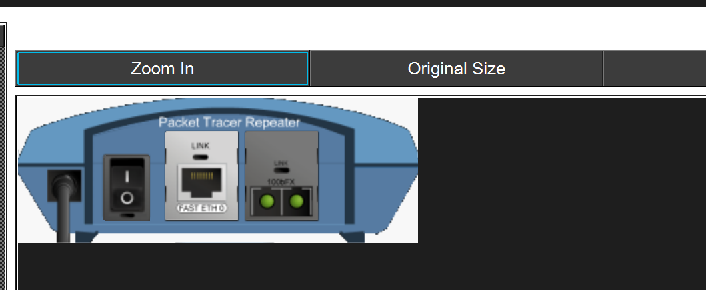
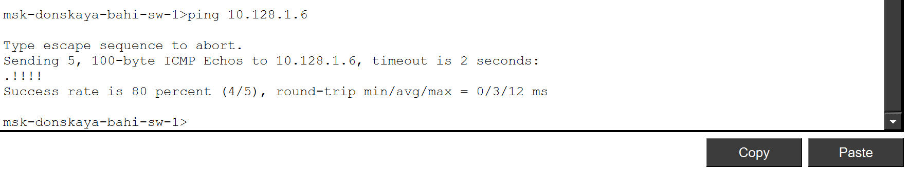

---
## Author
author:
  name: бахи сиди али темассини
  degrees: Student (3 курс)
  orcid: ""
  email: 1032234211@rudn.ru
  affiliation:
    - name: Российский университет дружбы народов
      country: Российская Федерация
      postal-code: 117198
      city: Москва
      address: ул. Миклухо-Маклая, д. 6

## Title
title: "Отчёт по лабораторной работе №7"
subtitle: "Администрирование локальных сетей"
license: "CC BY"
---

# Цель работы

Получить навыки работы с физической рабочей областью Packet Tracer, а также учесть физические параметры сети [@packettracer2014].

# Выполнение лабораторной работы

## Создание физической структуры сети

- На первом этапе выполнено создание физической структуры сети с указанием города Moscow ([рис. @fig-1]).

{#fig-1 width=70%}

## Добавление зданий сети

- Далее добавлены два здания с именами Donskaya и Pavlovskaya, соответствующие двум территориям сети ([рис. @fig-2]).

{#fig-2 width=70%}

## Размещение оконечных устройств

- Затем выполнено размещение оконечных устройств внутри здания Donskaya ([рис. @fig-3]).

{#fig-3 width=70%}

## Просмотр серверной стойки

- После этого открыта серверная стойка, в которой размещены коммутаторы и серверы ([рис. @fig-4]).

{#fig-4 width=70%}

## Перемещение устройств между зданиями

- Далее выполнено перемещение устройств, относящихся к Pavlovskaya, в соответствующее здание  ([рис. @fig-5]).

{#fig-5 width=70%}

## Проверка физической иерархии

- Дополнительно показан результат размещения устройств Pavlovskaya в соответствующем здании в физической иерархии ([рис. @fig-5-1]).

{#fig-5-1 width=70%}

## Проверка соединения (ping)

- Проведена проверка доступности узлов до учёта длины кабеля с помощью команды ping ([рис. @fig-6]).

{#fig-6 width=70%}

## Включение учёта длины кабеля

- Затем включена опция учёта длины кабеля в настройках программы ([рис. @fig-7]).

{#fig-7 width=70%}

## Увеличение расстояния между зданиями

- После активации учёта длины кабеля здания были разнесены на значительное расстояние, а для соединения показан медный кабель Cross-Over длиной 1075.37 метров  ([рис. @fig-8]).

{#fig-8 width=70%}

## Потеря соединения

- Выполнена проверка соединения при увеличенной длине кабеля, в результате чего связь отсутствует([рис. @fig-9]).

{#fig-9 width=70%}

## Добавление повторителей

- Далее добавлены повторители (Repter-PT) для организации связи между территориями ([рис. @fig-10]).

{#fig-10 width=70%}

## Размещение повторителя

- Далее показано перемещение повторителя в здание Pavlovskaya через меню Move  ([рис. @fig-11]).

{#fig-11 width=70%}

## Построение итоговой топологии

- В логической области представлена итоговая схема сети, в которой связь между территориями реализована через два повторителя ([рис. @fig-12]).
После этого выполнено соединение повторителей с использованием оптоволоконного кабеля ([рис. @fig-12]).

{#fig-12 width=70%}

## Восстановление соединения

- В завершение выполнена проверка доступности узлов, подтверждающая восстановление соединения ([рис. @fig-13]).

{#fig-13 width=70%}

# Выводы

В ходе работы показано влияние длины кабеля на работоспособность сети. При превышении допустимой длины медного кабеля соединение нарушается. Использование повторителей и оптоволоконного соединения позволяет восстановить связь между удалёнными сегментами сети [@ieee8021q].

# Ответы на контрольные вопросы

## Перечислите возможные среды передачи данных. На какие характеристики среды передачи данных следует обращать внимание при планировании сети?

- Коаксиал, витая пара, оптоволокно, беспроводные. Допустимое расстояние, скорость передачи, реальные физические факторы для беспроводных сетей.

## Перечислите категории витой пары. Чем они отличаются? Какая категория в каких условиях может применяться? 

- Существует несколько категорий кабеля «витая пара», которые нумеруются от 1 до 8 и определяют эффективный пропускаемый частотный диапазон Категории отличаются диапазоном частот, строением кабелей, скоростью передачи. Применяются в зависимости от требуемой скорости передачи/века.

## В чем отличие одномодового и многомодового оптоволокна? Какой тип кабеля в каких условиях может применяться? 

- В количестве проходящих лучей. Одномодовые — дороже, многомодовые — охватывают меньшее расстояние.

## Какие разъёмы встречаются на патчах оптоволокна? Чем они отличаются?
 
- SC — высокая скорость и плотность коммутации, ненадежный корпус. 
- ST — меньшая плотность коммутации, надежный корпус. 
- FC — большая сложность коммутации.

# Список литературы{.unnumbered}

::: {#refs}
:::

