---
## Author
author:
  name: бахи сиди али темассини
  degrees: Student (3 курс)
  orcid: ""
  email: 1032234211@rudn.ru
  affiliation:
    - name: Российский университет дружбы народов
      country: Российская Федерация
      postal-code: 117198
      city: Москва
      address: ул. Миклухо-Маклая, д. 6
## Title
title: Лабораторная работа №8
subtitle: Администрирование локальных сетей
license: CC BY
date: today
date-format: "YYYY-MM-DD" # Example: 2025-09-06
---

# Информация

## Докладчик

:::::::::::::: {.columns align=center}
::: {.column width="70%"}

  - бахи сиди али темассини
  - Российский университет дружбы народов
  - [GitHub](https://github.com/sidiali2030)

:::
::::::::::::::

# Цель работы

## Цель работы

- Настройка DHCP
- Изучение динамической адресации
- Работа в локальной сети

# Выполнение лабораторной работы

## Подключение DNS-сервера

- Добавлен DNS-сервер
- Подключён к msk-donskaya-sw-3
- Использован порт Fa0/2
- Настроен VLAN 3

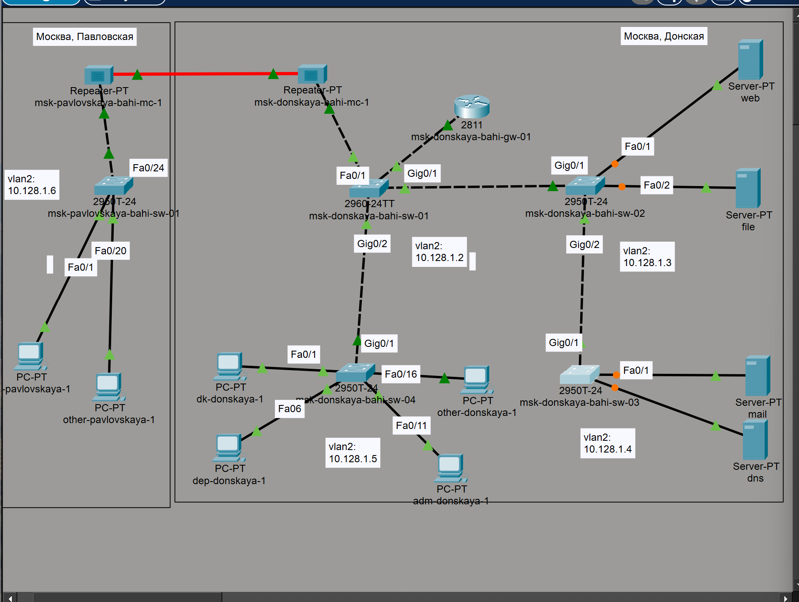{#fig-1 width=70%}

## Настройка IP DNS-сервера

- IP: 10.128.0.5
- Маска: 255.255.255.0
- Шлюз: 10.128.0.1

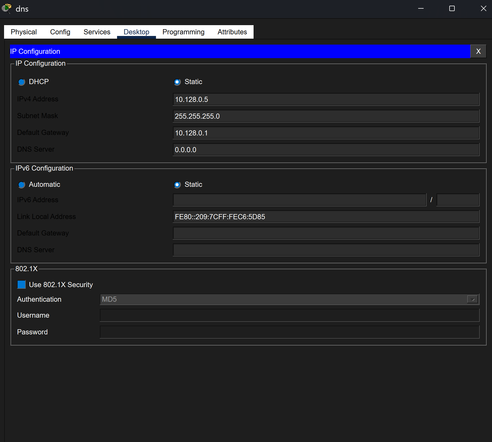{#fig-2 width=70%}

## Настройка порта коммутатора

- `interface fa0/2`
  - переход к настройке интерфейса

- `switchport mode access`
  - перевод порта в режим access

- `switchport access vlan 3`
  - назначение VLAN 3

- `no shutdown`
  - активация порта
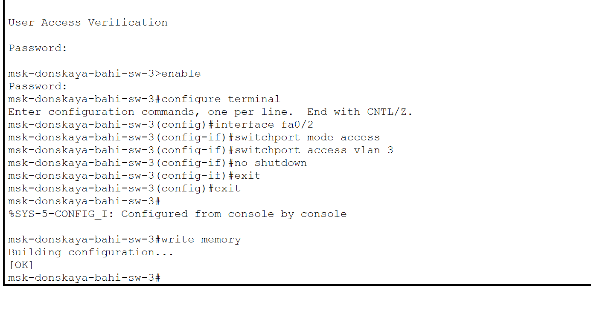{#fig-3 width=70%}

## Активация DNS-сервиса

- Включён DNS (On)
- Тип записи A Record для доменных имён:
  - A Record: Используется для сопоставления доменного имени с IPv4-адресом. Это позволяет пользователям обращаться к ресурсам по удобным именам, а не по числовым IP-адресам. Например:
- www.donskaya.rudn.ru → 10.128.0.2
- mail.donskaya.rudn.ru → 10.128.0.4
- file.donskaya.rudn.ru → 10.128.0.3
- dns.donskaya.rudn.ru → 10.128.0.5

---

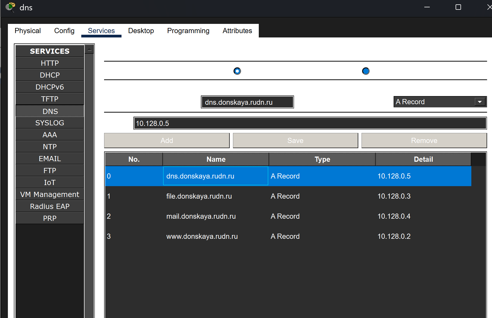{#fig-4 width=70%}

## Настройка DHCP на маршрутизаторе

- Указан DNS: `ip name-server 10.128.0.5`
- Включён DHCP: `service dhcp`

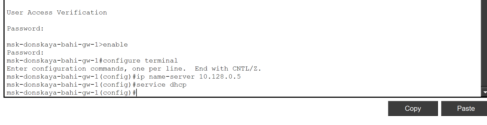{#fig-5 width=70%}

## DHCP пул dk

- Сеть 10.128.3.0

- `ip dhcp pool dk`: 
  - создание пула:  Используется для создания DHCP-пула с именем "dk".

- `network 10.128.3.0 255.255.255.0`
  - задание сети для пула DHCP. Указывает, что пул будет выдавать адреса из сети

- `default-router 10.128.3.1`
  - указание шлюза

- `dns-server 10.128.0.5`
  - указание DNS 

## DHCP пул dk

- `ip dhcp excluded-address 10.128.3.1 10.128.3.29`
  - исключение адресов:
- `ip dhcp excluded-address 10.128.3.200 10.128.3.254`
  - исключение адресов:
  
Указывает, что адреса от 10.128.3.1 до 10.128.3.29 И от 10.128.3.200 до 10.128.3.254 не будут выданы клиентам DHCP. Эти адреса могут быть зарезервированы для статической настройки устройств, таких как серверы, принтеры или другие важные устройства в сети.

---

{#fig-6 width=70%}

## DHCP пул departments

- `ip dhcp pool departments`: 
  - создание пула:  Используется для создания DHCP-пула с именем "departments".

- `network 10.128.4.0 255.255.255.0`
  - задание сети для пула DHCP. Указывает, что пул будет выдавать адреса из сети

- `default-router 10.128.4.1`
  - указание шлюза

- `dns-server 10.128.0.5`
  - указание DNS 

---

## DHCP пул departments

- `ip dhcp excluded-address 10.128.4.1 10.128.4.29`
  - исключение адресов:
- `ip dhcp excluded-address 10.128.4.200 10.128.4.254`
  - исключение адресов:

{#fig-7 width=70%}

## DHCP пул adm

- Сеть 10.128.5.0
- Шлюз 10.128.5.1
- исключение адресов:  10.128.5.1 10.128.5.29
- исключение адресов:  10.128.5.200 10.128.5.254

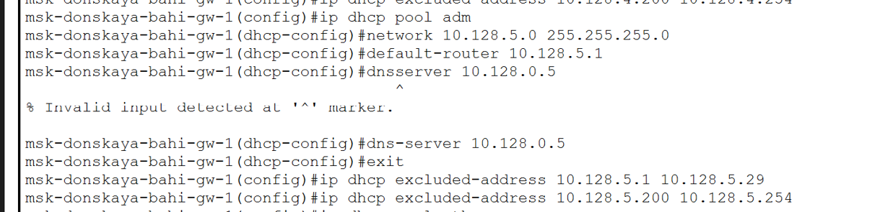{#fig-8 width=70%}

## DHCP пул other

- Сеть 10.128.6.0
- Шлюз 10.128.6.1
- исключение адресов:  10.128.6.1 10.128.6.29
- исключение адресов:  10.128.6.200 10.128.6.254

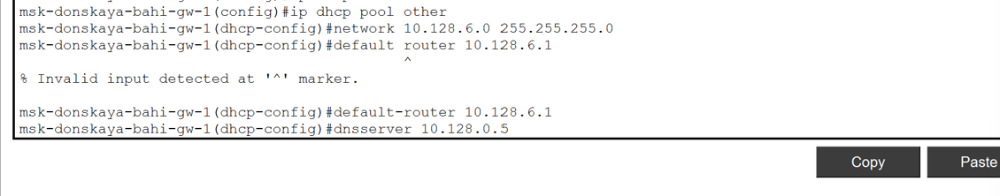{#fig-9 width=70%}

## Проверка DHCP pool

- Использована команда: `show ip dhcp pool`
которая показала наличие всех настроенных пулов адресов, их параметры и доступное количество IP-адресов.

{#fig-10 width=70%}

## Проверка DHCP binding

- Использована команда: `show ip dhcp binding`
- Клиенты отсутствуют

{#fig-11 width=70%}

## Включение DHCP на ПК

- Выбран режим DHCP
- Получены IP автоматически

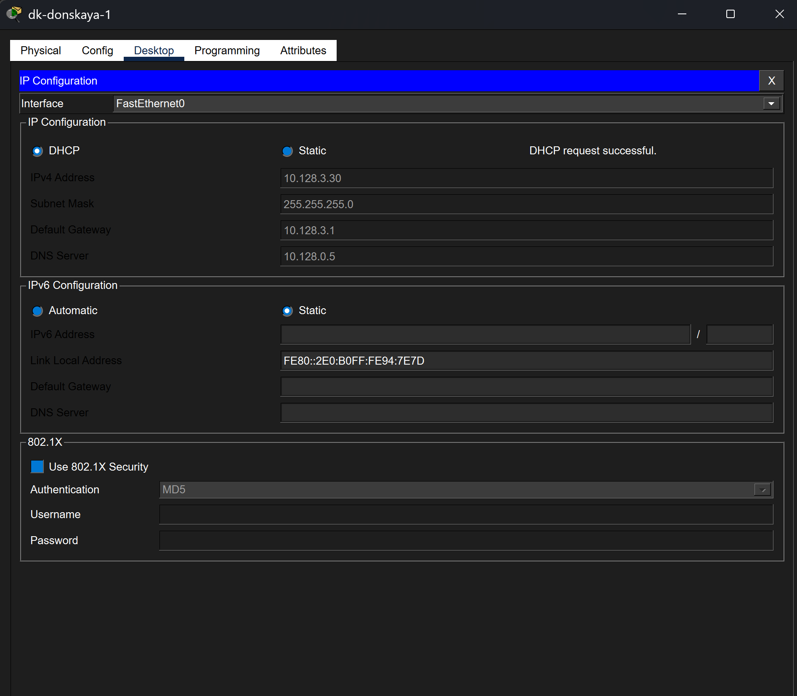{#fig-12 width=70%}

## DHCP в разных VLAN

- DHCP работает корректно

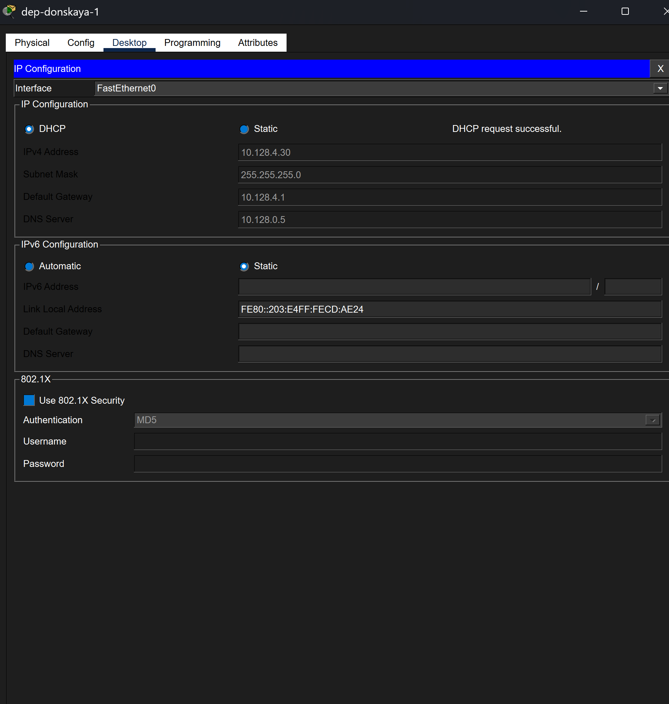{#fig-13 width=70%}

## DHCP на adm

- Адрес получен

{#fig-14 width=70%}

## DHCP на other

- Адрес получен

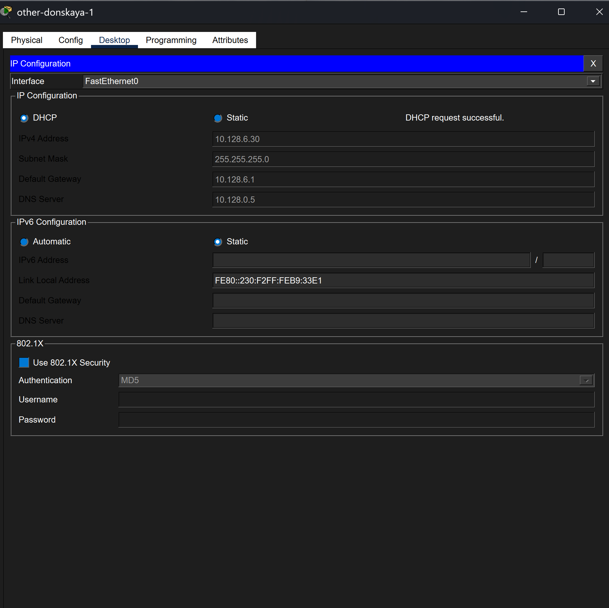{#fig-15 width=70%}

## Проверка выданных адресов

- Использована команда: `show ip dhcp binding`
- Отображены клиенты которая получили IP-адреса от DHCP-сервера

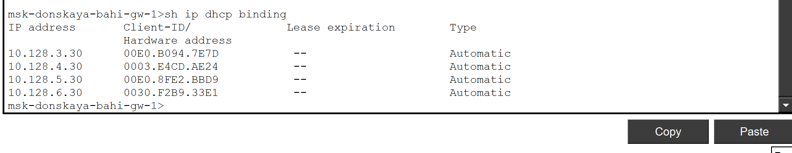{#fig-16 width=70%}

## Проверка DNS

- Проверка [www.donskaya.rudn.ru](http://www.donskaya.rudn.ru)
- Имя преобразовано в IP
- Первый пакет потерян

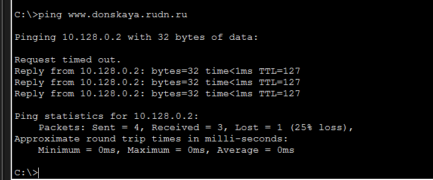{#fig-17 width=70%}

## Проверка между VLAN (dk)

- Доступ к другим сетям
- ICMP успешен

{#fig-18 width=70%}

## Проверка между VLAN (departments)

- Связь стабильна

{#fig-19 width=70%}

## Проверка между VLAN (adm)

- Минимальная задержка
- Сеть стабильна

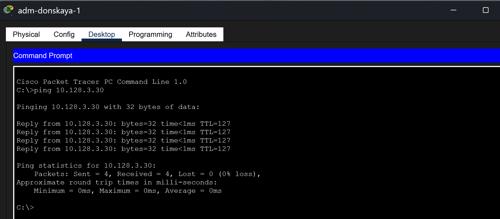{#fig-20 width=70%}

## DHCP Simulation

- Discover: Клиент отправляет широковещательное сообщение DHCP Discover, чтобы найти доступные DHCP-серверы в сети.
- Offer : DHCP-сервер отвечает на Discover сообщением DHCP Offer, предлагая клиенту IP-адрес и другие параметры конфигурации.
- Request: Клиент выбирает один из предложенных серверов и отправляет ему DHCP Request, запрашивая назначенный IP-адрес.
- ACK: DHCP-сервер подтверждает запрос клиента сообщением DHCP ACK, окончательно назначая IP-адрес и предоставляя клиенту всю необходимую информацию для настройки сети.

## DHCP Simulation

{#fig-21 width=70%}

# Выводы

## Выводы

- Настроен DHCP и DNS
- Автоматическая адресация работает
- Проверена связность
- DNS функционирует
- Изучен процесс DHCP
- Сеть работает стабильно

