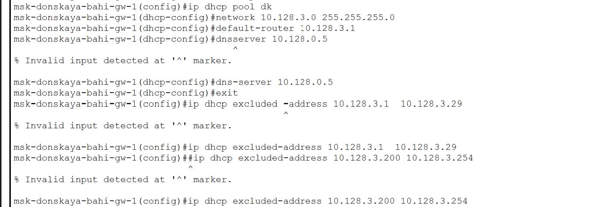
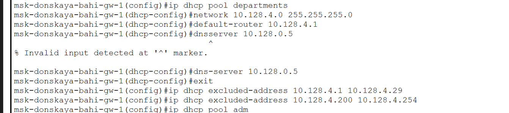
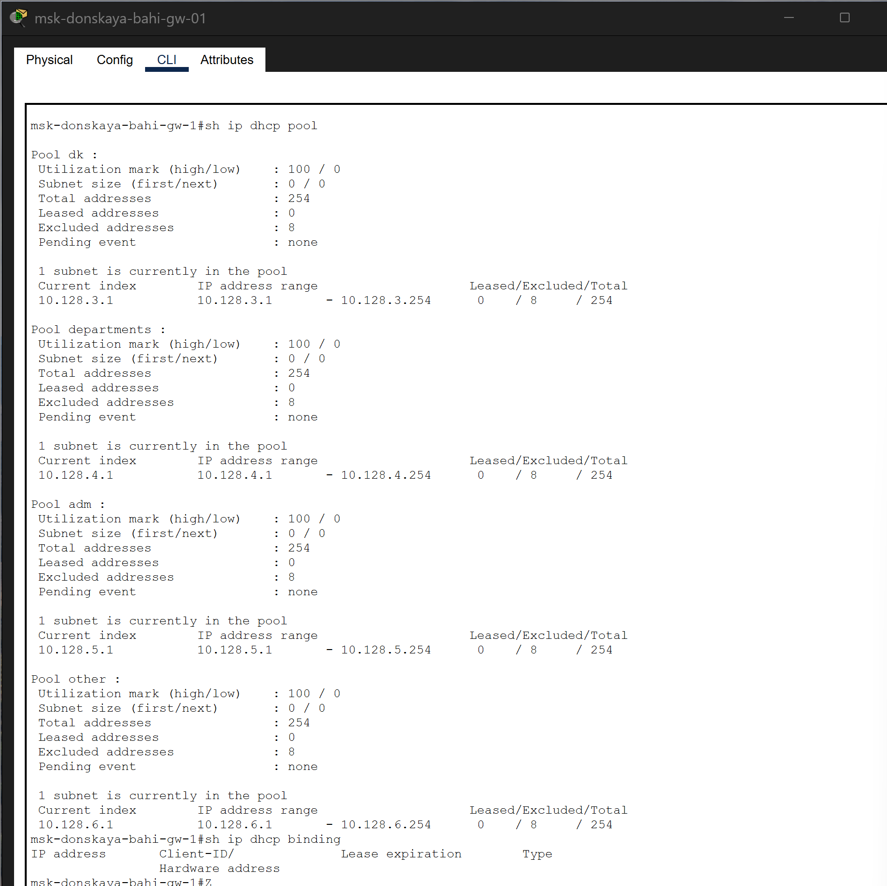
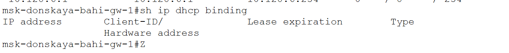
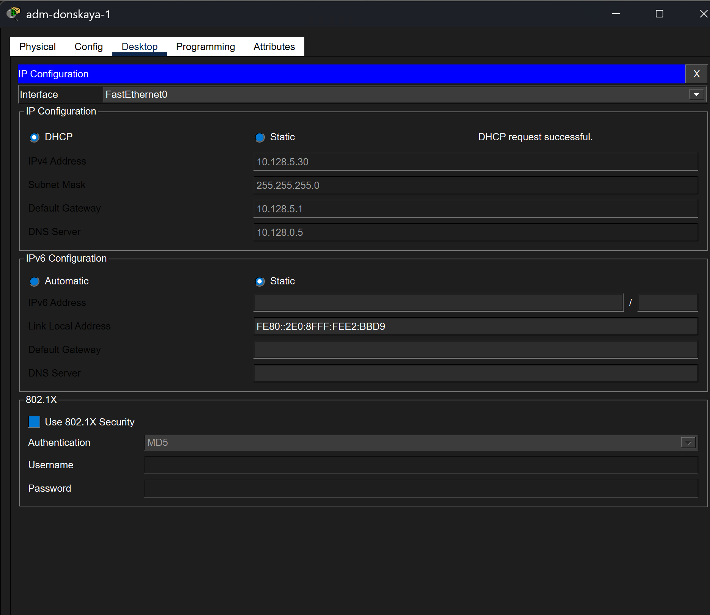
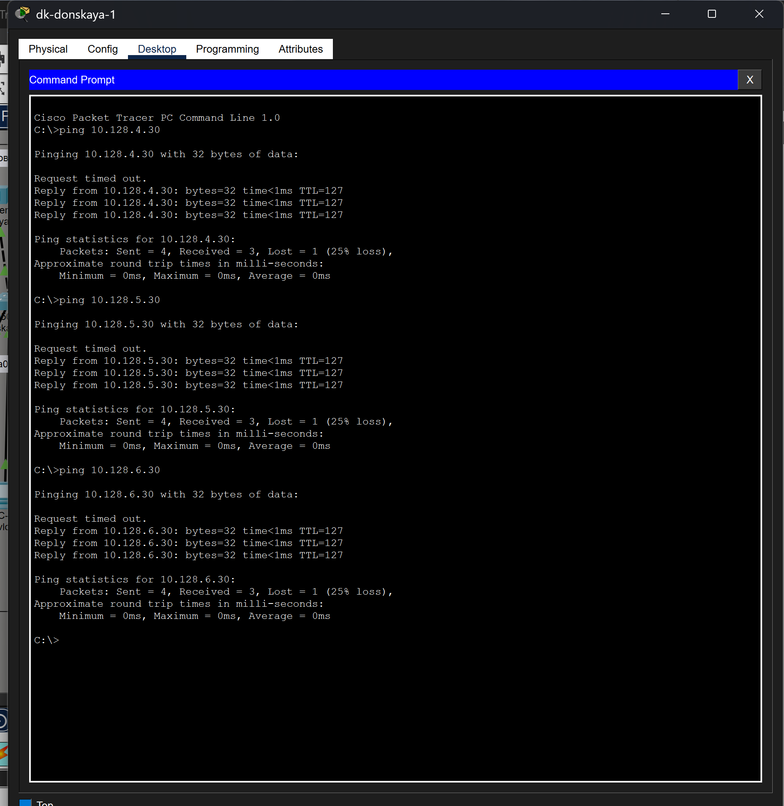
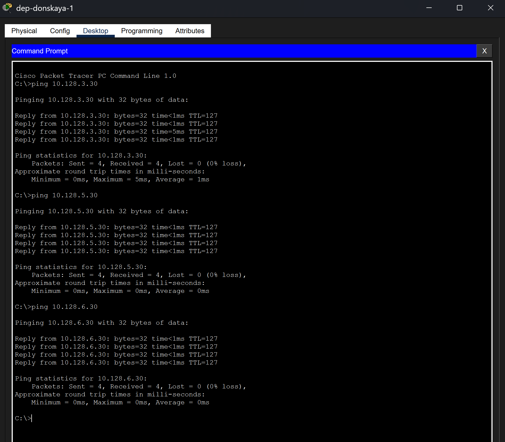

---
## Author
author:
  name: бахи сиди али темассини
  degrees: Student (3 курс)
  orcid: ""
  email: 1032234211@rudn.ru
  affiliation:
    - name: Российский университет дружбы народов
      country: Российская Федерация
      postal-code: 117198
      city: Москва
      address: ул. Миклухо-Маклая, д. 6

## Title
title: "Отчёт по лабораторной работе №08"
subtitle: "Администрирование локальных сетей"
license: "CC BY"
---

# Цель работы

Приобретение практических навыков по настройке динамического распределения IP-адресов посредством протокола DHCP (Dynamic Host Configuration Protocol) [5] в локальной сети.

# Выполнение лабораторной работы

## Подключение DHCP-сервера к коммутатору уровня доступа

В рамках выполнения лабораторной работы была произведена настройка DNS-сервера в локальной сети с последующим подключением его к коммутатору уровня доступа.

На первом этапе в логическую рабочую область был добавлен сервер DNS и подключён к коммутатору msk-donskaya-sw-3 через интерфейс Fa0/2. Для корректной работы соединения порт на коммутаторе был активирован и переведён в режим доступа с привязкой к VLAN 3, что соответствует сети серверной инфраструктуры.

{#fig-1 width=70%}

Далее была выполнена настройка сетевого интерфейса DNS-сервера. Серверу был назначен статический IP-адрес 10.128.0.5 с маской подсети 255.255.255.0, а в качестве шлюза по умолчанию указан адрес 10.128.0.1. Эти параметры обеспечивают корректную маршрутизацию трафика между подсетями и доступ к другим узлам сети.

{#fig-2 width=70%}

На коммутаторе msk-donskaya-sw-3 была выполнена конфигурация интерфейса Fa0/2, включающая перевод порта в режим access, назначение VLAN 3 и активацию интерфейса командой -no shutdown-. Данные действия необходимы для корректного функционирования соединения между сервером и коммутатором.

{#fig-3 width=70%}

## Настройте сервис DNS

На следующем этапе лабораторной работы была выполнена настройка службы DNS на сервере, обеспечивающей разрешение доменных имён в IP-адреса внутри локальной сети.

В конфигурации сервера была выбрана служба DNS и активирована путём установки параметра On. Далее для каждой записи был выбран тип A Record, который используется для сопоставления доменного имени с IPv4-адресом.

{#fig-4 width=70%}

После активации службы были добавлены ресурсные записи для основных сетевых сервисов. В частности, для web-сервера задано доменное имя [www.donskaya.rudn.ru](http://www.donskaya.rudn.ru), соответствующее IP-адресу 10.128.0.2. Аналогичным образом были созданы записи для серверов mail, file и dns, каждая из которых связана с соответствующим IP-адресом в сети.

В результате выполненной настройки DNS-сервер обеспечивает корректное преобразование доменных имён в IP-адреса, что позволяет пользователям обращаться к сетевым ресурсам по удобным символьным именам вместо числовых адресов.

## Настройте DHCP-сервер на маршрутизаторе

На данном этапе лабораторной работы была выполнена настройка службы DHCP на маршрутизаторе msk-donskaya-bahi-gw-1, обеспечивающей автоматическое распределение IP-адресов в различных VLAN сети.

Сначала на маршрутизаторе была указана адресация DNS-сервера с помощью команды ip name-server 10.128.0.5, а также активирована служба DHCP. При этом была допущена ошибка ввода команды (ip name server), которая была исправлена на корректный синтаксис (ip name-server), что позволило успешно продолжить настройку.

{#fig-5 width=70%}

Далее была выполнена настройка пула адресов для сети dk (VLAN 101). Был задан адрес сети 10.128.3.0/24, шлюз по умолчанию 10.128.3.1, а также DNS-сервер 10.128.0.5. Дополнительно были исключены диапазоны адресов, используемые для инфраструктурных нужд.

{#fig-6 width=70%}

Аналогичным образом был настроен DHCP-пул для сети departments (VLAN 102) с адресным пространством 10.128.4.0/24 и шлюзом 10.128.4.1.

{#fig-7 width=70%}

Затем была выполнена настройка DHCP-пула для сети adm (VLAN 103) с использованием сети 10.128.5.0/24 и шлюза 10.128.5.1.

{#fig-8 width=70%}

После этого был настроен DHCP-пул для сети other (VLAN 104) с адресным пространством 10.128.6.0/24 и шлюзом 10.128.6.1.

{#fig-9 width=70%}

Для проверки корректности конфигурации была использована команда show ip dhcp pool, которая показала наличие всех настроенных пулов адресов, их параметры и доступное количество IP-адресов.

{#fig-10 width=70%}

Дополнительно была выполнена проверка таблицы привязок с помощью команды show ip dhcp binding, которая на данном этапе не содержала записей, что свидетельствует об отсутствии активных клиентов, запросивших IP-адреса.

{#fig-11 width=70%}

В результате выполненных действий DHCP-сервис был полностью настроен и готов к автоматическому распределению IP-адресов для всех пользовательских подсетей.

## Замена статического IP-адреса на динамический

На данном этапе лабораторной работы была выполнена замена статического назначения IP-адресов на динамическое на всех оконечных устройствах сети.

На каждом ПК в настройках сетевого интерфейса был выбран режим DHCP, после чего устройства автоматически получили сетевые параметры от DHCP-сервера, настроенного на маршрутизаторе. В результате каждому устройству был назначен IP-адрес из соответствующего пула, а также автоматически заданы маска подсети, шлюз по умолчанию и адрес DNS-сервера.

{#fig-12 width=70%}

Аналогичным образом динамическая адресация была успешно применена для устройств в других подсетях, что подтверждает корректную работу DHCP для разных VLAN.

{#fig-13 width=70%}

{#fig-14 width=70%}

{#fig-15 width=70%}

## Для проверки корректности распределения адресов

Для проверки корректности распределения адресов была использована команда show ip dhcp binding на маршрутизаторе. В таблице привязок отображаются все выданные IP-адреса, соответствующие MAC-адресам клиентов, что подтверждает успешную работу DHCP-сервиса.

{#fig-16 width=70%}

После перевода оконечных устройств на динамическую адресацию была выполнена проверка выданных IP-адресов, а также тестирование доступности узлов из разных подсетей. Проверка показала, что разрешение доменного имени [www.donskaya.rudn.ru](http://www.donskaya.rudn.ru) выполняется корректно: имя было сопоставлено с IP-адресом 10.128.0.2, после чего узел стал доступен по ICMP. Наличие первого потерянного пакета объясняется начальным процессом ARP-разрешения и не свидетельствует о неисправности сети.

{#fig-17 width=70%}

На рабочей станции dk-donskaya-1 была выполнена проверка доступности устройств из других подсетей. Узлы с адресами 10.128.4.30, 10.128.5.30 и 10.128.6.30 успешно отвечают на ICMP-запросы, что подтверждает корректную межсетевую маршрутизацию между VLAN. Первичная потеря одного пакета при каждом первом обращении также связана с предварительным определением MAC-адреса шлюза и получателя.

{#fig-18 width=70%}

Аналогичная проверка была проведена на устройстве dep-donskaya-1. Результаты показывают устойчивую доступность узлов 10.128.3.30, 10.128.5.30 и 10.128.6.30 без потерь пакетов, что дополнительно подтверждает корректность работы маршрутизатора и настроенной схемы адресации.

{#fig-19 width=70%}

На устройстве adm-donskaya-1 была проверена доступность узла 10.128.3.30 из другой подсети. Все ICMP-пакеты были успешно доставлены, а время отклика оставалось минимальным, что свидетельствует о стабильной работе сети и правильной настройке IP-маршрутизации между пользовательскими сегментами.

{#fig-20 width=70%}

В результате выполненных действий все оконечные устройства сети получили корректные сетевые настройки в автоматическом режиме, что свидетельствует о правильной конфигурации DHCP-сервиса и его функционировании во всех подсетях.

## В режиме симуляции изучите, каким образом происходит запрос адреса по протоколу DHCP:

На заключительном этапе лабораторной работы был выполнен анализ процесса получения IP-адреса по протоколу DHCP в режиме симуляции Packet Tracer.

В ходе наблюдения за сетевыми событиями было установлено, что процесс динамического назначения адреса происходит по стандартной четырёхэтапной схеме взаимодействия клиента и сервера DHCP. Сначала оконечное устройство инициирует широковещательный запрос DHCP Discover, направленный на поиск доступного DHCP-сервера в сети. Далее маршрутизатор, выполняющий роль DHCP-сервера, отвечает сообщением DHCP Offer, предлагая клиенту свободный IP-адрес из соответствующего пула.

После получения предложения клиент отправляет сообщение DHCP Request, подтверждая выбор предложенного адреса. Завершающим этапом является сообщение DHCP ACK, в котором сервер окончательно закрепляет IP-адрес за клиентом и передаёт дополнительные параметры конфигурации, включая шлюз по умолчанию и DNS-сервер.

{#fig-21 width=70%}

Дополнительно в процессе симуляции наблюдаются служебные протоколы, такие как ARP и STP, которые обеспечивают корректную работу канального уровня и предотвращение петель в сети. Однако ключевыми для процесса назначения IP-адреса являются именно сообщения DHCP.

Таким образом, анализ показал, что процедура получения IP-адреса реализуется корректно и соответствует стандартному алгоритму работы протокола DHCP, что подтверждает правильность настройки сетевой инфраструктуры.

# Выводы

В ходе выполнения лабораторной работы были получены практические навыки настройки сетевых сервисов DHCP и DNS в локальной сети на базе Cisco Packet Tracer.

Был успешно добавлен и настроен DNS-сервер, обеспечивающий разрешение доменных имён в IP-адреса для внутренних сетевых ресурсов. Созданные записи типа A позволили обращаться к серверам по символьным именам, что повысило удобство работы в сети.

На маршрутизаторе была выполнена корректная настройка DHCP-сервиса для нескольких подсетей (VLAN), включая создание пулов адресов, указание шлюзов по умолчанию, DNS-сервера и исключённых диапазонов адресов. Это обеспечило автоматическое распределение сетевых параметров для оконечных устройств.

Оконечные устройства были переведены с статической адресации на динамическую, в результате чего они успешно получили IP-адреса, маску подсети, шлюз и DNS-сервер от DHCP.

Проведённая проверка показала, что все устройства корректно взаимодействуют между собой, включая обмен данными между различными подсетями. Также была подтверждена работоспособность DNS за счёт успешного разрешения доменных имён.

В режиме симуляции был изучен процесс работы протокола DHCP, включающий последовательность сообщений Discover, Offer, Request и ACK, что позволило наглядно понять механизм динамического назначения IP-адресов.

Таким образом, все поставленные задачи лабораторной работы выполнены, а сеть функционирует корректно и стабильно.[@cisco_nat_faq2],[@hill2009]

# Контрольные вопросы

## За что отвечает протокол DHCP?

Протокол DHCP (Dynamic Host Configuration Protocol) отвечает за автоматическое назначение сетевых параметров оконечным устройствам в сети. К таким параметрам относятся IP-адрес, маска подсети, шлюз по умолчанию и адрес DNS-сервера. Использование DHCP позволяет централизовать управление адресацией и исключить необходимость ручной настройки каждого устройства. [@droms1997],[@olifer2017],[@tanenbaum2016]

## Какие типы DHCP-сообщений передаются по сети?

В процессе работы DHCP используются следующие основные типы сообщений:

- DHCP Discover — клиент отправляет широковещательный запрос для поиска DHCP-сервера
- DHCP Offer — сервер предлагает клиенту IP-адрес
- DHCP Request — клиент запрашивает выбранный IP-адрес
- DHCP ACK — сервер подтверждает назначение IP-адреса

Дополнительно могут использоваться:

- DHCP NAK — отказ в назначении адреса
- DHCP Release — освобождение адреса клиентом
- DHCP Inform — запрос дополнительных параметров

[@droms1997],[@korolkova2012]

## Какие параметры могут быть переданы в сообщениях DHCP?

DHCP может передавать следующие параметры:

- IP-адрес клиента
- Маска подсети
- Шлюз по умолчанию (default gateway)
- DNS-сервер
- Время аренды IP-адреса (lease time)
- Доменное имя
- NTP-сервер
- WINS-сервер

Это позволяет полностью автоматически настроить сетевое взаимодействие устройства.

[@olifer2017]

## Что такое DNS?

DNS (Domain Name System) — это система доменных имён, предназначенная для преобразования символьных доменных имён в IP-адреса и наоборот. Она позволяет пользователям обращаться к сетевым ресурсам по удобным именам (например, [www.example.com](http://www.example.com)) вместо числовых адресов.

[@linkmeup]

## Какие типы записи описания ресурсов есть в DNS и для чего они используются?

Основные типы DNS-записей:

- A (Address Record) — сопоставляет доменное имя с IPv4-адресом
- AAAA — сопоставляет доменное имя с IPv6-адресом
- CNAME (Canonical Name) — создаёт псевдоним для другого доменного имени
- MX (Mail Exchange) — указывает почтовый сервер для домена
- NS (Name Server) — определяет DNS-серверы, обслуживающие домен
- PTR (Pointer) — используется для обратного разрешения IP-адреса в имя
- TXT — хранит произвольную текстовую информацию (например, SPF-записи)
[@korolkova2012b]

# Список литературы{.unnumbered}

::: {#refs}
:::
