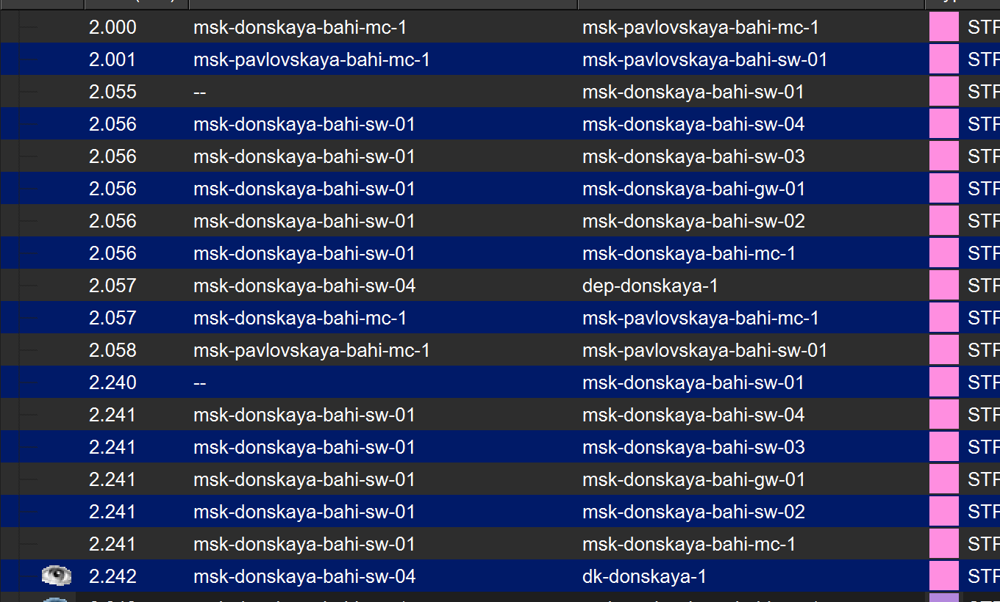
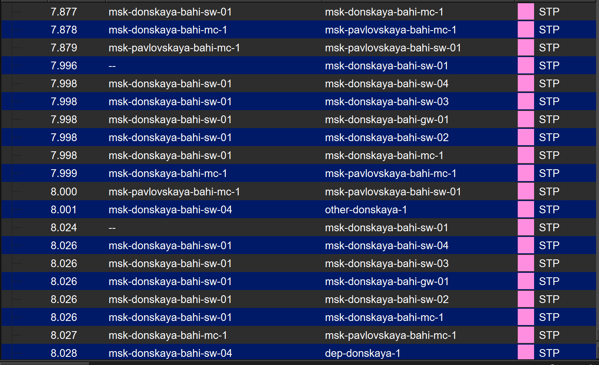
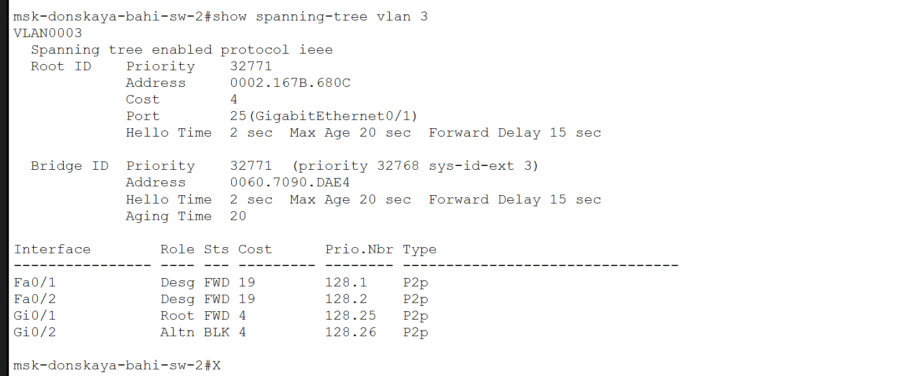
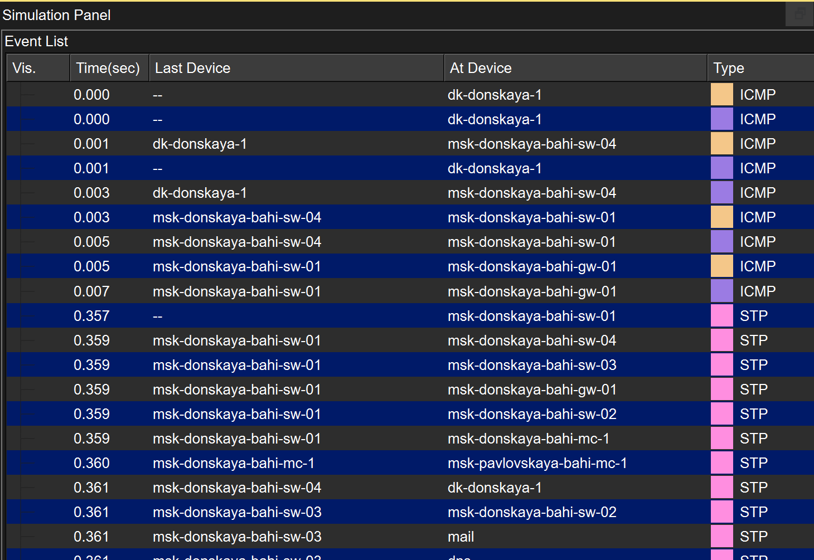
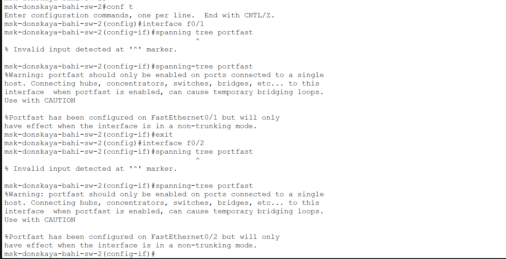
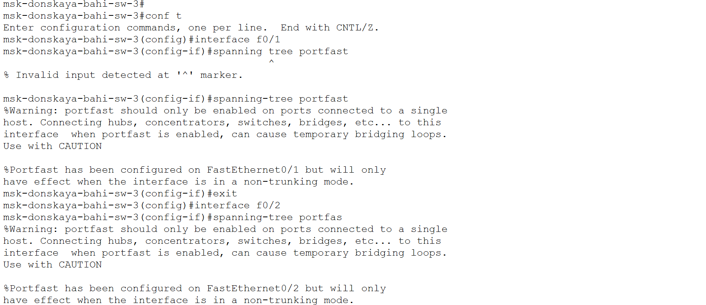
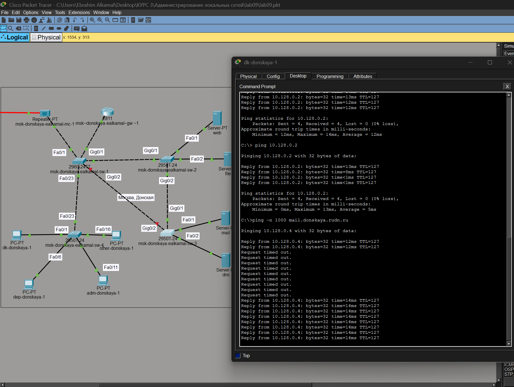
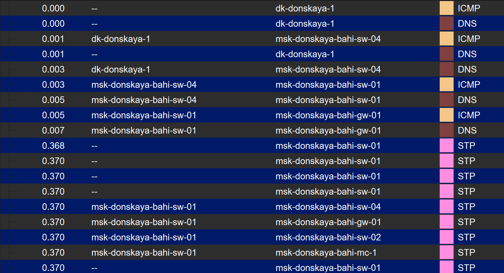
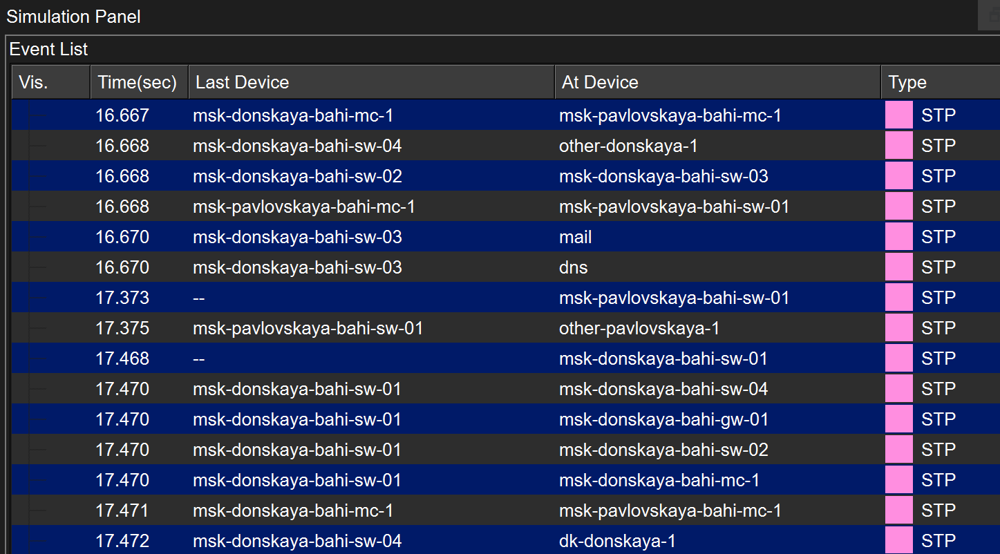
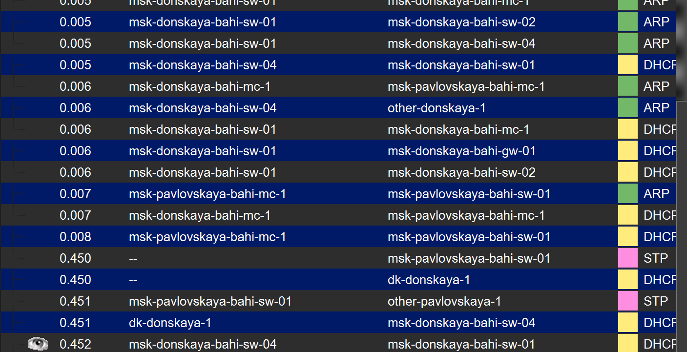

---
## Author
author:
  name: бахи сиди али темассини
  degrees: Student (3 курс)
  orcid: ""
  email: 1032234211@rudn.ru
  affiliation:
    - name: Российский университет дружбы народов
      country: Российская Федерация
      postal-code: 117198
      city: Москва
      address: ул. Миклухо-Маклая, д. 6
## Title
title: Лабораторная работа №9
subtitle: Администрирование локальных сетей
license: CC BY
date: today
date-format: "YYYY-MM-DD" # Example: 2025-09-06
---

# Информация

## Докладчик

:::::::::::::: {.columns align=center}
::: {.column width="70%"}

  - бахи сиди али темассини
  - Российский университет дружбы народов
  - [GitHub]

:::
::::::::::::::

# Цель работы

- Изучение возможностей протокола STP
- Обеспечение отказоустойчивости сети
- Агрегирование интерфейсов
- Перераспределение нагрузки

---

# Выполнение лабораторной работы

## Формирование резервного соединения

- Замена соединения SW1–SW4 на SW1–SW3
- Интерфейс Gig0/2 на SW3 переведён в trunk
- Соединение SW1–SW4 через Fa0/23 в trunk

{#fig-1 width=70%}

---

## Настройка транкового режима интерфейса

- Настройка Gig0/2 на SW3
- Использована команда `switchport mode trunk`
- Передача нескольких VLAN по одному каналу

{#fig-2 width=70%}

---

## Настройка транкового соединения между коммутаторами

- Интерфейс Fa0/23 на SW1 переведён в trunk
- Организация соединения между коммутаторами

{#fig-3 width=70%}

---

## Настройка транкового интерфейса на втором коммутаторе

- Интерфейс Fa0/23 на SW4 переведён в trunk
- Обеспечена корректная передача VLAN

{#fig-4 width=70%}

---

## Анализ движения пакетов ICMP

- Выполнена проверка ICMP в режиме симуляции
- Пакеты проходят через SW2
- Соответствие требованиям задания

{#fig-5 width=70%}

---

## Дополнительное подтверждение работы STP

- Зафиксирован обмен BPDU
- Подтверждена работа STP
- Наличие резервных путей

{#fig-6 width=70%}

---

## Проверка состояния протокола STP

- Выполнена команда `show spanning-tree vlan 3`
- Коммутатор не является корневым
- Определён root-порт Gig0/1
- Есть альтернативный заблокированный порт

---

{#fig-7 width=70%}

## Назначение корневого коммутатора

- Выполнена команда `spanning-tree vlan 3 root primary`
- SW1 назначен корневым

{#fig-8 width=70%}

## Проверка путей прохождения ICMP-пакетов в режиме симуляции

- Проверен путь к mail через SW1 и SW3
- Проверен путь к web через SW1 и SW2

{#fig-9 width=70%}

##

- Зафиксирован маршрут до web через SW4 → SW1 → SW2
- Обратный путь подтверждён

{#fig-10 width=70%}

## Настройка режима PortFast на интерфейсах подключения серверов

- Настройка PortFast на SW2 (Fa0/1, Fa0/2)
- Получено предупреждение о нетранковом режиме

{#fig-11 width=70%}

##

- Настройка PortFast на SW3 (Fa0/2)
- Аналогичное предупреждение

{#fig-12 width=70%}

## Исследование отказоустойчивости протокола STP

- Путь до mail через SW1 → SW3 до разрыва

{#fig-13 width=70%}

##

- Зафиксировано перестроение STP
- Восстановление передачи пакетов

{#fig-14 width=70%}

##

- Выполнен ping
- Наблюдаются timeout
- Затем восстановление связи

{#fig-15 width=70%}

##

- Путь после восстановления через SW2
- Используется резервный маршрут

{#fig-16 width=70%}

## Исследование отказоустойчивости протокола STP

- Выполнен ping с потерей пакетов
- Восстановление соединения после переключения

{#fig-17 width=70%}

## Переключение коммутаторов в режим Rapid PVST+

- Зафиксирован маршрут ICMP после переключения
- Путь проходит через SW4 → SW1 → SW2 → SW3

{#fig-18 width=70%}

## Исследование отказоустойчивости протокола Rapid PVST+

- Используется резервный путь
- Подтверждена работа Rapid PVST+

{#fig-18 width=70%}

## Формирование агрегированного соединения между msk-donskaya-sw-1 и msk-donskaya-sw-4

- Соединение по интерфейсам Fa0/20–Fa0/23
- Четыре параллельных канала

{#fig-21 width=70%}

## Настройка агрегирования каналов EtherChannel

- Настроен channel-group 1
- Создан интерфейс Port-channel 1
- Обнаружена несовместимость Fa0/23

---

{#fig-19 width=70%}

##  CLI при настройке EtherChannel на коммутаторе sw-4

- Удалён access vlan 104 на SW4
- Настроен EtherChannel
- Зафиксированы ошибки Native VLAN
- Блокировка Port-channel1

---

{#fig-20 width=70%}

# Выводы

## Выводы

- Сформировано резервное соединение
- STP обеспечивает отказоустойчивость
- Наблюдается временная потеря пакетов
- Связь восстанавливается через резервный путь
- Rapid PVST+ ускоряет восстановление
- Передача ICMP стабильна
- Обнаружены ошибки EtherChannel
- Несоответствие VLAN и DTP
- Частичное исключение портов
- Требуется корректная настройка STP и EtherChannel

