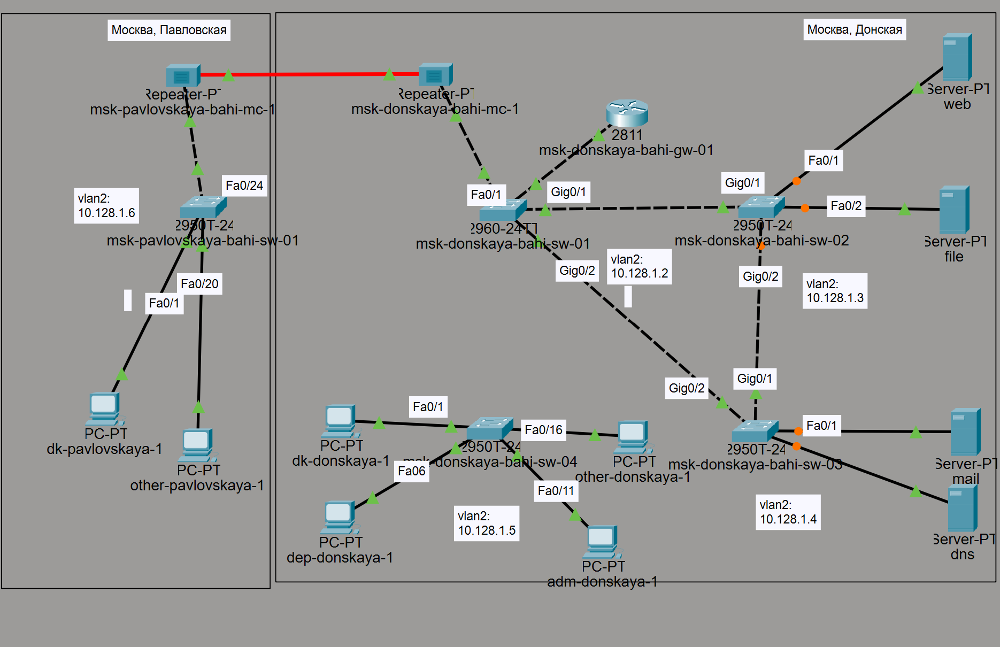
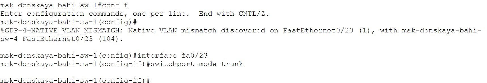
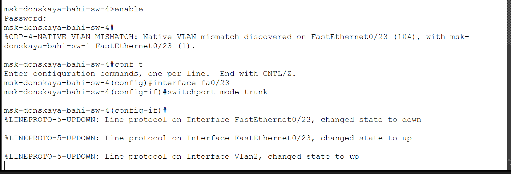
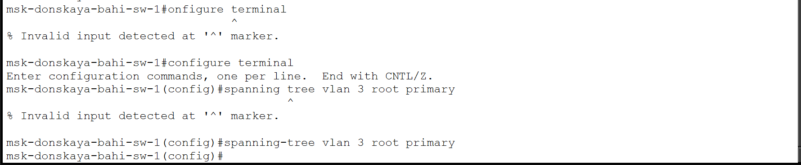
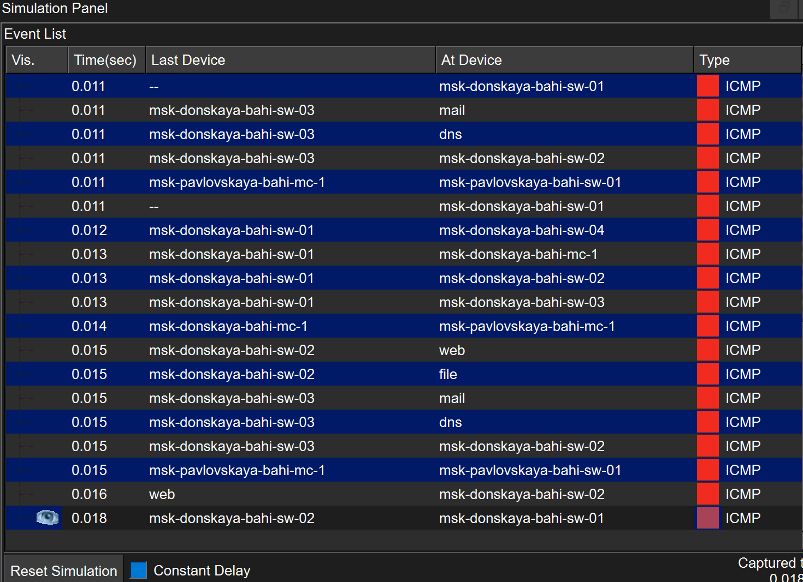
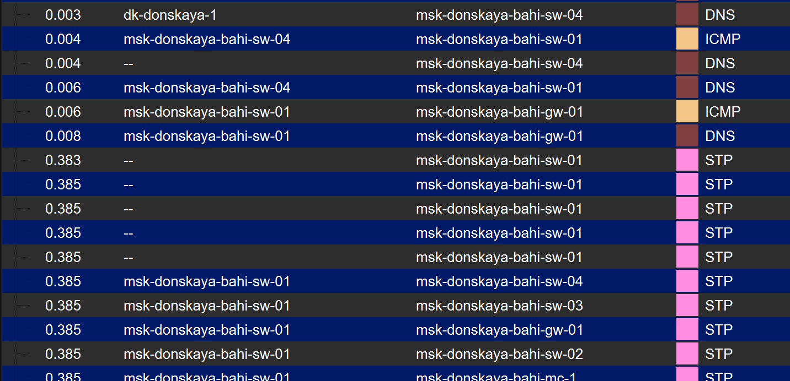
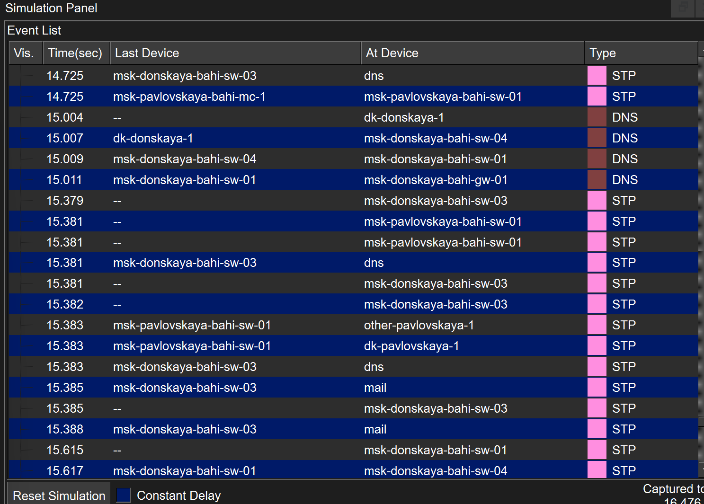
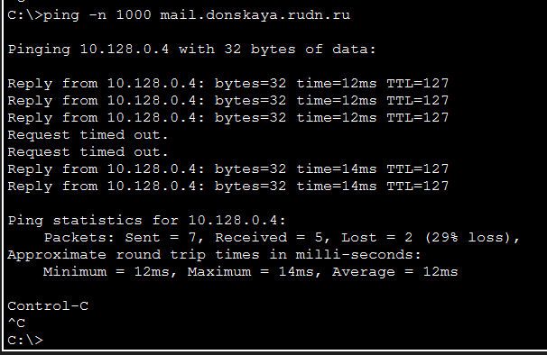
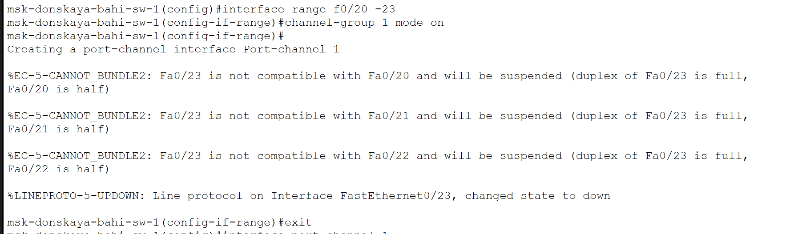
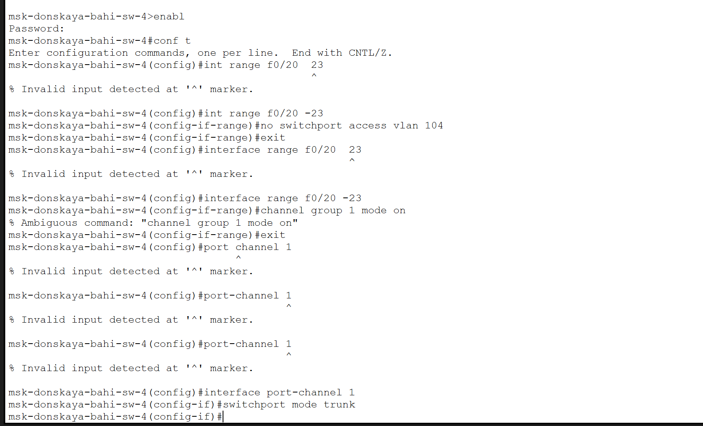

---
## Author
author:
  name: бахи сиди али темассини
  degrees: Student (3 курс)
  orcid: ""
  email: 11032234211@rudn.ru
  affiliation:
    - name: Российский университет дружбы народов
      country: Российская Федерация
      postal-code: 117198
      city: Москва
      address: ул. Миклухо-Маклая, д. 6

## Title
title: "Отчёт по лабораторной работе №09"
subtitle: "Администрирование локальных сетей"
license: "CC BY"
---

# Цель работы

Изучение возможностей протокола STP и его модификаций по обеспечению отказоустойчивости сети, агрегированию интерфейсов и перераспределению нагрузки между ними.

# Выполнение лабораторной работы

## Формирование резервного соединения

На топологии сети выполнена замена соединения между коммутаторами: вместо связи msk-donskaya-sw-1 (Gig0/2) — msk-donskaya-sw-4 (Gig0/1) настроено соединение между msk-donskaya-sw-1 (Gig0/2) и msk-donskaya-sw-3 (Gig0/2). Дополнительно на коммутаторе msk-donskaya-sw-3 интерфейс Gig0/2 переведён в транковый режим. Также соединение между msk-donskaya-sw-1 и msk-donskaya-sw-4 организовано через интерфейсы Fa0/23 с активацией режима trunk ([рис. @fig-1]).

{#fig-1 width=70%}

## Настройка транкового режима интерфейса

На коммутаторе msk-donskaya-sw-3 выполнена настройка интерфейса Gig0/2 в режиме trunk с использованием команды `switchport mode trunk`, что обеспечивает передачу трафика нескольких VLAN по одному каналу ([рис. @fig-2]).

{#fig-2 width=70%}

## Настройка транкового соединения между коммутаторами

На коммутаторе msk-donskaya-sw-1 интерфейс Fa0/23 переведён в транковый режим для организации соединения с другим коммутатором ([рис. @fig-3]).

{#fig-3 width=70%}

## Настройка транкового интерфейса на втором коммутаторе

Аналогичная настройка выполнена на коммутаторе msk-donskaya-sw-4, где интерфейс Fa0/23 также переведён в режим trunk для обеспечения корректной передачи VLAN-трафика ([рис. @fig-4]).

{#fig-4 width=70%}

## Анализ движения пакетов ICMP

В режиме симуляции выполнена проверка прохождения ICMP-пакетов от конечного устройства dk-donskaya-1 к серверам. По журналу событий видно, что пакеты проходят через коммутатор msk-donskaya-sw-2, что соответствует требованиям задания ([рис. @fig-5]).

{#fig-5 width=70%}

## Дополнительное подтверждение работы STP

В журнале событий также наблюдается обмен BPDU-сообщениями протокола STP между коммутаторами, что подтверждает корректную работу алгоритма остовного дерева и наличие резервных путей в сети ([рис. @fig-6]).

{#fig-6 width=70%}

## Проверка состояния протокола STP

На коммутаторе msk-donskaya-sw-2 выполнена команда `show spanning-tree vlan 3`. Из вывода видно, что данный коммутатор не является корневым, а в качестве корневого порта используется интерфейс Gig0/1. Также присутствует альтернативный порт в состоянии блокировки, что подтверждает наличие резервного пути ([рис. @fig-7]).

{#fig-7 width=70%}

## Назначение корневого коммутатора

На коммутаторе msk-donskaya-sw-1 выполнена настройка для назначения его корневым устройством в VLAN 3 с использованием команды `spanning-tree vlan 3 root primary` ([рис. @fig-8]).

{#fig-8 width=70%}

## Проверка путей прохождения ICMP-пакетов в режиме симуляции

В режиме симуляции проверено прохождение ICMP-пакетов от узла `dk-donskaya-1` к серверам `mail` и `web`. По журналу событий установлено, что трафик к серверу `mail` проходит через коммутаторы `msk-donskaya-sw-1` и `msk-donskaya-sw-3`, а трафик к серверу `web` — через `msk-donskaya-sw-1` и `msk-donskaya-sw-2` ([рис. @fig-9]).

{#fig-9 width=70%}

В отдельном фрагменте журнала симуляции для обращения к серверу `web` зафиксирован путь `dk-donskaya-1 → msk-donskaya-sw-4 → msk-donskaya-sw-1 → msk-donskaya-sw-2 → web` с последующим возвратом пакета по обратному направлению ([рис. @fig-10]).

{#fig-10 width=70%}

## Настройка режима PortFast на интерфейсах подключения серверов

На коммутаторе `msk-donskaya-sw-2` выполнена настройка режима `PortFast` на интерфейсах `Fa0/1` и `Fa0/2`. В выводе CLI зафиксировано предупреждение о том, что режим `PortFast` будет иметь эффект только при нетранковом режиме интерфейса ([рис. @fig-11]).

{#fig-11 width=70%}

На коммутаторе `msk-donskaya-sw-3` выполнена аналогичная настройка режима `PortFast` на интерфейсе `Fa0/2`. В выводе CLI также присутствует предупреждение о применении режима только для нетранковых интерфейсов ([рис. @fig-12]).

{#fig-12 width=70%}

## Исследование отказоустойчивости протокола STP

До разрыва соединения в режиме симуляции зафиксирован путь прохождения ICMP-пакета к серверу `mail` через коммутаторы `msk-donskaya-sw-1` и `msk-donskaya-sw-3` ([рис. @fig-13]).

{#fig-13 width=70%}

Во время переключения на резервное соединение в журнале симуляции наблюдается обмен STP-сообщениями, после чего возобновляется прохождение ICMP-пакетов между узлом `dk-donskaya-1` и сервером `mail` ([рис. @fig-14]).

{#fig-14 width=70%}

На хосте `dk-donskaya-1` выполнена команда `ping -n 1000 mail.donskaya.rudn.ru`. В выводе команды зафиксированы ответы от узла `10.128.0.4`, затем несколько сообщений `Request timed out`, после чего ответы возобновились, что подтверждает восстановление связи после переключения на резервное соединение ([рис. @fig-15]).

{#fig-15 width=70%}

После восстановления связи в режиме симуляции зафиксирован путь ICMP-пакета к серверу `mail` через коммутаторы `msk-donskaya-sw-1`, `msk-donskaya-sw-2` и `msk-donskaya-sw-3`, что соответствует работе резервного соединения ([рис. @fig-16]).

{#fig-16 width=70%}

## Исследование отказоустойчивости протокола STP

На узле `dk-donskaya-1` выполнена команда `ping -n 1000 mail.donskaya.rudn.ru`. В выводе зафиксированы ответы от узла `10.128.0.4`, затем несколько сообщений `Request timed out`, после чего ответы возобновились. Это указывает на временное прерывание связи и последующее восстановление соединения при переключении на резервный путь ([рис. @fig-17]).

{#fig-17 width=70%}

## Переключение коммутаторов в режим Rapid PVST+

После переключения коммутаторов в режим `Rapid PVST+` в журнале симуляции зафиксировано прохождение ICMP-пакета от узла `dk-donskaya-1` к серверу `mail` по пути через `msk-donskaya-sw-4`, `msk-donskaya-sw-1`, `msk-donskaya-sw-2` и `msk-donskaya-sw-3`, с последующей доставкой на `mail` и возвратом ответа по обратному маршруту ([рис. @fig-18]).

{#fig-18 width=70%}

## Исследование отказоустойчивости протокола Rapid PVST+

По журналу симуляции после переключения на `Rapid PVST+` восстановленный путь к серверу `mail` проходит через резервное соединение с участием коммутаторов `msk-donskaya-sw-1`, `msk-donskaya-sw-2` и `msk-donskaya-sw-3`. Это подтверждает использование резервного маршрута после изменения состояния соединений ([рис. @fig-18]).

{#fig-18 width=70%}

## Формирование агрегированного соединения между msk-donskaya-sw-1 и msk-donskaya-sw-4

На логической схеме сети между коммутаторами `msk-donskaya-sw-1` и `msk-donskaya-sw-4` сформировано агрегированное соединение по интерфейсам `Fa0/20 – Fa0/23`. На схеме показаны четыре параллельных физических линии между указанными устройствами ([рис. @fig-21]).

{#fig-21 width=70%}

## Настройка агрегирования каналов EtherChannel

На коммутаторе `msk-donskaya-sw-1` для диапазона интерфейсов `Fa0/20 – Fa0/23` выполнена команда `channel-group 1 mode on`, после чего создан логический интерфейс `Port-channel 1`. В выводе CLI зафиксированы сообщения о несовместимости параметров интерфейса `Fa0/23` с интерфейсами `Fa0/20 – Fa0/22`, вследствие чего этот интерфейс переведён в состояние `suspended` ([рис. @fig-19]).

{#fig-19 width=70%}

На коммутаторе `msk-donskaya-sw-4` для диапазона `Fa0/20 – Fa0/23` сначала удалена привязка `access vlan 104`, затем выполнено включение интерфейсов в `channel-group 1`. В CLI зафиксированы сообщения о несоответствии `Native VLAN`, о несовместимости интерфейса `Fa0/23` с остальными интерфейсами диапазона, а также сообщения STP о блокировке `Port-channel1` в VLAN 1 из-за несогласованного типа порта ([рис. @fig-20]).

{#fig-20 width=70%}

## Выводы

В ходе выполнения работы было сформировано резервное соединение между коммутаторами и проверено прохождение трафика в сети [@linkmeup]. Установлено, что протокол STP обеспечивает отказоустойчивость: при разрыве основного соединения наблюдается временная потеря пакетов, после чего связь восстанавливается за счёт переключения на резервный путь [@gost7498].

После перевода коммутаторов в режим Rapid PVST+ [@rfc2131] наблюдается более быстрое восстановление соединения и стабильная передача ICMP-пакетов по альтернативному маршруту.

При настройке [@rfc3069] агрегированного канала EtherChannel выявлены ошибки конфигурации, связанные с несоответствием параметров интерфейсов (режимы DTP, Native VLAN), что привело к исключению части портов из агрегированного канала и блокировке логического интерфейса STP [@cisco_nat_order].

Таким образом, корректная настройка STP, Rapid PVST+ и EtherChannel [@neumann2009] является необходимым условием для обеспечения отказоустойчивости и стабильной работы сети[@korolkova2012_lectures].

# Список литературы{.unnumbered}

::: {#refs}
:::
