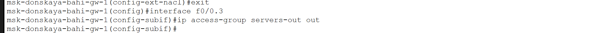
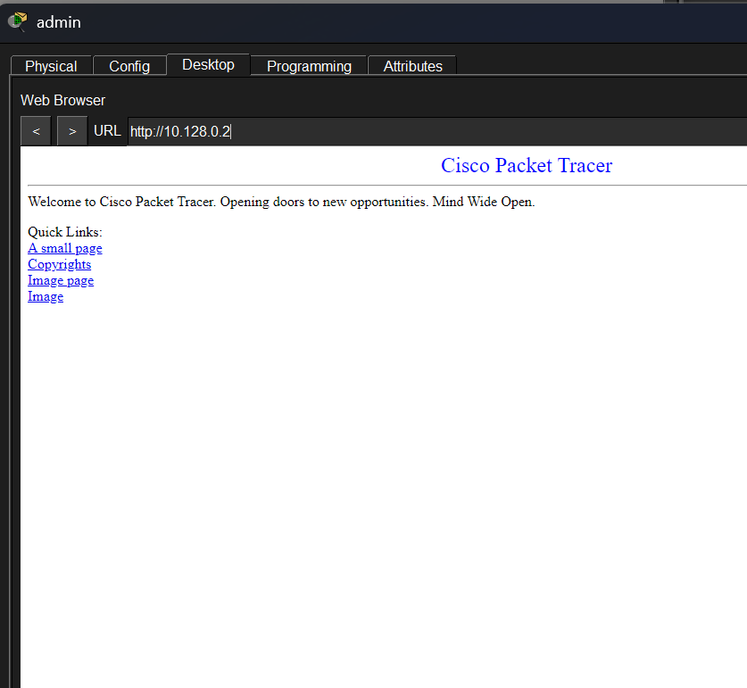
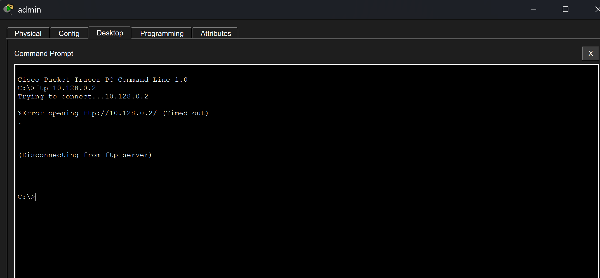
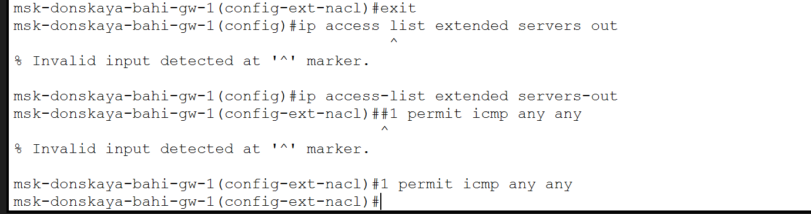
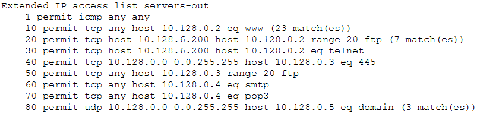
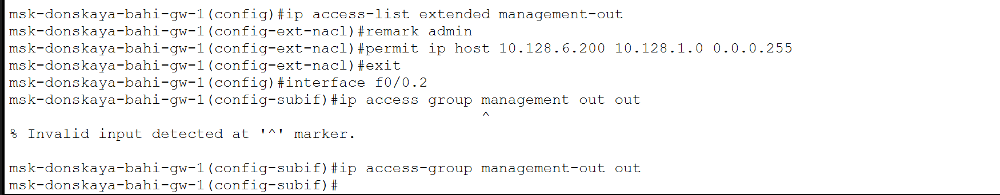

---
## Author
author:
  name: бахи сиди али темассини
  degrees: Student (3 курс)
  orcid: ""
  email: 1032234211@rudn.ru
  affiliation:
    - name: Российский университет дружбы народов
      country: Российская Федерация
      postal-code: 117198
      city: Москва
      address: ул. Миклухо-Маклая, д. 6
      
## Title
title: Лабораторная работа №10
subtitle: Администрирование локальных сетей
license: CC BY
date: today
date-format: "YYYY-MM-DD" # Example: 2025-09-06
---

# Информация

## Докладчик

:::::::::::::: {.columns align=center}
::: {.column width="70%"}

  - бахи сиди али темассини
  - Российский университет дружбы народов
  - [GitHub]

:::

:::
::::::::::::::

# Цель работы

- Освоение настройки прав доступа пользователей к ресурсам сети

# Выполнение лабораторной работы

## Анализ топологии сети

- Добавлен ноутбук администратора в сеть
- Подключён к коммутатору для настройки доступа

{#fig-1 width=70%}

## Настройка IP-параметров администратора

- Назначен IP-адрес: 10.128.6.200
- Установлена маска: 255.255.255.0
- Задан шлюз: 10.128.6.1
- Указан DNS: 10.128.0.5

{#fig-2 width=70%}

## Создание ACL для web-сервера

- Создан расширенный ACL: servers-out
- Добавлено правило разрешения HTTP (TCP 80)
- Указан адрес сервера: 10.128.0.2

{#fig-3 width=70%}

## Привязка ACL к интерфейсу маршрутизатора

- Выбран подинтерфейс: f0/0.3
- Применён ACL servers-out
- Направление: исходящий трафик (out)

{#fig-4 width=70%}

## Проверка доступа к web-серверу

- Открыт браузер на клиенте
- Введён IP-адрес сервера
- Проверен доступ по HTTP

{#fig-5 width=70%}

## Настройка дополнительных прав администратора

- Добавлено правило FTP для администратора
- Добавлено правило Telnet для администратора
- Указан IP администратора: 10.128.6.200

{#fig-6 width=70%}

## Проверка FTP-доступа администратора

- Выполнено подключение по FTP
- Указан адрес сервера
- Успешная аутентификация

{#fig-7 width=70%}

## Проверка ограничения доступа для пользователей

- Выполнена попытка FTP с обычного ПК
- Соединение не установлено
- Доступ ограничен ACL

{#fig-8 width=70%}

## Настройка доступа к файловому серверу

- Добавлено правило SMB (порт 445)
- Разрешён доступ внутренней сети
- Разрешён FTP для всех

{#fig-9 width=70%}

## Настройка доступа к почтовому серверу

- Разрешён SMTP
- Разрешён POP3
- Указан адрес сервера: 10.128.0.4

{#fig-10 width=70%}

## Настройка доступа к DNS-серверу

- Разрешён UDP порт 53
- Ограничение для внутренней сети
- Указан DNS сервер

{#fig-11 width=70%}

## Проверка доступа по доменному имени

- Введено доменное имя в браузере
- Проверено разрешение DNS
- Доступ к web-серверу выполнен

{#fig-12 width=70%}

## Разрешение ICMP-трафика

- Добавлено правило ICMP
- Размещено в начале ACL
- Используется для проверки доступности

{#fig-13 width=70%}

## Проверка списка ACL

- Выполнена команда show access-lists
- Отображены правила ACL
- Показано количество совпадений

{#fig-14 width=70%}

## Ограничение доступа для сети Other

- Создан ACL other-in
- Разрешён доступ только администратору
- Применён к интерфейсу f0/0.104

{#fig-15 width=70%}

## Ограничение доступа к сети управления

- Создан ACL management-out
- Разрешён доступ только администратору
- Применён к интерфейсу f0/0.2

{#fig-16 width=70%}

# Выводы

- Настроены расширенные списки ACL
- Разграничены права доступа пользователей
- Реализована фильтрация по протоколам и портам
- Обеспечена изоляция сетей
- Предоставлены административные привилегии одному устройству

