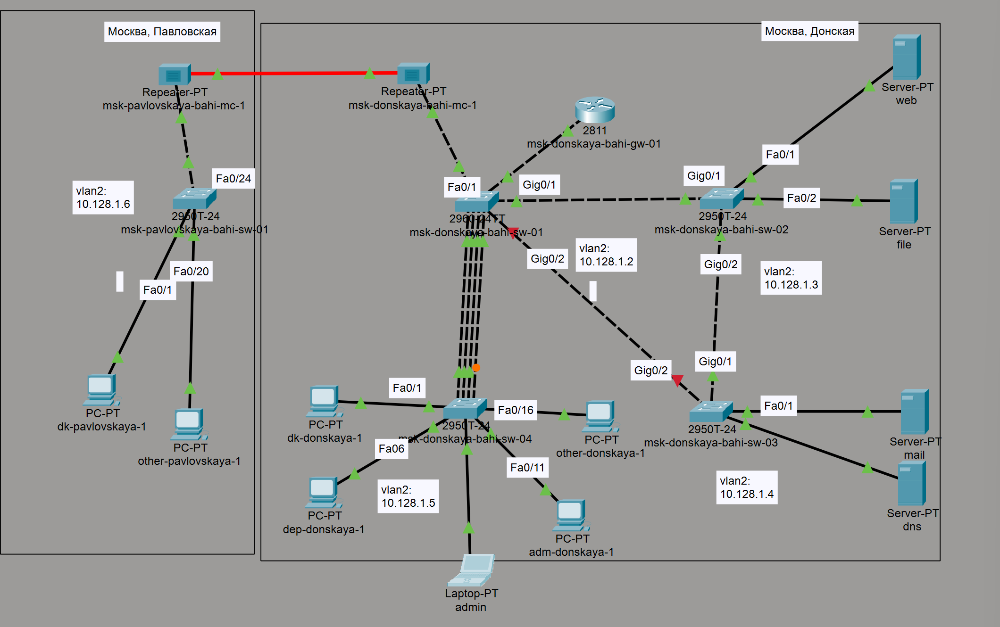
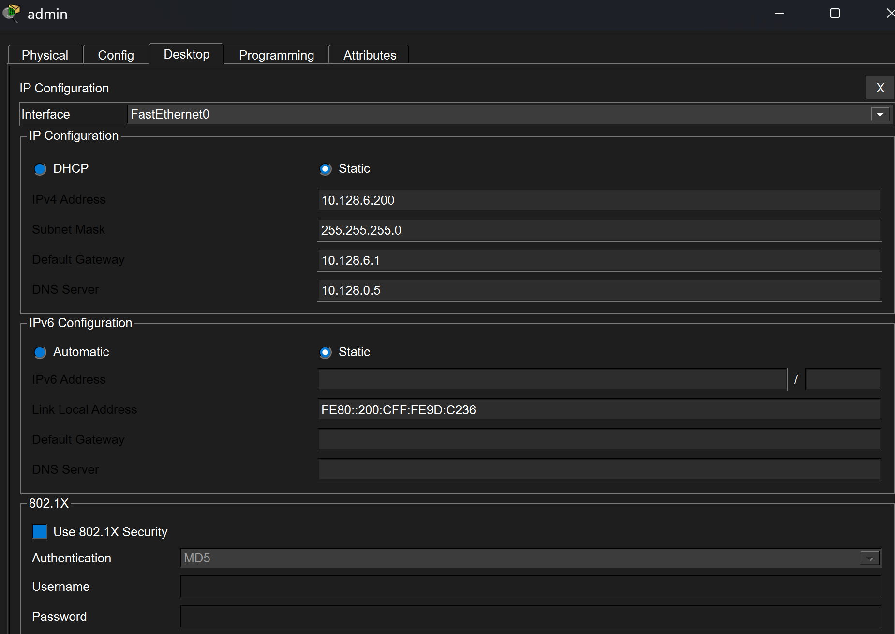
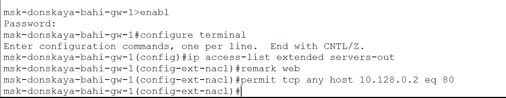
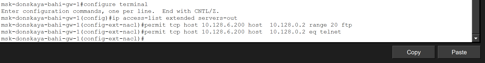
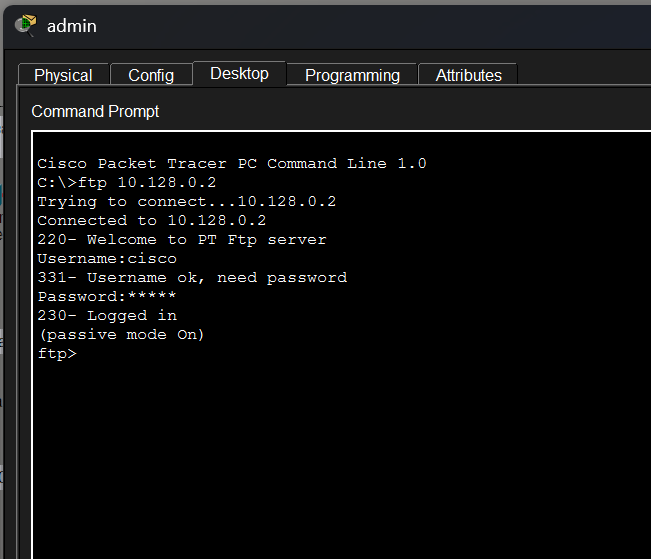
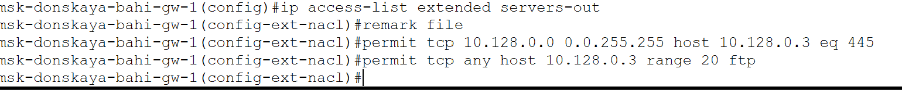
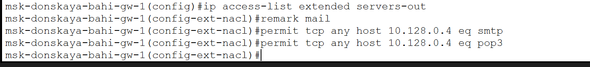
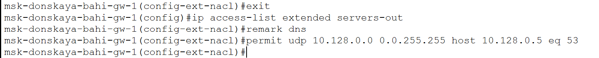
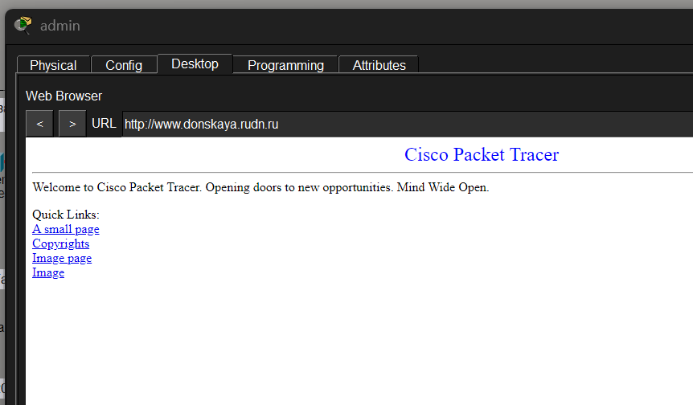
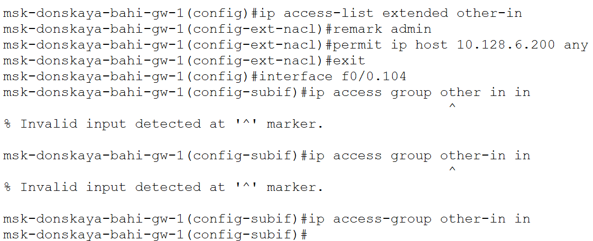

---
## Author
author:
  name: бахи сиди али темассини
  degrees: Student (3 курс)
  orcid: ""
  email: 1032234211@rudn.ru
  affiliation:
    - name: Российский университет дружбы народов
      country: Российская Федерация
      postal-code: 117198
      city: Москва
      address: ул. Миклухо-Маклая, д. 6

## Title
title: "Отчёт по лабораторной работе №10"
subtitle: "Администрирование локальных сетей"
license: "CC BY"
---

# Цель работы

  Освоить настройку прав доступа пользователей к ресурсам сети

# Выполнение лабораторной работы


**Настройка списков управления доступом (ACL)**


## Анализ топологии сети

На первом этапе в сеть был добавлен ноутбук администратора и подключён к коммутатору для дальнейшей настройки прав доступа ([рис. @fig-1]) [@tetz2011].

{#fig-1 width=70%}


## Настройка IP-параметров администратора

На ноутбуке администратора был задан статический IP-адрес 10.128.6.200, маска 255.255.255.0, шлюз 10.128.6.1 и DNS-сервер 10.128.0.5. Это необходимо для предоставления административных прав доступа ([рис. @fig-2]) [@odom2017].

{#fig-2 width=70%}


## Создание ACL для web-сервера

На маршрутизаторе был создан расширенный список доступа servers-out и добавлено правило разрешения HTTP-трафика (порт 80 TCP) ко web-серверу с адресом 10.128.0.2 ([рис. @fig-3]) [@tanenbaum2016].

{#fig-3 width=70%}


## Привязка ACL к интерфейсу маршрутизатора

ACL servers-out был применён к подинтерфейсу f0/0.3 в направлении исходящего трафика. Это обеспечивает фильтрацию пакетов, направляемых к сети серверов ([рис. @fig-4]) [@odom2017].

{#fig-4 width=70%}


## Проверка доступа к web-серверу

С клиентского устройства выполнено обращение к web-серверу по IP-адресу через браузер. Доступ по HTTP успешно установлен, что подтверждает корректность настройки ACL ([рис. @fig-5]) [@tetz2011].

{#fig-5 width=70%}


## Настройка дополнительных прав администратора

В ACL были добавлены правила, разрешающие администратору (10.128.6.200) доступ к web-серверу по протоколам FTP и Telnet. Это обеспечивает расширенные права управления ([рис. @fig-6]) [@odom2016].

{#fig-6 width=70%}


## Проверка FTP-доступа администратора

С устройства администратора выполнено подключение к web-серверу по FTP. Аутентификация прошла успешно, что подтверждает корректность настроенных правил ([рис. @fig-7]) [@rfc2131].

{#fig-7 width=70%}


## Проверка ограничения доступа для пользователей

С обычного клиентского устройства попытка FTP-подключения завершилась ошибкой. Это подтверждает, что доступ ограничен согласно ACL ([рис. @fig-8]) [@tanenbaum2016].

{#fig-8 width=70%}


## Настройка доступа к файловому серверу

В список servers-out добавлены правила для файлового сервера (10.128.0.3), разрешающие доступ по SMB (порт 445) для внутренней сети и FTP для всех пользователей ([рис. @fig-9]) [@odom2017].

{#fig-9 width=70%}


## Настройка доступа к почтовому серверу

Добавлены правила разрешения SMTP и POP3 для почтового сервера (10.128.0.4), что обеспечивает работу почтовых сервисов ([рис. @fig-10]) [@tanenbaum2016].

{#fig-10 width=70%}


## Настройка доступа к DNS-серверу

Добавлено правило разрешения UDP-трафика на порт 53 к DNS-серверу (10.128.0.5) для внутренней сети ([рис. @fig-11]) [@rfc2131].

{#fig-11 width=70%}


## Проверка доступа по доменному имени

Проверено обращение к web-серверу по доменному имени [www.donskaya.rudn.ru](http://www.donskaya.rudn.ru). Успешное открытие страницы подтверждает корректную работу DNS ([рис. @fig-12]) [@tetz2011].

{#fig-12 width=70%}


## Разрешение ICMP-трафика

В начало ACL добавлено правило разрешения ICMP для диагностики сети и проверки доступности узлов ([рис. @fig-13]) [@tanenbaum2016].

{#fig-13 width=70%}


## Проверка списка ACL

С помощью команды show access-lists был получен полный список правил ACL с указанием количества совпадений, что подтверждает их применение ([рис. @fig-14]) [@odom2017].

{#fig-14 width=70%}


## Ограничение доступа для сети Other

Создан ACL other-in, разрешающий полный доступ только администратору и применён к входящему трафику интерфейса f0/0.104 ([рис. @fig-15]) [@odom2016].

{#fig-15 width=70%}


## Ограничение доступа к сети управления

Создан ACL management-out, разрешающий доступ к сети управления только администратору, и применён к интерфейсу f0/0.2 ([рис. @fig-16]) [@odom2017].

{#fig-16 width=70%}


## Выводы

В ходе работы были настроены расширенные списки управления доступом, обеспечивающие разграничение прав пользователей в сети. Реализованы правила фильтрации по протоколам и портам, а также обеспечена изоляция сетей и предоставление административных привилегий только одному устройству.

# Ответы на контрольные вопросы


## Как задать действие правила для конкретного протокола?

Действие правила для конкретного протокола задаётся при создании записи в расширенном ACL с указанием типа протокола в команде.

Общий синтаксис:

```bash
permit | deny <protocol> <source> <destination>
```

Пример:

```bash
permit tcp any host 10.128.0.2 eq 80
```

Здесь:

* `tcp` — указание конкретного протокола,
* правило применяется только к TCP-трафику.

Аналогично можно использовать:

* `udp` — для UDP,
* `icmp` — для ICMP,
* `ip` — для всех протоколов IP.


## Как задать действие правила сразу для нескольких портов?

Для задания действия сразу для нескольких портов используются ключевые слова:

* `range` — диапазон портов,
* `eq` — один порт,
* `gt` / `lt` — больше/меньше указанного порта.

Пример для диапазона:

```bash
permit tcp host 10.128.6.200 host 10.128.0.2 range 20 21
```

Здесь правило применяется сразу к портам:

* 20
* 21

Пример для одного порта:

```bash
permit tcp any host 10.128.0.4 eq 25
```


## Как узнать номер правила в списке прав доступа?

Номер правила отображается при выводе списка ACL с помощью команды:

```bash
show access-lists
```

В выводе каждая строка имеет порядковый номер, например:

```
10 permit tcp any host 10.128.0.2 eq 80
20 permit tcp any host 10.128.0.3 eq 445
```

Эти номера используются для:

* идентификации правил,
* изменения или удаления конкретного правила.


## Каким образом можно изменить порядок применения правил в списке контроля доступа?

Порядок применения правил определяется их номерами и обрабатывается сверху вниз до первого совпадения.

Изменение порядка возможно следующими способами:

### Добавление правила с указанием номера

```bash
ip access-list extended servers-out
5 permit icmp any any
```

Правило с номером `5` будет размещено выше правил с номерами `10`, `20` и т.д.


### Удаление и повторное добавление

```bash
no 20
20 permit tcp any host 10.128.0.2 eq 80
```

# Список литературы{.unnumbered}

::: {#refs}
:::
