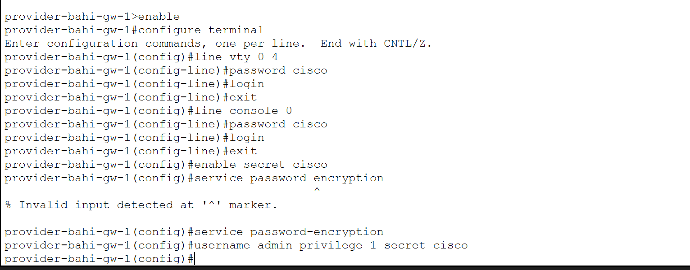
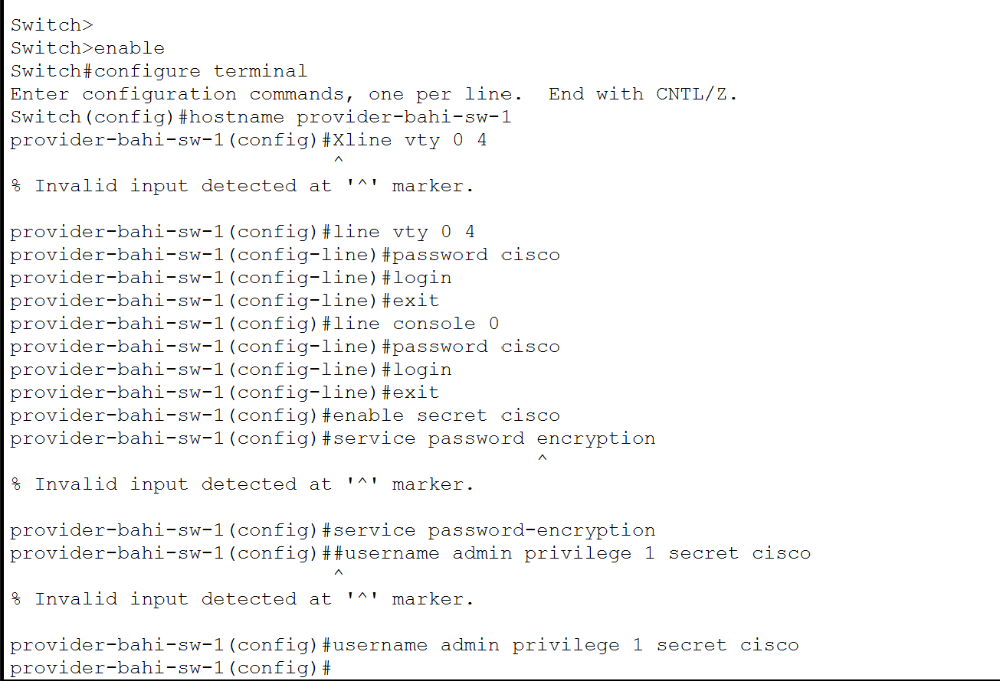
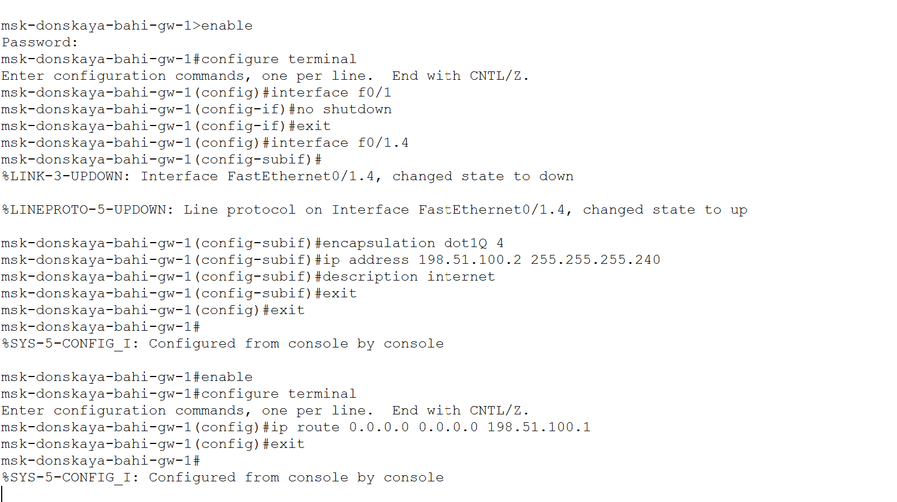
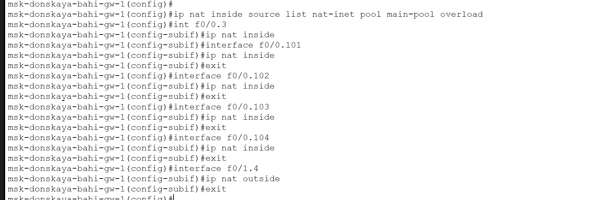
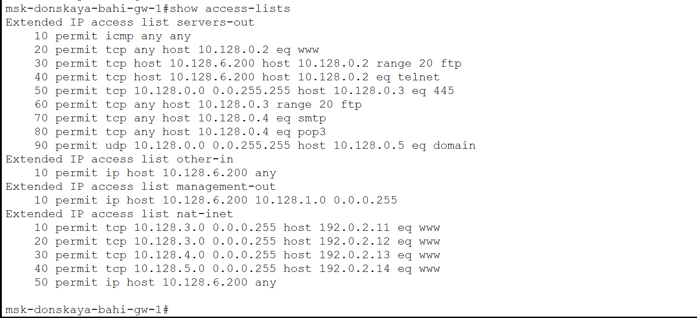
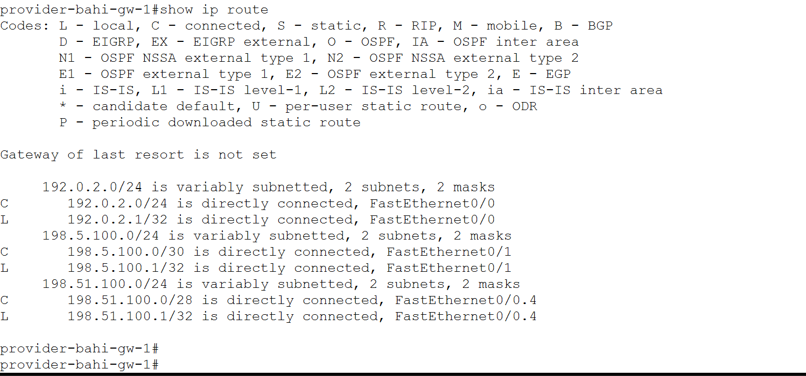

---
## Author
author:
  name: бахи сиди али темассини
  degrees: Student (3 курс)
  orcid: ""
  email: 1032234211@rudn.ru
  affiliation:
    - name: Российский университет дружбы народов
      country: Российская Федерация
      postal-code: 117198
      city: Москва
      address: ул. Миклухо-Маклая, д. 6
## Title
title: Лабораторная работа №12
subtitle: Администрирование локальных сетей
license: CC BY
date: today
date-format: "YYYY-MM-DD" # Example: 2025-09-06
---

# Информация

## Докладчик

:::::::::::::: {.columns align=center}
::: {.column width="70%"}

  - бахи сиди али темассини
  - Российский университет дружбы народов
  - [GitHub]

:::

:::
::::::::::::::

# Лабораторная работа №12. Настройка NAT

## Цель работы

- Освоение настройки доступа локальной сети к Интернет через NAT

# Выполнение лабораторной работы

## Первоначальная настройка маршрутизатора provider-gw-1

- Настроен доступ по паролю для VTY
- Настроен доступ по паролю для консоли
- Установлен enable secret
- Создан пользователь администратора

---

{#fig-1 width=70%}

## Первоначальная настройка коммутатора provider-sw-1

- Задано имя устройства
- Настроен доступ по VTY и консоли
- Включено шифрование паролей
- Создан пользователь администратора

---

{#fig-2 width=70%}

## Настройка интерфейсов маршрутизатора provider-gw-1

- Активирован интерфейс FastEthernet
- Создан подинтерфейс VLAN 4
- Назначен IP-адрес для NAT сети
- Настроен интерфейс выхода в Интернет

---

{#fig-3 width=70%}

## Настройка интерфейсов коммутатора provider-sw-1

- Интерфейсы переведены в режим trunk
- Создан VLAN 4
- Назначено имя VLAN nat
- Активирован интерфейс VLAN

---

{#fig-4 width=70%}

## Настройка интерфейсов маршрутизатора msk-donskaya-gw-1

- Активирован интерфейс подключения к провайдеру
- Создан подинтерфейс VLAN 4
- Назначен IP-адрес
- Настроен маршрут по умолчанию

---

{#fig-5 width=70%}

## Настройка пула NAT и списка доступа

- Создан пул внешних IP-адресов
- Настроен список доступа NAT
- Заданы правила для VLAN
- Ограничен доступ по условиям

---

{#fig-6 width=70%}

## Настройка NAT и интерфейсов

- Настроен PAT (overload)
- Применён список доступа
- Назначены inside интерфейсы
- Назначен outside интерфейс

---

{#fig-7 width=70%}

## Настройка статических правил NAT

- Настроен доступ к WEB-серверу
- Настроен доступ к файловому серверу
- Настроен доступ к почтовому серверу
- Настроен доступ по RDP

---

{#fig-8 width=70%}

## Проверка таблицы трансляций NAT

- Выполнена проверка NAT таблицы
- Обнаружены статические трансляции
- Обнаружены динамические трансляции
- Подтверждена работа NAT

---

{#fig-9 width=70%}

## Проверка статистики NAT

- Проверено количество трансляций
- Проверено использование пула
- Обнаружены активные соединения

---

{#fig-10 width=70%}

## Проверка списков доступа

- Проверены ACL правила
- Подтверждена фильтрация трафика
- Проверено соответствие условиям

---

{#fig-11 width=70%}

## Проверка таблицы маршрутизации

- Проверен маршрут по умолчанию
- Проверены подключённые сети
- Подтверждена корректная маршрутизация

---

{#fig-12 width=70%}

## Проверка состояния интерфейсов

- Проверено состояние интерфейсов
- Подтверждена их активность
- Проверена IP-адресация

---

{#fig-13 width=70%}

## Проверка маршрутизации на стороне провайдера

- Проверена таблица маршрутизации
- Обнаружен маршрут к внутренним сетям
- Подтверждена доступность сети

---

{#fig-14 width=70%}

# Выводы

- Настроен доступ к Интернет через NAT
- Реализован PAT с использованием пула адресов
- Ограничен доступ для VLAN по условиям
- Настроены статические правила NAT
- Подтверждена корректная работа сети
