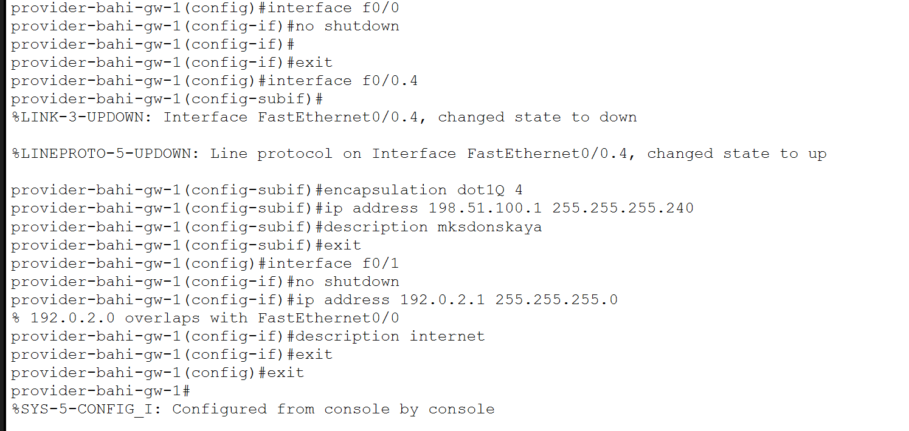
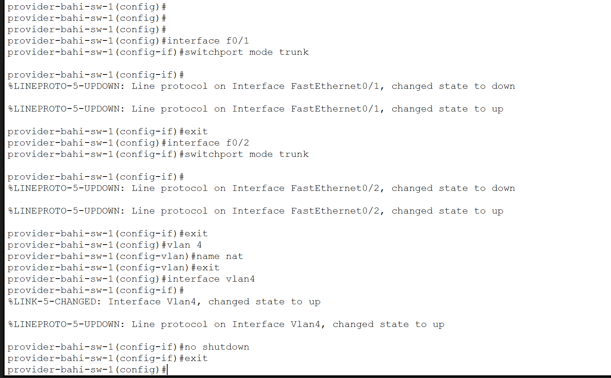
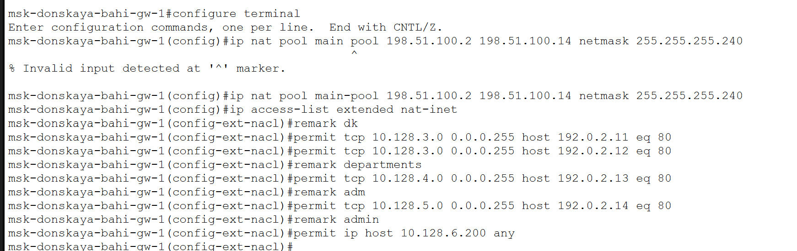
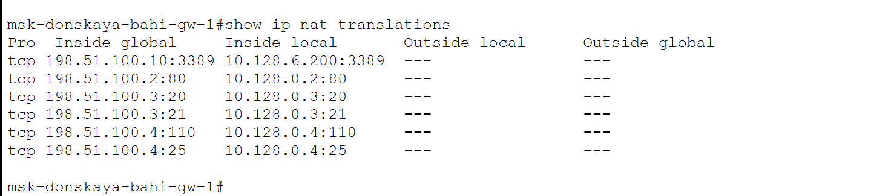
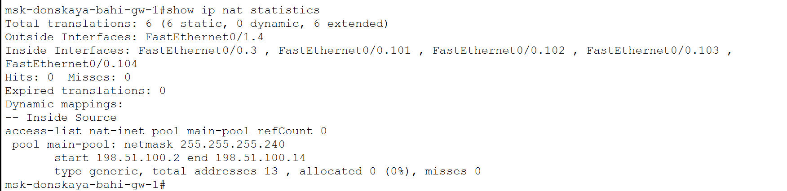
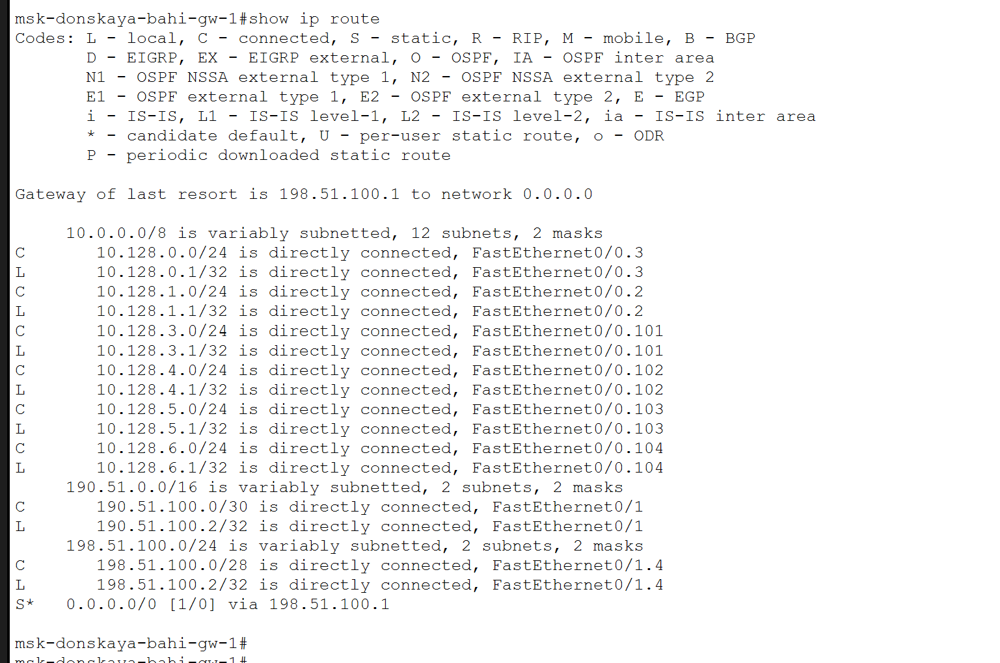
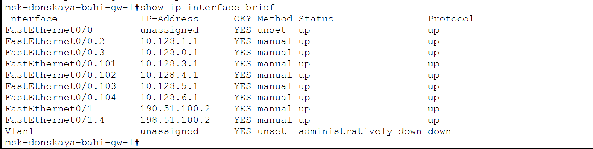

---
## Author
author:
  name: бахи сиди али темассини
  degrees: Student (3 курс)
  orcid: ""
  email: 1032234211@rudn.ru
  affiliation:
    - name: Российский университет дружбы народов
      country: Российская Федерация
      postal-code: 117198
      city: Москва
      address: ул. Миклухо-Маклая, д. 6

## Title
title: "Отчёт по лабораторной работе №12"
subtitle: "Администрирование локальных сетей"
license: "CC BY"
---

# Цель работы

Освоение практических навыков настройки доступа локальной сети к внешней сети Интернет с использованием технологии NAT .

# Выполнение лабораторной работы

## Первоначальная настройка маршрутизатора provider-gw-1

Выполнена базовая конфигурация маршрутизатора провайдера, включая настройку доступа по паролю для линий VTY и консоли, установку секретного пароля и создание пользователя администратора ([рис. @fig-1]).

{#fig-1 width=70%}

## Первоначальная настройка коммутатора provider-sw-1

На коммутаторе провайдера выполнена настройка имени устройства, линий VTY и консоли, а также включено шифрование паролей и создан пользователь администратора ([рис. @fig-2]).

{#fig-2 width=70%}

## Настройка интерфейсов маршрутизатора provider-gw-1

На маршрутизаторе настроены интерфейсы: активирован физический интерфейс, создан подинтерфейс с тегированием VLAN 4 и назначен IP-адрес для соединения с сетью NAT, а также настроен интерфейс для выхода в Интернет ([рис. @fig-3]).

{#fig-3 width=70%}

## Настройка интерфейсов коммутатора provider-sw-1

Интерфейсы коммутатора переведены в режим trunk, создан VLAN 4 с именем nat и активирован интерфейс VLAN для обеспечения связи с маршрутизатором ([рис. @fig-4]).

{#fig-4 width=70%}

## Настройка интерфейсов маршрутизатора msk-donskaya-gw-1

На маршрутизаторе локальной сети активирован интерфейс подключения к провайдеру, создан подинтерфейс VLAN 4 с назначением IP-адреса, а также настроен маршрут по умолчанию для выхода в Интернет ([рис. @fig-5]).

{#fig-5 width=70%}

## Настройка пула NAT и списка доступа

Создан пул внешних IP-адресов для NAT и настроен расширенный список доступа, определяющий правила выхода в Интернет для различных VLAN (дисплейные классы, кафедры, администрация и администратор) ([рис. @fig-6]).

{#fig-6 width=70%}

## Настройка NAT и интерфейсов

Настроен механизм PAT с использованием созданного пула адресов и списка доступа, а также определены внутренние и внешние интерфейсы для NAT ([рис. @fig-7]).

{#fig-7 width=70%}

## Настройка статических правил NAT

Настроены статические преобразования для публикации внутренних серверов: веб-сервера, файлового сервера, почтового сервера и удалённого доступа к компьютеру администратора ([рис. @fig-8]).

{#fig-8 width=70%}

## Проверка таблицы трансляций NAT

Выполнена проверка таблицы NAT, где отображаются как статические, так и динамические трансляции, что подтверждает корректную работу механизма NAT ([рис. @fig-9]).

{#fig-9 width=70%}

## Проверка статистики NAT

Проверена статистика NAT, показывающая количество трансляций, использование пула адресов и наличие активных соединений ([рис. @fig-10]).

{#fig-10 width=70%}

## Проверка списков доступа

Проверены списки контроля доступа, определяющие правила фильтрации трафика между сегментами сети и внешней сетью ([рис. @fig-11]).

{#fig-11 width=70%}

## Проверка таблицы маршрутизации

Выполнена проверка таблицы маршрутизации на маршрутизаторе локальной сети, подтверждающая наличие маршрута по умолчанию и подключённых сетей ([рис. @fig-12]).

{#fig-12 width=70%}

## Проверка состояния интерфейсов

Проверено состояние интерфейсов маршрутизатора, подтверждающее их активное состояние и корректную адресацию ([рис. @fig-13]).

{#fig-13 width=70%}

## Проверка маршрутизации на стороне провайдера

Проверена таблица маршрутизации маршрутизатора провайдера, подтверждающая наличие маршрута к внутренним сетям организации ([рис. @fig-14]).

{#fig-14 width=70%}

# Выводы

В ходе лабораторной работы была выполнена настройка доступа локальной сети к внешней сети с использованием технологии NAT. Реализовано преобразование адресов с применением пула внешних IP-адресов и механизма PAT, что обеспечило выход внутренних узлов в Интернет .

Были настроены расширенные списки доступа, ограничивающие доступ различных VLAN к внешним ресурсам в соответствии с заданными условиями. Также реализованы статические преобразования NAT для публикации внутренних серверов и обеспечения удалённого доступа к компьютеру администратора.

Проверка таблиц трансляций, статистики NAT и маршрутизации подтвердила корректную работу настроенной схемы.

::: {#refs}
:::
