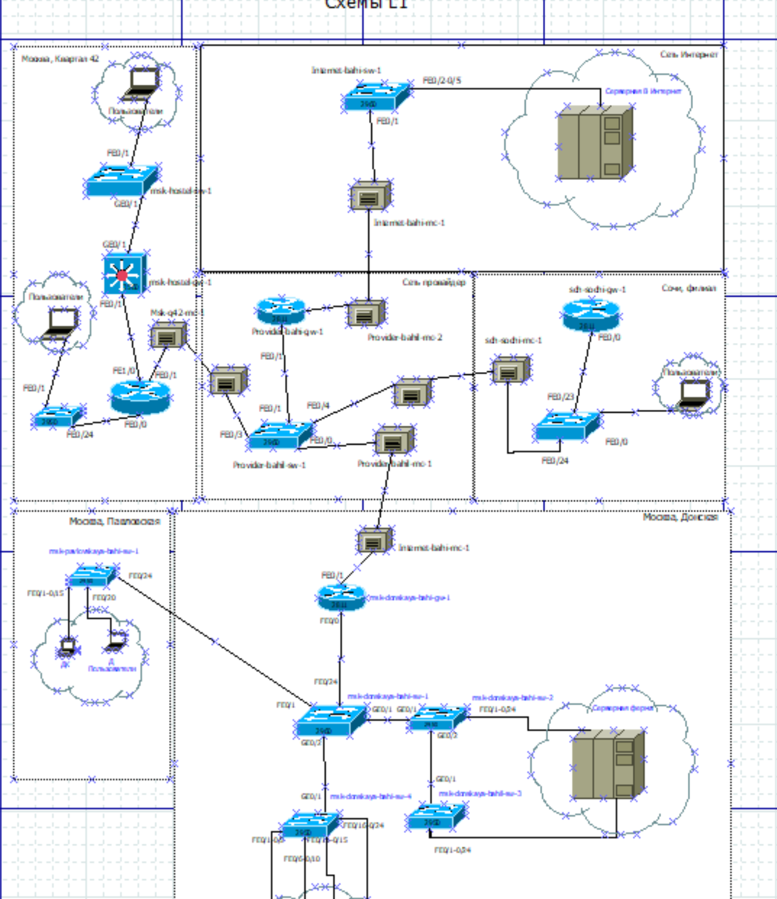
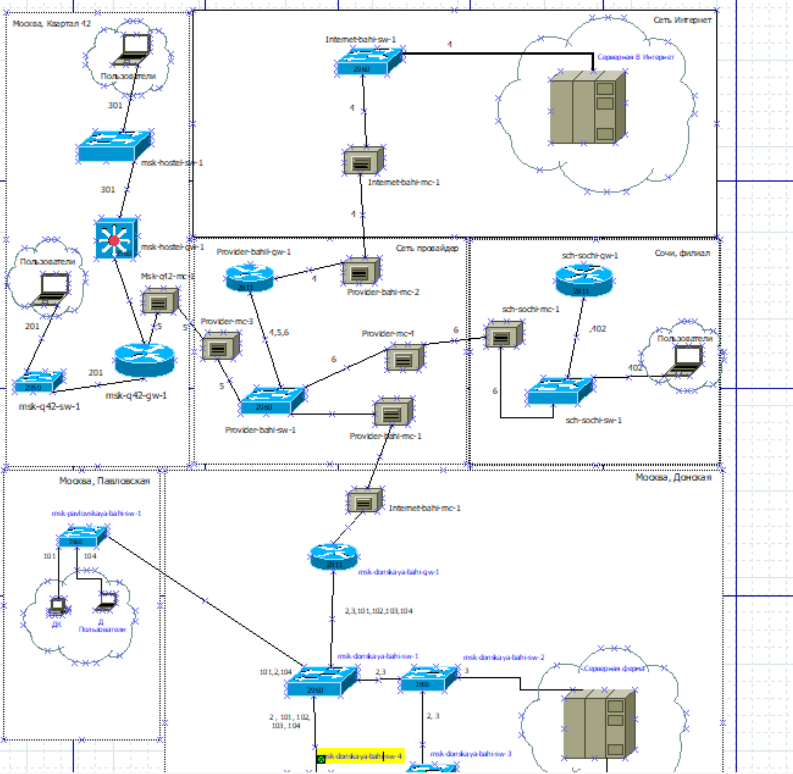
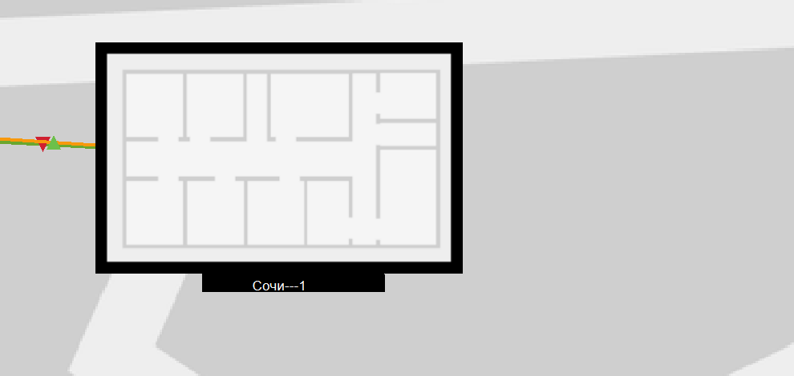
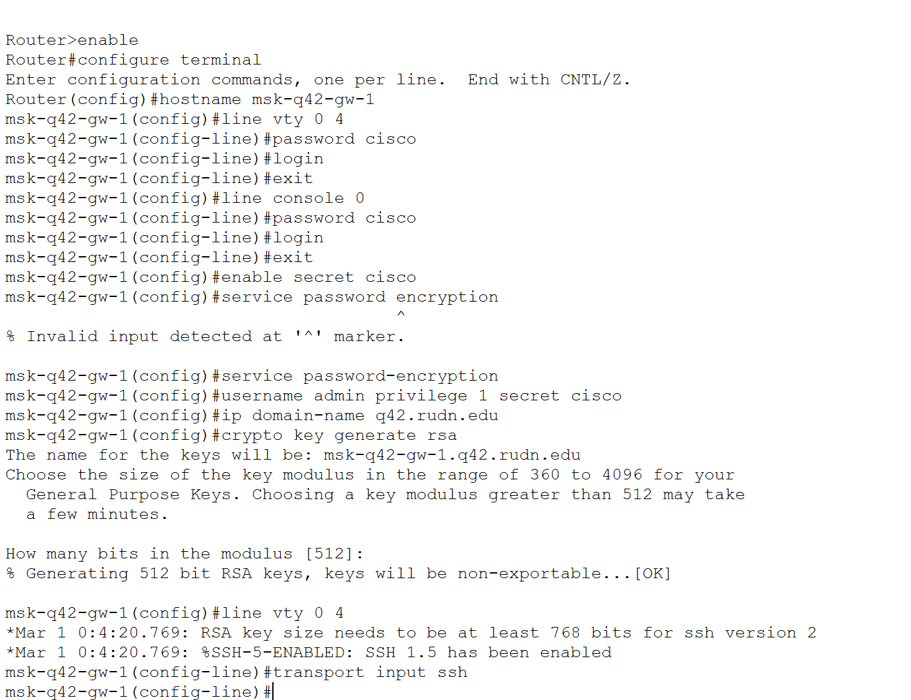
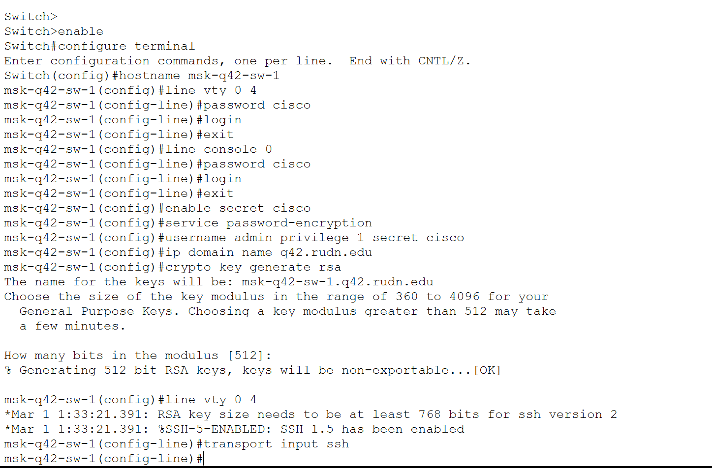
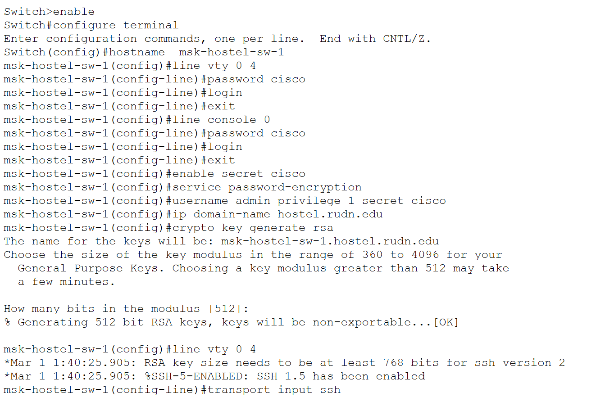
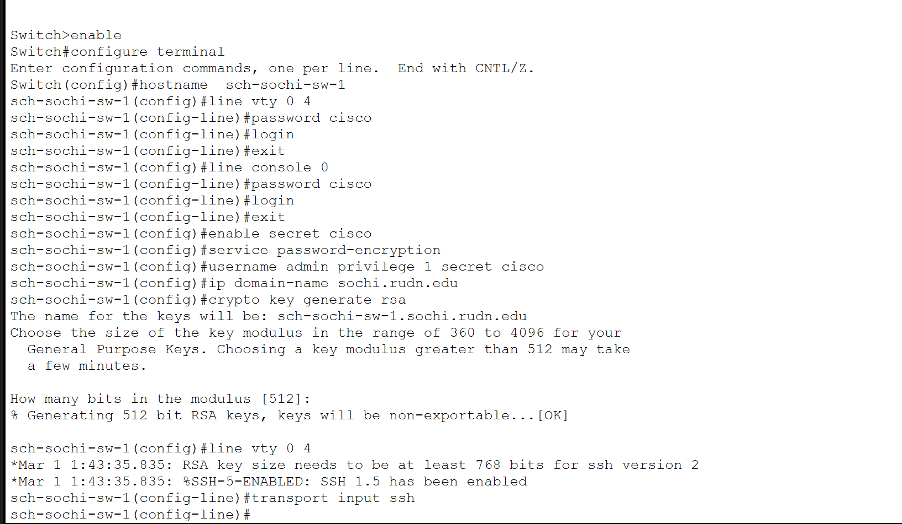
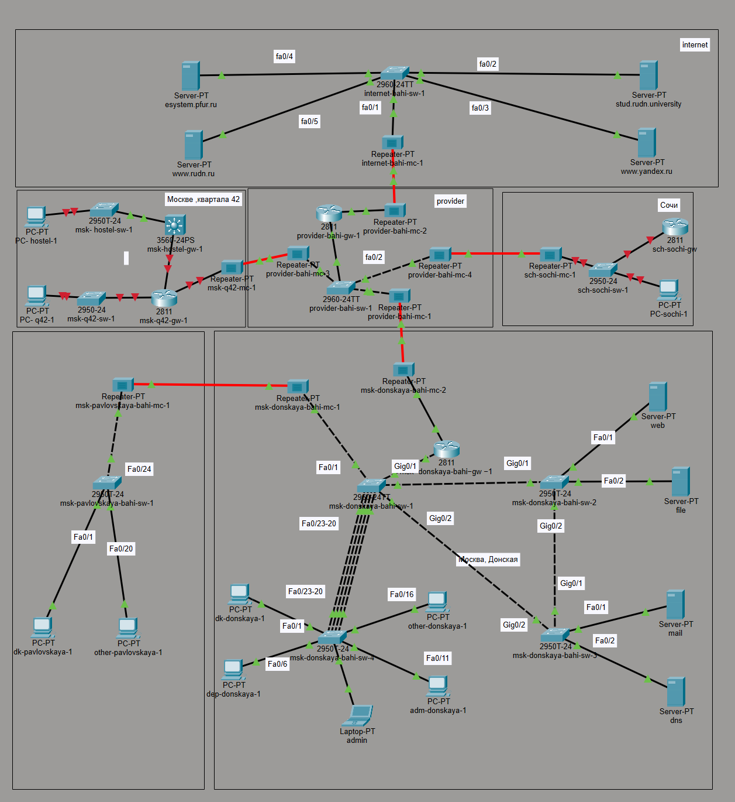

---
## Author
author:
  name: бахи сиди али темассини
  degrees: Student (3 курс)
  orcid: ""
  email: 1032234211@rudn.ru
  affiliation:
    - name: Российский университет дружбы народов
      country: Российская Федерация
      postal-code: 117198
      city: Москва
      address: ул. Миклухо-Маклая, д. 6
## Title
title: Лабораторная работа №13
subtitle: Администрирование локальных сетей
license: CC BY
date: today
date-format: "YYYY-MM-DD" # Example: 2025-09-06
---

# Информация

## Докладчик

:::::::::::::: {.columns align=center}
::: {.column width="70%"}

  - Ибрахим Мохсейн Алькамаль
  - Российский университет дружбы народов
  - [GitHub]

:::
::::::::::::::

# Цель работы

- Подготовка локальной сети к подключению к Интернету
- Построение схем L1, L2 и L3
- Моделирование сети провайдера и сети Интернет в Cisco Packet Tracer

# Выполнение лабораторной работы

## Построение схемы L1 сети

- Сформирована схема L1 сети
- Добавлена сеть провайдера
- Добавлена модельная сеть Интернет
- Указаны маршрутизаторы, коммутаторы, медиаконвертеры и серверы
- Обозначены интерфейсы подключения

---

{#fig-1 width=70%}

## Построение схемы L2 сети

- Разработана схема L2 сети
- Указаны VLAN различных сегментов сети
- Отображены VLAN локальной сети
- Добавлены VLAN сети провайдера
- Показаны соединения с модельной сетью Интернет

---

{#fig-2 width=70%}

## Построение схемы L3 сети

- Построена схема L3 сети
- Настроена IP-адресация локальных сетей
- Указаны адреса каналов связи
- Использована подсеть 192.0.2.0/24 для Интернета
- Использована подсеть 198.51.100.0/28 для сети провайдера

---

{#fig-3 width=70%}

## Настройка медиаконвертеров

- Выполнена замена стандартных модулей
- Установлены модули PT-REPEATER-NM-1FFE
- Установлены модули PT-REPEATER-NM-1CFE
- Подготовено подключение Fast Ethernet и оптоволокна

---

{#fig-4 width=70%}

## Проверка интерфейсов маршрутизатора

- Проверена конфигурация интерфейсов маршрутизатора
- Проверены установленные сетевые модули
- Подтверждена готовность подключения к сети провайдера

---

{#fig-5 width=70%}

## Настройка физической рабочей области

- В физической области Packet Tracer добавлено здание Q42
- Организованы соединения между объектами
- Соединения выполнены по разработанной схеме сети

---

{#fig-6 width=70%}

## Создание здания филиала в Сочи

- Создано отдельное здание филиала в Сочи
- Подготовлено размещение оборудования удалённой сети

---

{#fig-7 width=70%}

## Соединение физических площадок

- Выполнено соединение площадок Moscow и Сочи
- Создана общая физическая топология сети

---

{#fig-8 width=70%}

## Первоначальная настройка маршрутизатора msk-q42-ealkamal-gw-1

- Назначено имя маршрутизатора
- Настроены пароли консоли и VTY
- Создан пользователь admin
- Настроен SSH-доступ
- Сгенерированы RSA-ключи

---

{#fig-9 width=70%}

## Первоначальная настройка коммутатора msk-q42-ealkamal-sw-1

- Настроен удалённый доступ
- Настроен консольный доступ
- Настроен SSH-доступ
- Выполнена генерация RSA-ключей

---

{#fig-10 width=70%}

## Настройка маршрутизатора msk-hostel-ealkamal-gw-1

- Настроено имя устройства
- Настроены пароли доступа
- Настроен SSH-доступ
- Выполнена генерация RSA-ключей

---

{#fig-11 width=70%}

## Настройка коммутатора msk-hostel-ealkamal-sw-1

- Настроен SSH-доступ
- Выполнено сохранение конфигурации
- Конфигурация сохранена в энергонезависимой памяти

---

{#fig-12 width=70%}

## Настройка коммутатора sch-sochi-ealkamal-sw-1

- Выполнена базовая настройка коммутатора
- Настроен SSH-доступ
- Сгенерированы RSA-ключи

---

{#fig-13 width=70%}

## Настройка маршрутизатора sch-sochi-ealkamal-gw-1

- Настроен SSH-доступ
- Выполнена настройка удалённого администрирования
- Сгенерированы RSA-ключи

---

{#fig-14 width=70%}

## Итоговая логическая топология сети

- Сформирована итоговая логическая топология
- Объединены локальные подсети
- Добавлена сеть провайдера
- Добавлена модельная сеть Интернет
- Подключены серверы и медиаконвертеры
- Настроены межсетевые соединения

---

{#fig-15 width=70%}

# Выводы

- Разработаны схемы L1, L2 и L3
- Выполнено моделирование сети провайдера
- Выполнено моделирование сети Интернет
- Размещено оборудование в физической области Packet Tracer
- Выполнена первоначальная настройка сетевых устройств
- Подготовлена инфраструктура для дальнейшей настройки NAT
