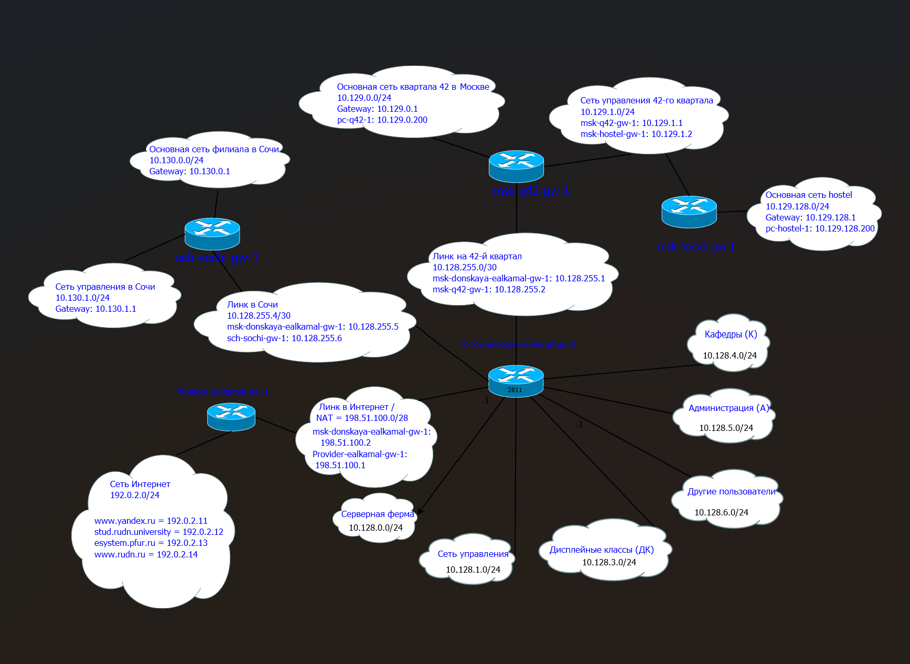
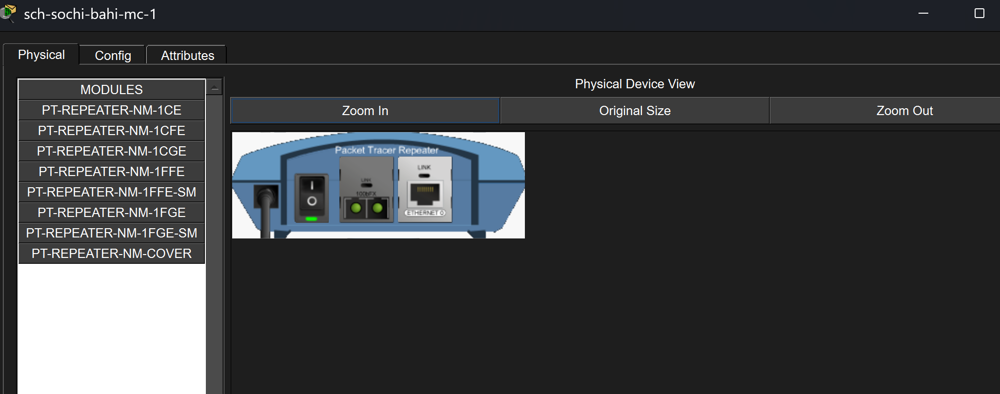
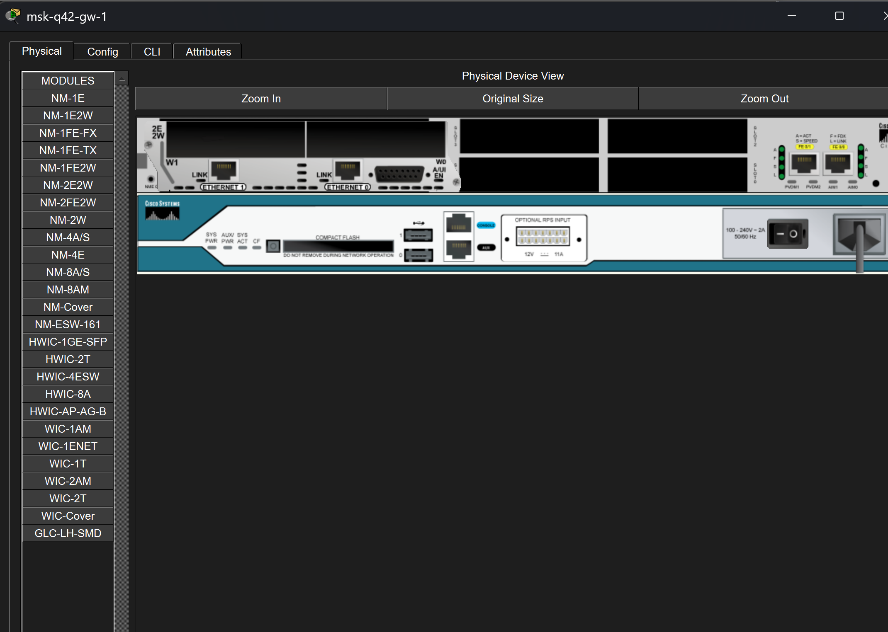
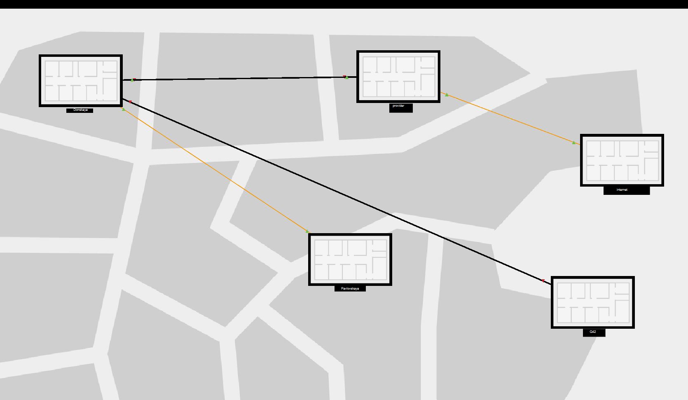
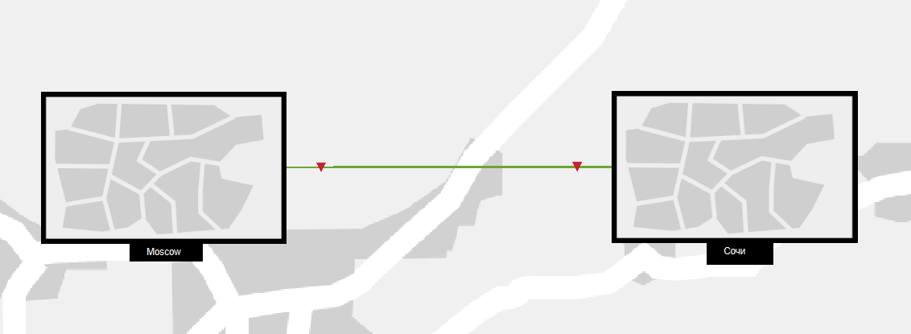
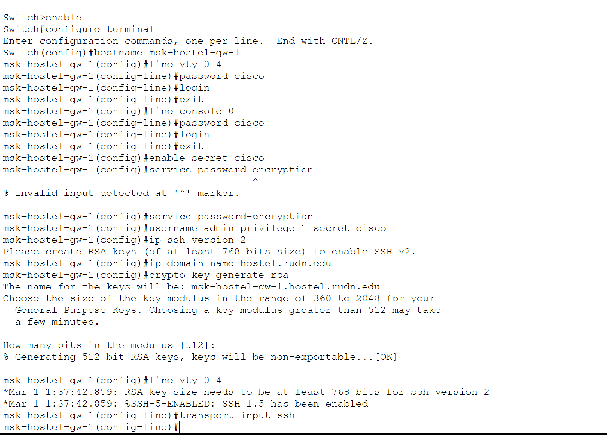
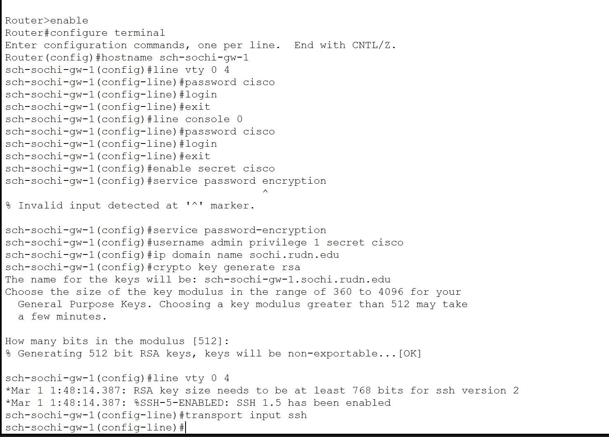

---
## Author
author:
  name: бахи сиди али темассини
  degrees: Student (3 курс)
  orcid: ""
  email: 1032234211@rudn.ru
  affiliation:
    - name: Российский университет дружбы народов
      country: Российская Федерация
      postal-code: 117198
      city: Москва
      address: ул. Миклухо-Маклая, д. 6

## Title
title: "Отчёт по лабораторной работе №13"
subtitle: "Администрирование локальных сетей"
license: "CC BY"
---

# Цель работы

Провести подготовительные мероприятия по подключению локальной сети организации к сети Интернет посредством построения схем L1, L2 и L3, а также моделирования сети провайдера и сети Интернет в Cisco Packet Tracer [@packettracer2014] [@rfc5735] [@odom2017].

# Выполнение лабораторной работы

## Построение схемы L1 сети

На первом этапе была сформирована схема L1, включающая локальную сеть «Донская», сеть провайдера и модельную сеть Интернет. На схеме указаны соединения между маршрутизаторами, коммутаторами, медиаконвертерами и серверами, а также обозначены используемые интерфейсы подключения ([рис. @fig-1]). [@ieee8021d2004] [@ieee8021q] [@korolkova2014]

{#fig-1 width=70%}

## Построение схемы L2 сети

Была разработана схема L2 с указанием VLAN для различных сегментов сети. На схеме отображены VLAN локальной сети, сети провайдера и соединения с модельной сетью Интернет ([рис. @fig-2]). [@ieee8021q] [@clark2003] [@odom2001]

{#fig-2 width=70%}

## Построение схемы L3 сети

Далее была построена схема L3, содержащая IP-адресацию локальных сетей, каналов связи и модельной сети Интернет. Для модельной сети Интернета использована подсеть 192.0.2.0/24, а для соединения с провайдером — подсеть 198.51.100.0/28 ([рис. @fig-3]). [@rfc5735] [@rfc2328] [@olifer2017]

{#fig-3 width=70%}

## Настройка медиаконвертеров

На медиаконвертерах были заменены стандартные модули на PT-REPEATER-NM-1FFE и PT-REPEATER-NM-1CFE для обеспечения подключения по Fast Ethernet и оптоволоконной линии связи ([рис. @fig-4]). [@packettracer2014] [@korolkova2012labs]

{#fig-4 width=70%}

## Проверка интерфейсов маршрутизатора

На маршрутизаторе msk-q42-gw-1 была проверена конфигурация физических интерфейсов и установленных сетевых модулей для подключения к сети провайдера ([рис. @fig-5]). [@neumann2009] [@odom2016]

{#fig-5 width=70%}

## Настройка физической рабочей области

В физической рабочей области Packet Tracer были добавлены здания  Q42 после чего между ними были организованы соединения согласно разработанной схеме сети ([рис. @fig-6]). [@packettracer2014] [@korolkova2009]

{#fig-6 width=70%}

## Создание здания филиала в Сочи

В физической области Packet Tracer было создано отдельное здание филиала в Сочи для размещения оборудования удалённой сети ([рис. @fig-7]). [@packettracer2014]

{#fig-7 width=70%}

## Соединение физических площадок

После размещения объектов было выполнено соединение физических площадок Moscow и Сочи в общей физической топологии Packet Tracer ([рис. @fig-8]). [@korolkova2014] [@tanenbaum2016]

{#fig-8 width=70%}

## Первоначальная настройка маршрутизатора msk-q42-ealkamal-gw-1

На маршрутизаторе msk-q42-ealkamal-gw-1 была выполнена базовая настройка: назначено имя устройства, настроены пароли для консоли и удалённого доступа, создан пользователь admin, настроен SSH-доступ и сгенерированы RSA-ключи ([рис. @fig-9]). [@odom2017] [@tetz2011]

{#fig-9 width=70%}

## Первоначальная настройка коммутатора msk-q42-ealkamal-sw-1

На коммутаторе msk-q42-ealkamal-sw-1 была выполнена настройка удалённого доступа, консольного доступа и SSH-подключения с использованием RSA-ключей ([рис. @fig-10]). [@clark2003] [@odom2001]

{#fig-10 width=70%}

## Настройка маршрутизатора msk-hostel-ealkamal-gw-1

На маршрутизаторе msk-hostel-ealkamal-gw-1 была произведена настройка имени устройства, паролей доступа и SSH-подключения ([рис. @fig-11]). [@neumann2009] [@tetz2011]

{#fig-11 width=70%}

## Настройка коммутатора msk-hostel-ealkamal-sw-1

На коммутаторе msk-hostel-ealkamal-sw-1 была выполнена настройка SSH-доступа, а также сохранение конфигурации в энергонезависимую память устройства ([рис. @fig-12]). [@odom2016] [@korolkova2012lecture]

{#fig-12 width=70%}

## Настройка коммутатора sch-sochi-ealkamal-sw-1

На коммутаторе sch-sochi-ealkamal-sw-1 была произведена базовая настройка доступа по SSH и генерация RSA-ключей ([рис. @fig-13]). [@odom2017] [@packettracer2014]

{#fig-13 width=70%}

## Настройка маршрутизатора sch-sochi-ealkamal-gw-1

На маршрутизаторе sch-sochi-ealkamal-gw-1 была выполнена настройка SSH-доступа и параметров удалённого администрирования ([рис. @fig-14]). [@neumann2009] [@tetz2011]

{#fig-14 width=70%}

## Итоговая логическая топология сети

В результате выполнения лабораторной работы была сформирована итоговая логическая топология сети, включающая локальные подсети, сеть провайдера, модельную сеть Интернет, медиаконвертеры, серверы и межсетевые соединения ([рис. @fig-15]). [@ieee8021d2004] [@ieee8021q] [@korolkova2014] [@kurose2016]

{#fig-15 width=70%}

# Выводы

В ходе лабораторной работы были разработаны схемы L1, L2 и L3 сети, выполнено моделирование сети провайдера и модельного Интернета, произведено размещение оборудования в физической рабочей области Packet Tracer, а также выполнена первоначальная настройка сетевых устройств и подготовка инфраструктуры для последующей настройки NAT [@natorder] [@natfaqru] [@natfaqru2].

# Контрольные вопросы

### 1. В каких случаях следует использовать статическую маршрутизацию?

- При небольшом размере сети
- При простой топологии сети
- Когда маршруты редко изменяются
- Для повышения контроля над маршрутизацией
- При соединении отдельных филиалов
- При отсутствии необходимости в динамических протоколах маршрутизации

### Примеры

- Соединение локальной сети с сетью провайдера
- Маршрутизация между двумя маршрутизаторами
- Подключение удалённого филиала через один фиксированный маршрут

### 2. Укажите основные принципы статической маршрутизации между VLANs

- Каждая VLAN использует отдельную IP-подсеть
- Для маршрутизации используется маршрутизатор или L3-коммутатор
- На маршрутизаторе создаются субинтерфейсы
- Для каждого субинтерфейса назначается VLAN и IP-адрес шлюза
- Между коммутатором и маршрутизатором используется trunk-соединение
- Маршруты между VLAN задаются вручную администратором сети

# Список литературы{.unnumbered}

::: {#refs}
:::
