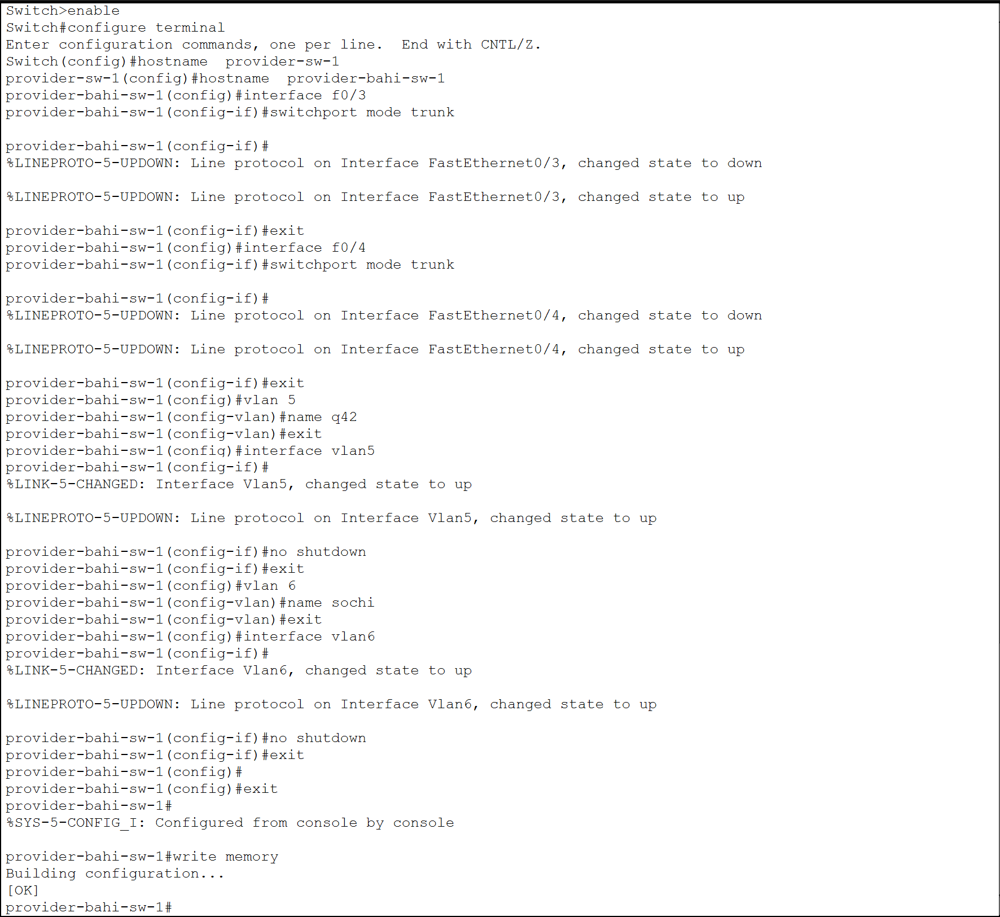
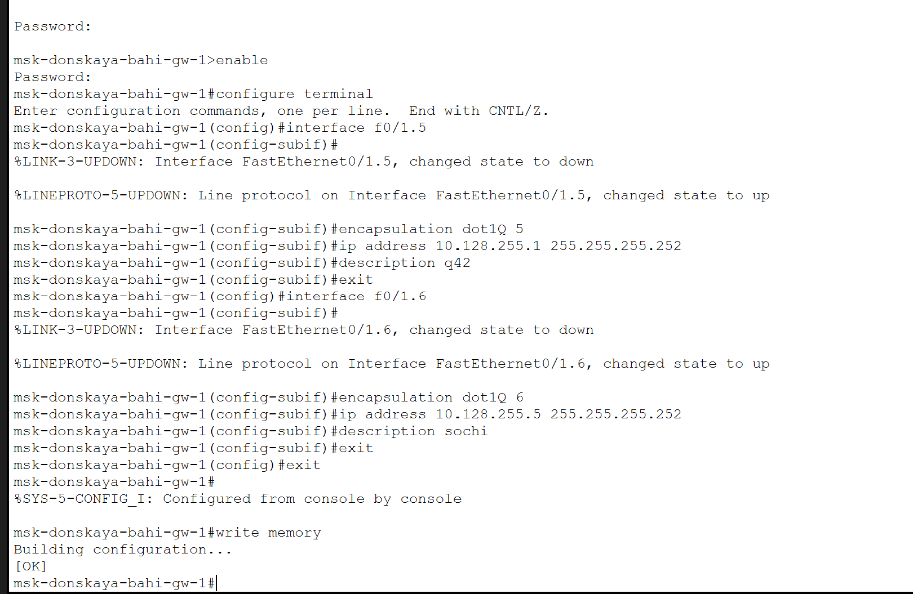
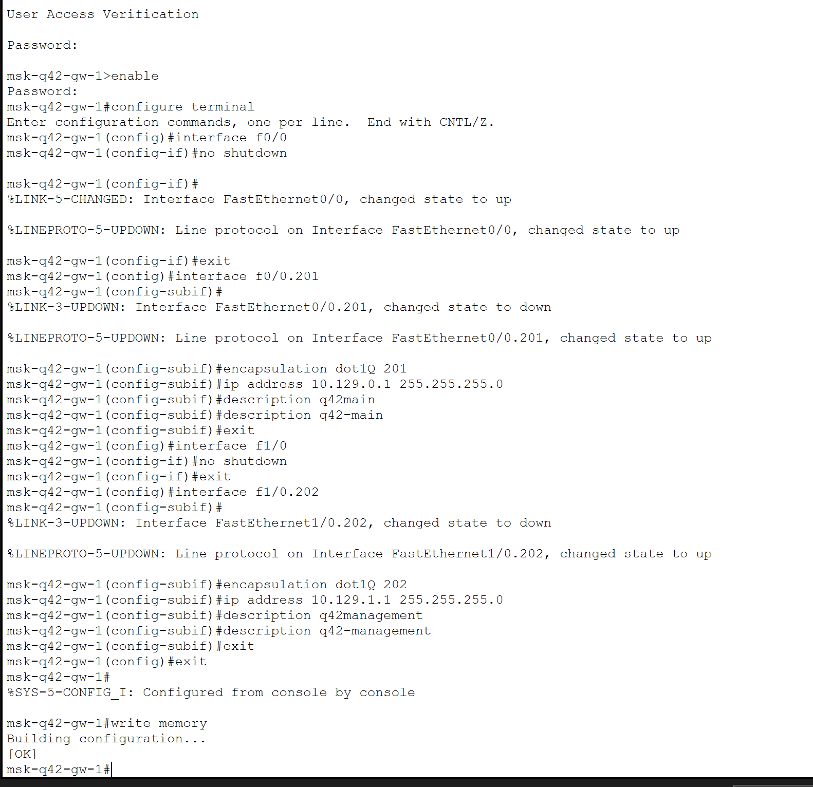
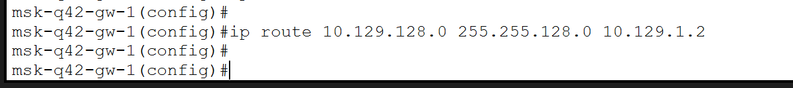
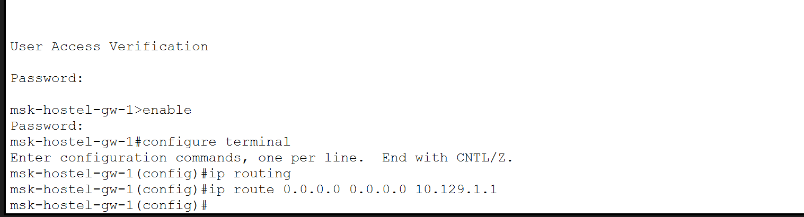
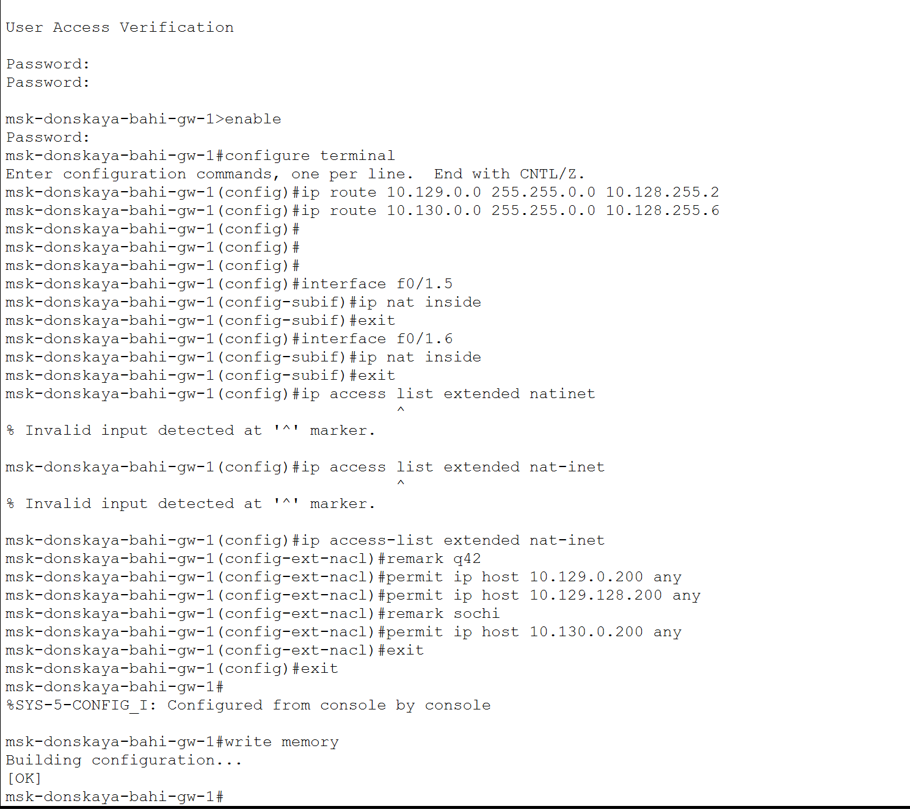
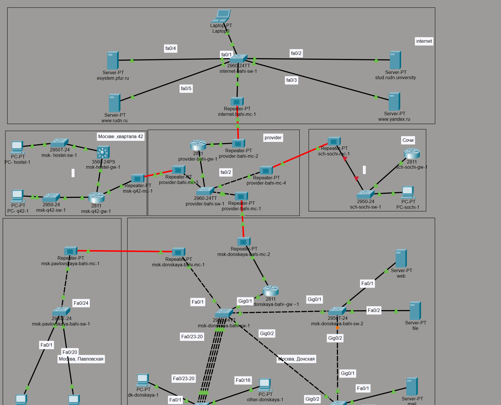

---
## Author
author:
  name:  бахи сиди али темассини
  degrees: Student (3 курс)
  orcid: ""
  email: 1032234211@rudn.ru
  affiliation:
    - name: Российский университет дружбы народов
      country: Российская Федерация
      postal-code: 117198
      city: Москва
      address: ул. Миклухо-Маклая, д. 6
## Title
title: Лабораторная работа №14
subtitle: Администрирование локальных сетей
license: CC BY
date: today
date-format: "YYYY-MM-DD" # Example: 2025-09-06
---

# Цель работы

- Настройка взаимодействия филиалов через сеть провайдера
- Реализация статической маршрутизации между сетями q42, Sochi и центральной сетью

# Выполнение лабораторной работы

## Настройка транковых соединений сети провайдера

- Настройка trunk-интерфейсов FastEthernet0/3 и FastEthernet0/4
- Создание VLAN 5 и VLAN 6
- Организация связи между филиалами и центральной сетью

---

{#fig-1 width=70%}

## Настройка маршрутизатора центральной сети

- Создание подинтерфейсов FastEthernet0/1.5 и FastEthernet0/1.6
- Настройка инкапсуляции IEEE 802.1Q
- Назначение IP-адресов для сетей q42 и sochi

---

{#fig-2 width=70%}

## Настройка маршрутизатора сети q42

- Активация интерфейса FastEthernet0/1
- Создание подинтерфейса FastEthernet0/1.5
- Настройка VLAN 5 и IP-адресации канала связи

---

{#fig-3 width=70%}

## Настройка коммутатора сети Sochi

- Настройка trunk-портов FastEthernet0/23 и FastEthernet0/24
- Создание VLAN 6
- Подключение к магистральной сети

---

{#fig-4 width=70%}

## Настройка маршрутизатора сети Sochi

- Активация интерфейса FastEthernet0/0
- Создание подинтерфейса FastEthernet0/0.6
- Настройка dot1Q и IP-адреса

---

{#fig-5 width=70%}

## Настройка VLAN сети q42

- Создание подинтерфейсов FastEthernet0/0.201 и FastEthernet1/0.202
- Настройка VLAN q42-main и q42-management
- Назначение IP-адресов интерфейсам

---

{#fig-6 width=70%}

## Настройка VLAN сети hostel

- Создание VLAN 202 и VLAN 301
- Назначение IP-адресов виртуальным интерфейсам
- Включение межвлановой маршрутизации

---

{#fig-7 width=70%}

## Настройка коммутатора сети hostel

- Настройка trunk-порта GigabitEthernet0/1
- Перевод FastEthernet0/1 в access VLAN 301

---

{#fig-8 width=70%}

## Настройка VLAN сети Sochi

- Создание подинтерфейсов FastEthernet0/0.401 и FastEthernet0/0.402
- Настройка сетей sochi-main и sochi-management
- Назначение IP-адресов VLAN

---

{#fig-9 width=70%}

## Настройка access-порта сети Sochi

- Перевод интерфейса FastEthernet0/1 в режим access VLAN 401
- Создание интерфейса VLAN401

---

{#fig-10 width=70%}

## Настройка статической маршрутизации центральной сети

- Добавление маршрута к сети 10.129.0.0/16
- Добавление маршрута к сети 10.130.0.0/16
- Использование маршрутизаторов филиалов как next-hop

---

{#fig-11 width=70%}

## Настройка маршрута по умолчанию сети q42

- Настройка default route через 10.128.255.1

{#fig-12 width=70%}

## Настройка маршрута по умолчанию сети Sochi

- Настройка default route через 10.128.255.5

{#fig-13 width=70%}

## Настройка маршрута к сети hostel

- Добавление статического маршрута к сети 10.129.128.0/17
- Использование адреса 10.129.1.2 в качестве next-hop

{#fig-14 width=70%}

## Настройка маршрутизации сети hostel

- Включение IP routing
- Настройка маршрута по умолчанию через 10.129.1.1

{#fig-15 width=70%}

## Настройка NAT

- Определение интерфейсов FastEthernet0/1.5 и FastEthernet0/1.6 как NAT inside
- Создание ACL nat-inet
- Разрешение трансляции адресов сетей q42, hostel и sochi

---

{#fig-16 width=70%}

## Итоговая топология сети

- Формирование итоговой сетевой топологии
- Объединение центральной сети, филиалов и сети Интернет
- Проверка структуры подключений

---

{#fig-17 width=70%}

# Выводы

- Настроены VLAN и trunk-соединения
- Выполнена настройка подинтерфейсов маршрутизаторов
- Реализована статическая маршрутизация и NAT
- Построена итоговая топология сети с подключением филиалов и сети Интернет
