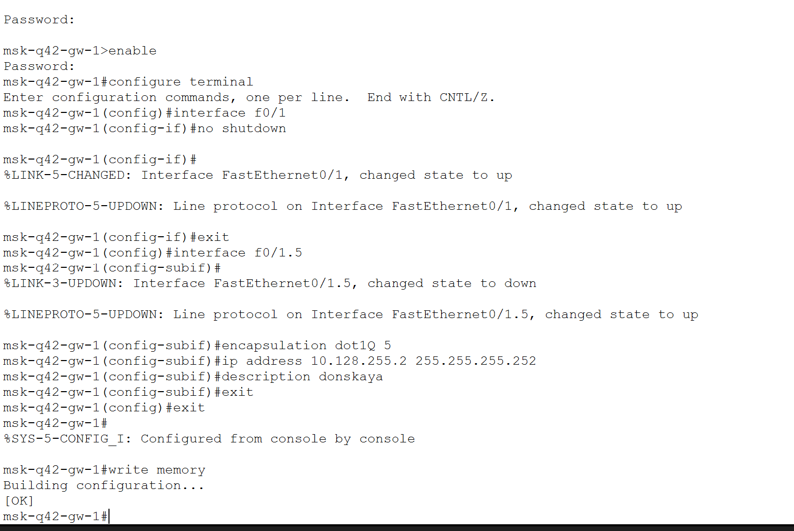
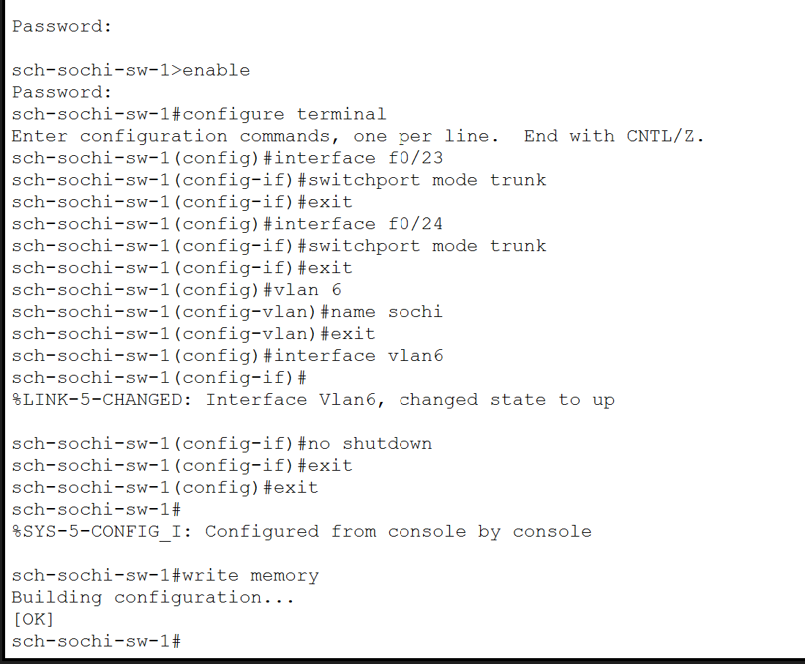
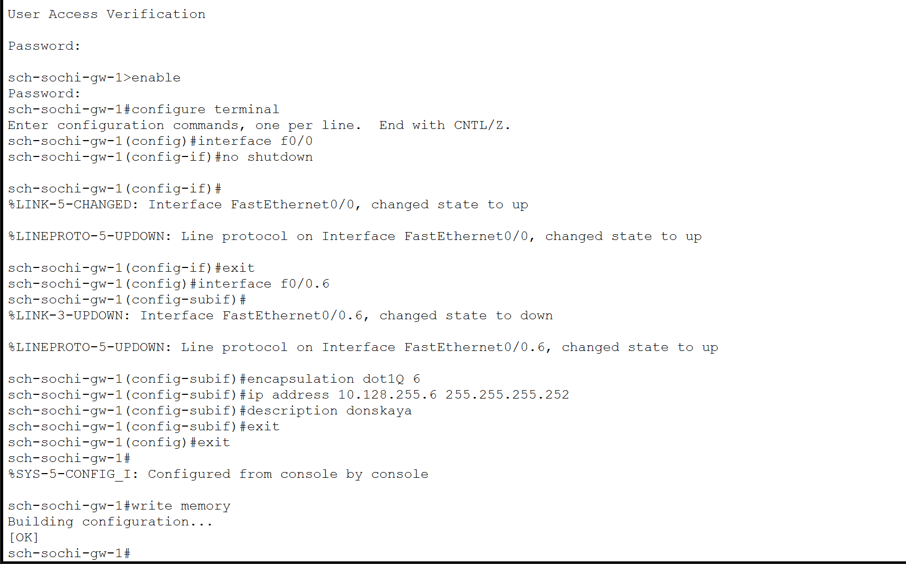
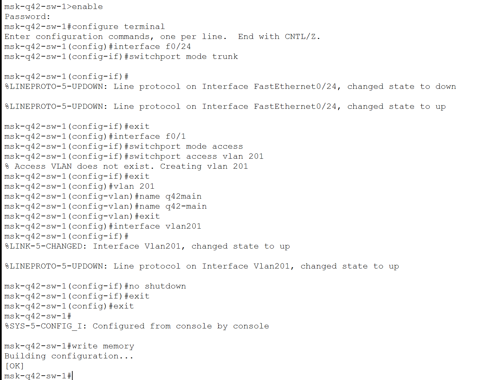
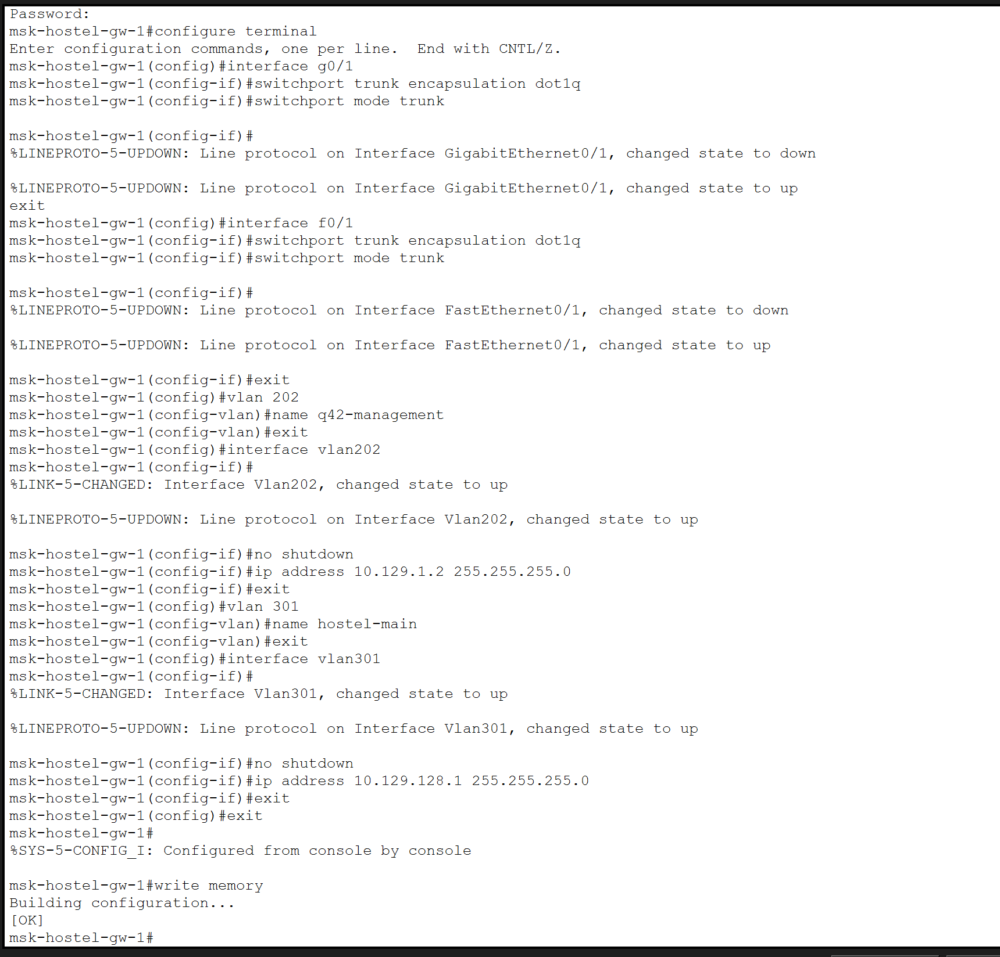
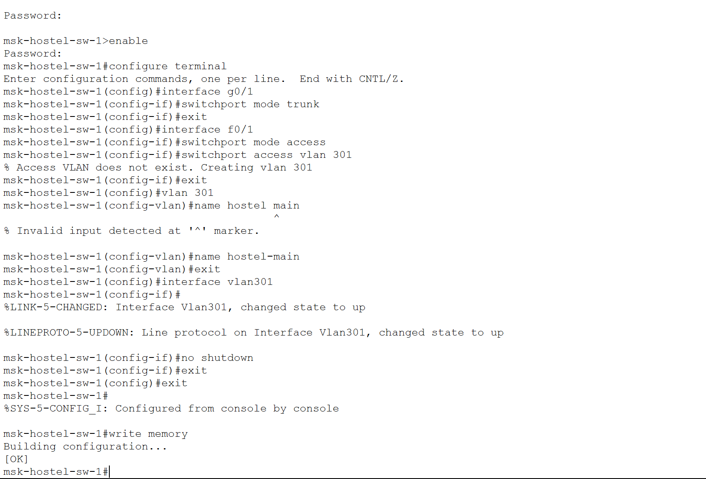
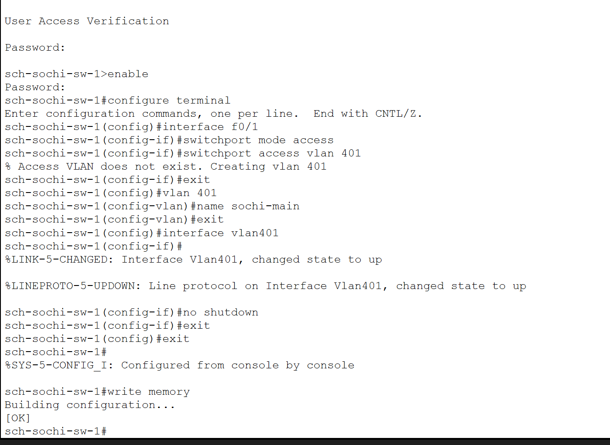
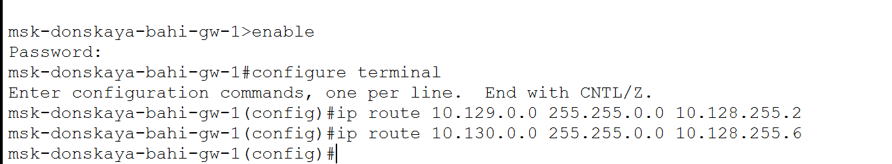
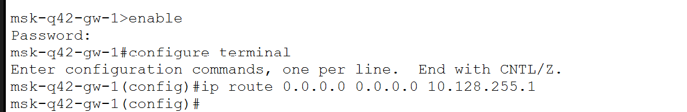

---
## Author
author:
  name: бахи сиди али темассини
  degrees: Student (3 курс)
  orcid: ""
  email: 1032234211@rudn.ru
  affiliation:
    - name: Российский университет дружбы народов
      country: Российская Федерация
      postal-code: 117198
      city: Москва
      address: ул. Миклухо-Маклая, д. 6

## Title
title: "Отчёт по лабораторной работе №14"
subtitle: "Администрирование локальных сетей"
license: "CC BY"
---

# Цель работы

Настроить взаимодействие через сеть провайдера посредством статической
маршрутизации локальной сети организации с сетью основного здания, расположенного в 42-м квартале в Москве, и сетью филиала, расположенного
в г. Сочи.

# Выполнение лабораторной работы

## Настройка транковых соединений сети провайдера

На коммутаторе сети провайдера были настроены транковые интерфейсы FastEthernet0/3 и FastEthernet0/4, после чего созданы VLAN 5 и VLAN 6 для организации связи между сетями филиалов и центральной сетью ([рис. @fig-1]). [@ieee8021q] [@clark2003]

{#fig-1 width=70%}

## Настройка маршрутизатора центральной сети

На маршрутизаторе центральной сети были созданы подинтерфейсы FastEthernet0/1.5 и FastEthernet0/1.6 с инкапсуляцией IEEE 802.1Q и назначением IP-адресов для сетей q42 и sochi ([рис. @fig-2]). [@ieee8021q] [@odom2017]

{#fig-2 width=70%}

## Настройка маршрутизатора сети q42

На маршрутизаторе сети q42 был активирован интерфейс FastEthernet0/1 и настроен подинтерфейс FastEthernet0/1.5 с поддержкой VLAN 5 и IP-адресацией канала связи с центральной сетью ([рис. @fig-3]). [@ieee8021q] [@odom2001]

{#fig-3 width=70%}

## Настройка коммутатора сети Sochi

На коммутаторе сети Sochi были настроены транковые интерфейсы FastEthernet0/23 и FastEthernet0/24, а также создан VLAN 6 для организации связи с магистральной сетью ([рис. @fig-4]). [@ieee8021q] [@clark2003]

{#fig-4 width=70%}

## Настройка маршрутизатора сети Sochi

На маршрутизаторе сети Sochi был активирован интерфейс FastEthernet0/0 и создан подинтерфейс FastEthernet0/0.6 с инкапсуляцией dot1Q и назначением IP-адреса для подключения к центральной сети ([рис. @fig-5]). [@ieee8021q] [@odom2016]

{#fig-5 width=70%}

## Настройка VLAN сети q42

На маршрутизаторе сети q42 были созданы подинтерфейсы FastEthernet0/0.201 и FastEthernet1/0.202 для VLAN q42-main и q42-management с назначением IP-адресов и описаний интерфейсов ([рис. @fig-6]). [@ieee8021q] [@korolkova2014]

{#fig-6 width=70%}

## Настройка VLAN сети hostel

На маршрутизаторе сети hostel были настроены VLAN 202 и VLAN 301, назначены IP-адреса виртуальным интерфейсам и включена поддержка маршрутизации между VLAN ([рис. @fig-7]). [@ieee8021q] [@odom2017]

{#fig-7 width=70%}

## Настройка коммутатора сети hostel

На коммутаторе сети hostel был настроен trunk-порт GigabitEthernet0/1, а интерфейс FastEthernet0/1 переведён в режим access VLAN 301 ([рис. @fig-8]). [@ieee8021q] [@clark2003]

{#fig-8 width=70%}

## Настройка VLAN сети Sochi

На маршрутизаторе сети Sochi были созданы подинтерфейсы FastEthernet0/0.401 и FastEthernet0/0.402 для сетей sochi-main и sochi-management с назначением IP-адресов ([рис. @fig-9]). [@ieee8021q] [@odom2016]

{#fig-9 width=70%}

## Настройка access-порта сети Sochi

На коммутаторе сети Sochi интерфейс FastEthernet0/1 был переведён в режим access VLAN 401, после чего создан интерфейс VLAN401 ([рис. @fig-10]). [@ieee8021q] [@clark2003]

{#fig-10 width=70%}

## Настройка статической маршрутизации центральной сети

На маршрутизаторе центральной сети были добавлены статические маршруты к сетям 10.129.0.0/16 и 10.130.0.0/16 через маршрутизаторы филиалов q42 и Sochi ([рис. @fig-11]). [@odom2017] [@tanenbaum2016]

{#fig-11 width=70%}

## Настройка маршрута по умолчанию сети q42

На маршрутизаторе сети q42 был настроен маршрут по умолчанию через адрес 10.128.255.1 ([рис. @fig-12]). [@odom2016] [@olifer2017]

{#fig-12 width=70%}

## Настройка маршрута по умолчанию сети Sochi

На маршрутизаторе сети Sochi был настроен маршрут по умолчанию через адрес 10.128.255.5 ([рис. @fig-13]). [@odom2016] [@olifer2017]

{#fig-13 width=70%}

## Настройка маршрута к сети hostel

На маршрутизаторе сети q42 был добавлен статический маршрут к сети 10.129.128.0/17 через адрес 10.129.1.2 ([рис. @fig-14]). [@odom2017] [@kurose2016]

{#fig-14 width=70%}

## Настройка маршрутизации сети hostel

На маршрутизаторе сети hostel была включена IP-маршрутизация и настроен маршрут по умолчанию через адрес 10.129.1.1 ([рис. @fig-15]). [@odom2017] [@olifer2017]

{#fig-15 width=70%}

## Настройка NAT

На маршрутизаторе центральной сети интерфейсы FastEthernet0/1.5 и FastEthernet0/1.6 были определены как внутренние NAT-интерфейсы. Дополнительно был создан расширенный список доступа nat-inet для разрешения трансляции адресов узлов сетей q42, hostel и sochi ([рис. @fig-16]). [@natorder] [@natfaqru]

{#fig-16 width=70%}

## Итоговая топология сети

После завершения настройки была сформирована итоговая топология сети, включающая центральную сеть, филиалы q42, hostel, Sochi, сеть провайдера и модель сети Интернет ([рис. @fig-17]). [@packettracer2014] [@korolkova2009]

{#fig-17 width=70%}

# Выводы

В ходе лабораторной работы были выполнены настройка VLAN, организация транковых соединений, настройка подинтерфейсов маршрутизаторов, реализация статической маршрутизации и NAT, а также построена итоговая топология сети с подключением филиалов и модельной сети Интернет.

# Контрольные вопросы

1. Пример настройки статической маршрутизации между двумя подсетями организации:

Для связи сети 10.129.0.0/16 с сетью 10.130.0.0/16 на маршрутизаторе центральной сети используется команда:

```cisco
ip route 10.130.0.0 255.255.0.0 10.128.255.6
```

где:

* `10.130.0.0` — сеть назначения;
* `255.255.0.0` — маска сети;
* `10.128.255.6` — IP-адрес следующего маршрутизатора. [@odom2017] [@olifer2017]

---

2. Процесс обращения устройства из одного VLAN к устройству из другого VLAN:

Устройство из VLAN отправляет пакет на шлюз по умолчанию. Коммутатор передаёт кадр через trunk-порт на маршрутизатор. Маршрутизатор принимает тегированный кадр, определяет VLAN по 802.1Q, выполняет маршрутизацию между подсетями и отправляет пакет в другой VLAN через соответствующий подинтерфейс. После этого коммутатор доставляет кадр конечному устройству. [@ieee8021q] [@clark2003]

---

3. Проверка работоспособности маршрута:

Для проверки маршрута используются команды:

```cisco
ping
```

и

```cisco
traceroute
```

Команда `ping` проверяет доступность узла, а `traceroute` показывает путь прохождения пакетов через маршрутизаторы сети. [@tanenbaum2016] [@kurose2016]

---

4. Просмотр таблицы маршрутизации:

Таблица маршрутизации просматривается командой:

```cisco
show ip route
```

Команда отображает:

* подключённые сети;
* статические маршруты;
* маршруты по умолчанию;
* адреса следующих переходов. [@odom2016] [@hill2009]


# Список литературы{.unnumbered}

::: {#refs}
:::
