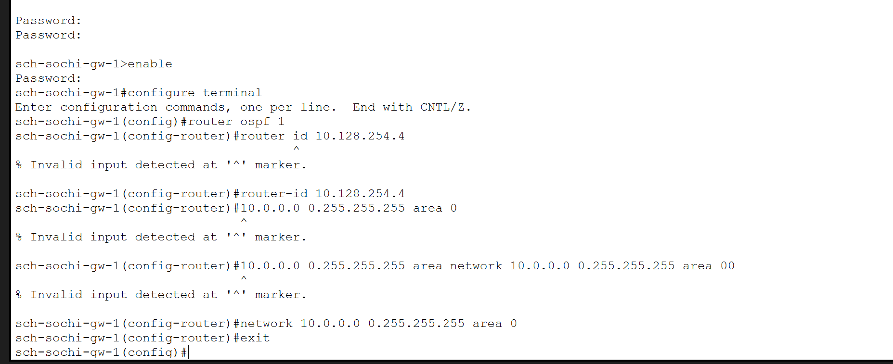
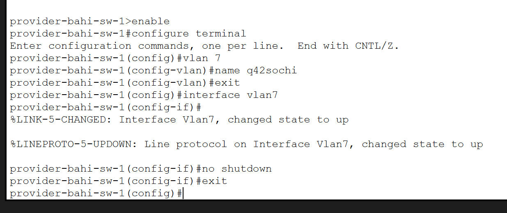
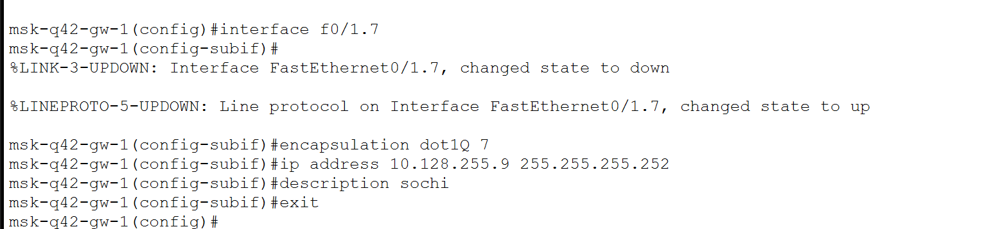

---
## Author
author:
  name: бахи сиди али темассини
  degrees: Student (3 курс)
  orcid: ""
  email: 1032234211@rudn.ru
  affiliation:
    - name: Российский университет дружбы народов
      country: Российская Федерация
      postal-code: 117198
      city: Москва
      address: ул. Миклухо-Маклая, д. 6
## Title
title: Лабораторная работа №15
subtitle: Администрирование локальных сетей
license: CC BY
date: today
date-format: "YYYY-MM-DD" # Example: 2025-09-06
---

# Цель работы

- Настройка динамической маршрутизации между территориями организации

# Выполнение лабораторной работы

## Настройка OSPF на маршрутизаторе сети «Донская»

- Включён процесс OSPF на маршрутизаторе сети «Донская»
- Назначен Router ID `10.128.254.1`
- Сети `10.0.0.0/8` добавлены в `area 0`

---

{#fig-1 width=70%}

## Проверка состояния OSPF и таблицы маршрутизации

- Выполнена проверка состояния OSPF
- Подтверждён запуск процесса OSPF
- Проверена таблица маршрутизации
- Обнаружен маршрут к сети Сочи `10.130.0.0/16`

---

{#fig-2 width=70%}

## Настройка OSPF на маршрутизаторе сети 42-го квартала

- Настроен OSPF на маршрутизаторе сети 42-го квартала
- Назначен Router ID `10.128.254.2`
- Сети добавлены в `area 0`

---

{#fig-3 width=70%}

## Настройка OSPF на маршрутизаторе сети общежития

- Настроен OSPF на маршрутизаторе сети общежития
- Назначен Router ID `10.128.254.3`
- Выполнена публикация сетей в `area 0`

---

{#fig-4 width=70%}

## Настройка OSPF на маршрутизаторе филиала в Сочи

- Настроен OSPF на маршрутизаторе филиала в Сочи
- Назначен Router ID `10.128.254.4`
- Локальные сети добавлены в `area 0`

---

{#fig-5 width=70%}

## Создание VLAN 7 на коммутаторе провайдера

- Создан VLAN 7 `q42-sochi` на коммутаторе провайдера
- Активирован интерфейс `Vlan7`

---

{#fig-6 width=70%}

# Настройка подинтерфейса VLAN 7 на маршрутизаторе 42-го квартала

- Создан подинтерфейс `FastEthernet0/1.7`
- Настроена инкапсуляция IEEE 802.1Q
- Назначен IP-адрес `10.128.255.9/30`
- Добавлено описание `sochi`

---

{#fig-7 width=70%}

## Создание VLAN 7 на коммутаторе филиала в Сочи

- Создан VLAN 7 `q42-sochi` на коммутаторе филиала в Сочи
- Активирован интерфейс `Vlan7`
- Интерфейс переведён в состояние `up/up`

---

{#fig-8 width=70%}

## Настройка OSPF и подинтерфейса VLAN 7 в филиале Сочи

- Настроен OSPF на маршрутизаторе филиала в Сочи
- Создан подинтерфейс `FastEthernet0/0.7`
- Настроена инкапсуляция IEEE 802.1Q
- Назначен IP-адрес `10.128.255.10/30`
- Добавлено описание `q42`

---

{#fig-9 width=70%}

# Выводы

- Выполнена настройка динамической маршрутизации OSPF
- Настроен VLAN 7 сети провайдера
- Созданы подинтерфейсы с IEEE 802.1Q
- Подтверждена корректная работа маршрутизации между сегментами сети
