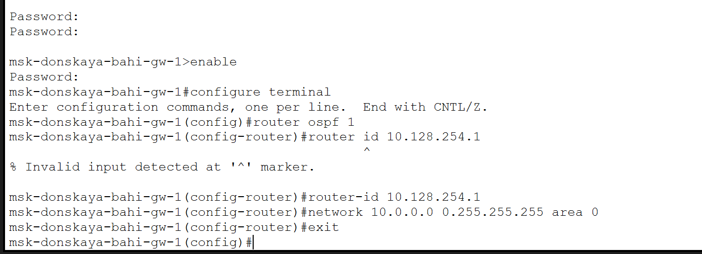
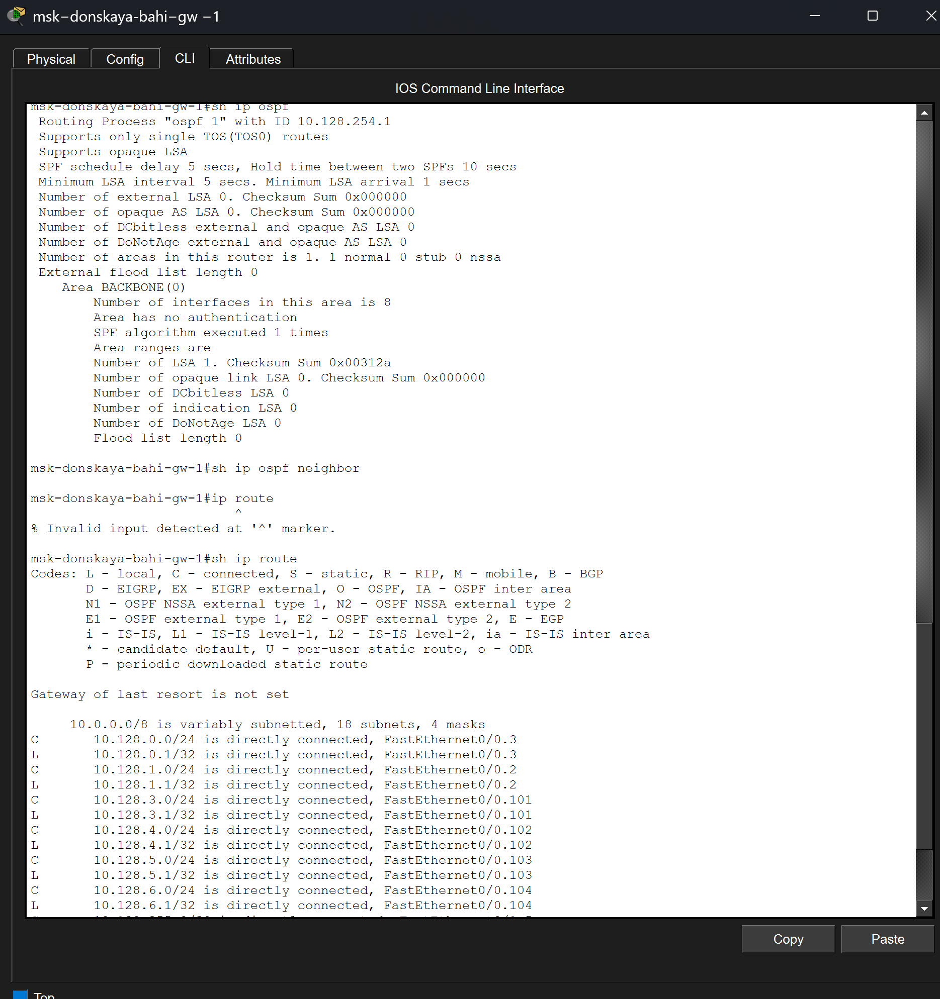
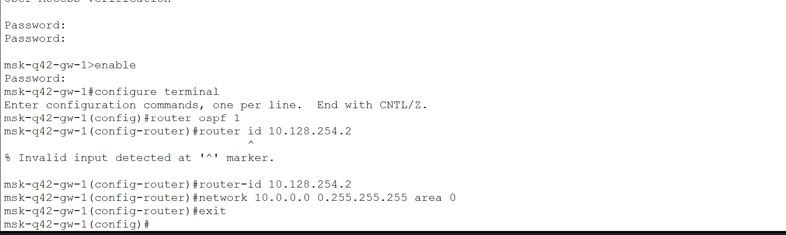
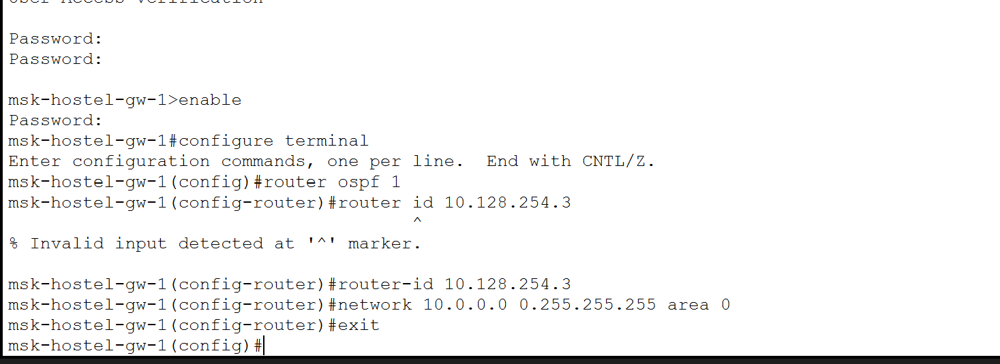
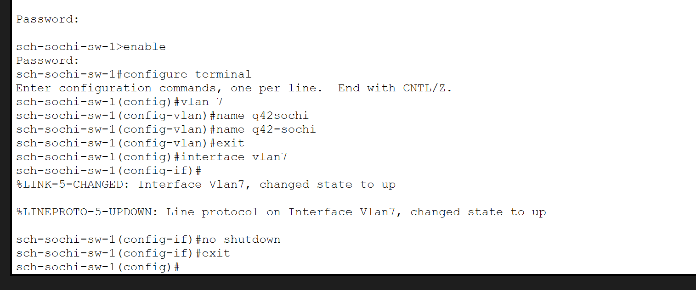

---
## Author
author:
  name: бахи сиди али темассини
  degrees: Student (3 курс)
  orcid: ""
  email: 1032234211@rudn.ru
  affiliation:
    - name: Российский университет дружбы народов
      country: Российская Федерация
      postal-code: 117198
      city: Москва
      address: ул. Миклухо-Маклая, д. 6

## Title
title: "Отчёт по лабораторной работе №15"
subtitle: "Администрирование локальных сетей"
license: "CC BY"
---

# Цель работы

Настроить динамическую маршрутизацию между территориями организации.

# Выполнение лабораторной работы

## Настройка OSPF-маршрутизации и VLAN сети провайдера

На маршрутизаторе сети «Донская» был включён процесс динамической маршрутизации OSPF с идентификатором процесса 1. Для маршрутизатора был задан Router ID `10.128.254.1`, а все сети диапазона `10.0.0.0/8` были добавлены в область `area 0` ([рис. @fig-1]). Настройка выполнена в соответствии с принципами протокола OSPF [@rfc2328] [@odom2017].

{#fig-1 width=70%}

После настройки был выполнен анализ состояния OSPF. Команда `show ip ospf` подтвердила запуск процесса OSPF с Router ID `10.128.254.1`. Команда `show ip route` показала наличие подключённых и статических маршрутов, включая сеть филиала Сочи `10.130.0.0/16`, доступную через интерфейс `FastEthernet0/1.6` ([рис. @fig-2]). [@rfc2328] [@tanenbaum2016]

{#fig-2 width=70%}

На маршрутизаторе сети 42-го квартала был настроен процесс OSPF с идентификатором маршрутизатора `10.128.254.2`. Все сети диапазона `10.0.0.0/8` были добавлены в магистральную область `area 0` ([рис. @fig-3]). [@rfc2328] [@odom2016]

{#fig-3 width=70%}

На маршрутизаторе сети общежития также был включён процесс OSPF. Для устройства был назначен Router ID `10.128.254.3`, после чего была выполнена публикация сетей диапазона `10.0.0.0/8` в область `area 0` ([рис. @fig-4]). [@korolkova2012lecture] [@odom2017]

{#fig-4 width=70%}

На маршрутизаторе филиала в Сочи был настроен OSPF-процесс с Router ID `10.128.254.4`. В конфигурацию OSPF были добавлены все локальные сети маршрутизатора посредством команды `network 10.0.0.0 0.255.255.255 area 0` ([рис. @fig-5]). [@rfc2328] [@kurose2016]

{#fig-5 width=70%}

На коммутаторе сети провайдера был создан VLAN 7 с именем `q42-sochi`. После создания VLAN был активирован интерфейс `Vlan7`, что обеспечило работу виртуального интерфейса сети провайдера ([рис. @fig-6]). [@ieee8021q] [@clark2003]

{#fig-6 width=70%}

На маршрутизаторе сети 42-го квартала был создан подинтерфейс `FastEthernet0/1.7` с инкапсуляцией IEEE 802.1Q для VLAN 7. Подинтерфейсу был назначен IP-адрес `10.128.255.9/30`, а также задано описание `sochi` ([рис. @fig-7]). [@ieee8021q] [@odom2001]

{#fig-7 width=70%}

На коммутаторе филиала в Сочи был создан VLAN 7 с именем `q42-sochi`. После создания VLAN был активирован виртуальный интерфейс `Vlan7`, что обеспечило его переход в рабочее состояние (`up/up`) ([рис. @fig-8]). Настройка выполнена для организации взаимодействия между сетью филиала и сетью 42-го квартала [@ieee8021q] [@clark2003].

{#fig-8 width=70%}

На маршрутизаторе филиала в Сочи был настроен процесс динамической маршрутизации OSPF с идентификатором маршрутизатора `10.128.254.4`. После этого был создан подинтерфейс `FastEthernet0/0.7` с инкапсуляцией IEEE 802.1Q для VLAN 7. Подинтерфейсу был назначен IP-адрес `10.128.255.10/30` и задано описание `q42` ([рис. @fig-9]). [@rfc2328] [@ieee8021q] [@odom2017]

{#fig-9 width=70%}

# Выводы

В ходе работы была выполнена настройка протокола динамической маршрутизации OSPF на маршрутизаторах сети организации и филиала в Сочи. Также была произведена настройка VLAN 7 сети провайдера и соответствующего подинтерфейса маршрутизатора с использованием инкапсуляции IEEE 802.1Q. Полученные результаты подтвердили корректную работу маршрутизации и взаимодействия между сегментами сети.

# Контрольные вопросы

## Какие протоколы относятся к протоколам динамической маршрутизации?

К протоколам динамической маршрутизации относятся RIP, OSPF, EIGRP и IS-IS. Данные протоколы обеспечивают автоматическое построение и обновление таблиц маршрутизации между маршрутизаторами сети [@rfc2328] [@odom2017].

## Охарактеризуйте принципы работы протоколов динамической маршрутизации.

Протоколы динамической маршрутизации автоматически обмениваются информацией о сетях между маршрутизаторами. На основе полученных данных маршрутизатор вычисляет оптимальный путь передачи пакетов и формирует таблицу маршрутизации. При изменении топологии сети маршруты автоматически пересчитываются без ручной настройки администратора [@kurose2016] [@tanenbaum2016].

## Опишите процесс обращения устройства из одной подсети к устройству из другой подсети по протоколу динамической маршрутизации.

При обращении устройства к узлу из другой подсети пакет отправляется на шлюз по умолчанию. Маршрутизатор анализирует таблицу маршрутизации и определяет следующий узел передачи согласно динамически полученным маршрутам. Далее пакет последовательно передаётся между маршрутизаторами сети до достижения конечного получателя [@rfc2328] [@odom2016].

## Опишите выводимую информацию при просмотре таблицы маршрутизации.

Таблица маршрутизации содержит информацию о доступных сетях, типе маршрута, сетевом адресе, маске подсети, следующем узле передачи и интерфейсе отправки. Также указываются административное расстояние и метрика маршрута, используемые для выбора оптимального пути передачи данных [@odom2017] [@olifer2017].

# Список литературы{.unnumbered}

::: {#refs}
:::
