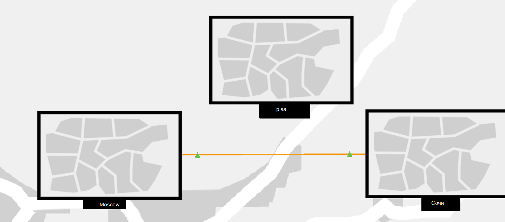
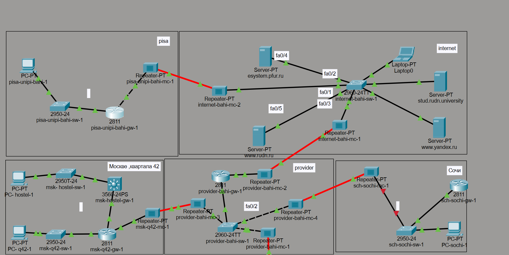
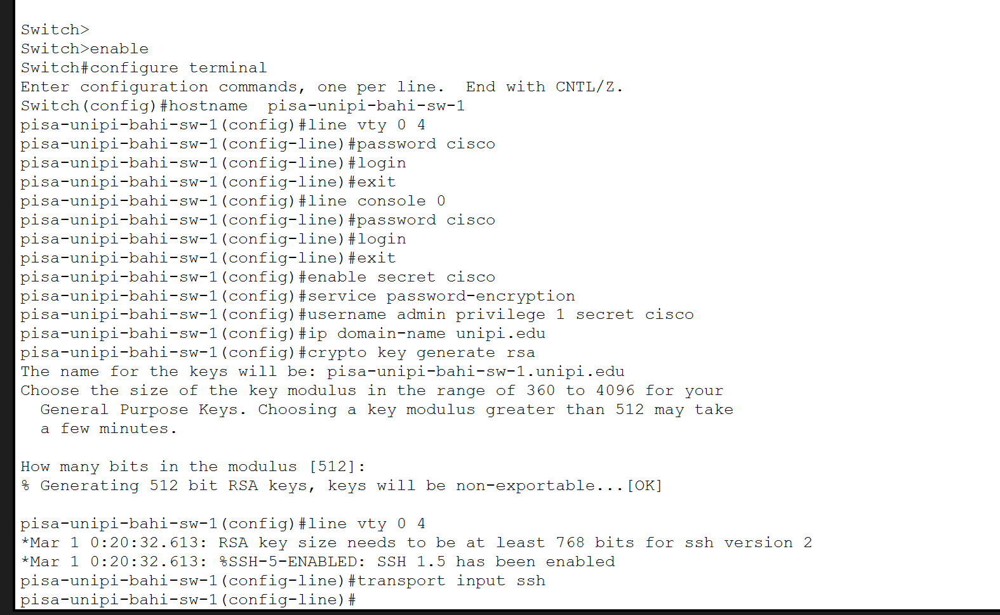
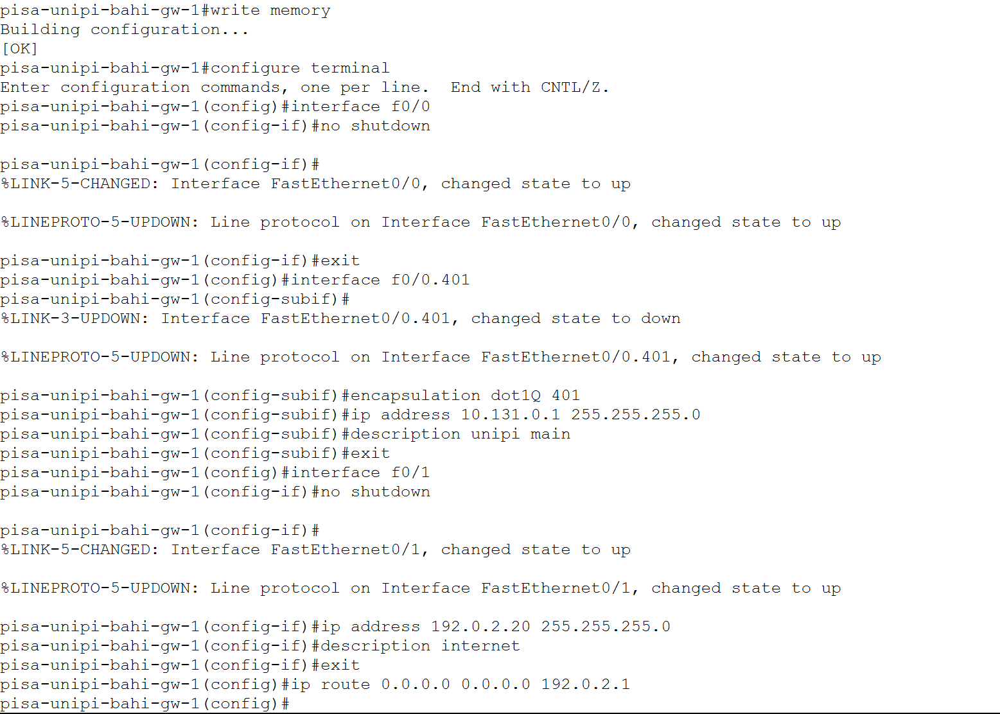
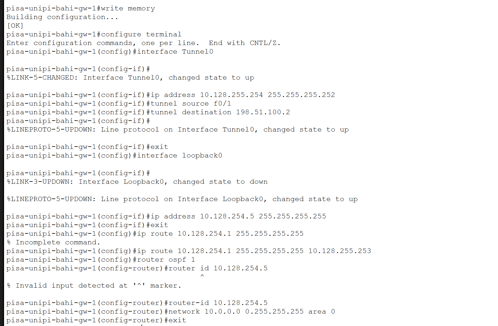

---
## Author
author:
  name: бахи сиди али темассини
  degrees: Student (3 курс)
  orcid: ""
  email: 1032234211@rudn.ru
  affiliation:
    - name: Российский университет дружбы народов
      country: Российская Федерация
      postal-code: 117198
      city: Москва
      address: ул. Миклухо-Маклая, д. 6
## Title
title: Лабораторная работа №16
subtitle: Администрирование локальных сетей
license: CC BY
date: today
date-format: "YYYY-MM-DD" # Example: 2025-09-06
---

# Информация

## Докладчик

:::::::::::::: {.columns align=center}
::: {.column width="70%"}

  - бахи сиди али темассини
  - Российский университет дружбы народов
  - [GitHub]

:::
::::::::::::::

# Цель работы

- Получение навыков настройки VPN-туннеля через незащищённое Интернетсоединение.

# Выполнение лабораторной работы

## Создание площадки Университета г. Пиза

- Создана дополнительная площадка Университета г. Пиза
- Добавлены маршрутизатор, коммутатор, ПК и подключение к Интернету

---

{#fig-1 width=70%}

## Создание физической структуры

- Создан город Pisa
- Создан объект University of Pisa

{#fig-2 width=70%}

---

{#fig-3 width=70%}

## Размещение оборудования

- Оборудование сети размещено внутри здания University of Pisa

{#fig-4 width=70%}

## Первоначальная настройка маршрутизатора Pisa

- Настроены консольные и VTY-линии
- Создан пользователь admin
- Настроено доменное имя `unipi.edu`
- Сгенерированы RSA-ключи
- Включён доступ по SSH

---

{#fig-5 width=70%}

## Первоначальная настройка коммутатора Pisa

- Настроены консольные и VTY-линии
- Создан пользователь admin
- Настроено доменное имя `unipi.edu`
- Сгенерированы RSA-ключи
- Настроен доступ по SSH

---

{#fig-6 width=70%}

## Настройка интерфейсов маршрутизатора Pisa

- Создан подинтерфейс `FastEthernet0/0.401`
- Назначен адрес `10.131.0.1/24`
- Настроен интерфейс `FastEthernet0/1` с адресом `192.0.2.20/24`
- Добавлен маршрут по умолчанию через `192.0.2.1`

---

{#fig-7 width=70%}

## Настройка коммутатора Pisa

- Настроен транковый порт `FastEthernet0/24`
- Создана VLAN 401 `unipi-main`
- Порт `FastEthernet0/1` назначен в VLAN 401

---

{#fig-8 width=70%}

## Настройка GRE-туннеля на маршрутизаторе Донская

- Создан интерфейс `Tunnel0`
- Назначен адрес `10.128.255.253/30`
- Указан источник туннеля `FastEthernet0/1.4`
- Указан адрес назначения `192.0.2.20`
- Создан интерфейс `Loopback0`
- Добавлен статический маршрут

---

{#fig-9 width=70%}

## Настройка GRE-туннеля и OSPF на маршрутизаторе Pisa

- Создан интерфейс `Tunnel0`
- Назначен адрес `10.128.255.254/30`
- Создан интерфейс `Loopback0` с адресом `10.128.254.5/32`
- Добавлен статический маршрут
- Настроен процесс OSPF
- Установлен Router ID `10.128.254.5`

---

{#fig-10 width=70%}

## Итоговая схема сети

- Сформирована итоговая топология сети
- Добавлена площадка Университета г. Пиза
- Настроено подключение к Интернету
- Настроен VPN-туннель между Москвой и Пизой

---

{#fig-11 width=70%}

# Выводы

- Выполнена настройка площадки Университета г. Пиза
- Настроено сетевое оборудование
- Создан GRE-туннель между сетью Университета г. Пиза и сетью «Донская»
- Выполнена настройка маршрутизации OSPF
