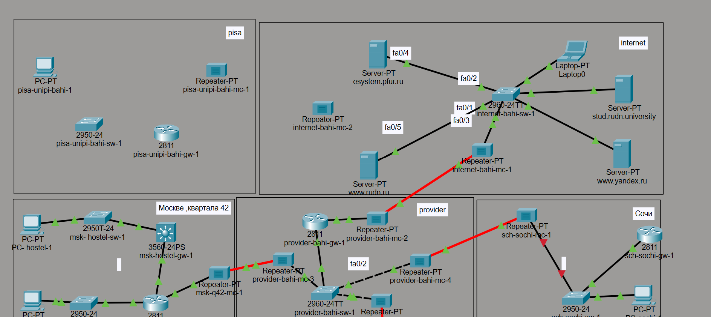
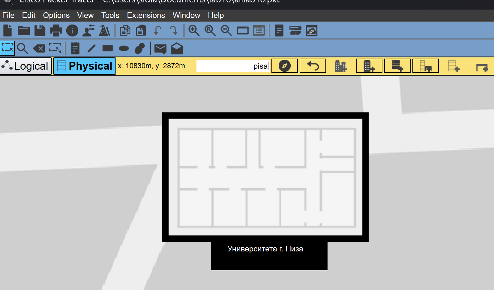
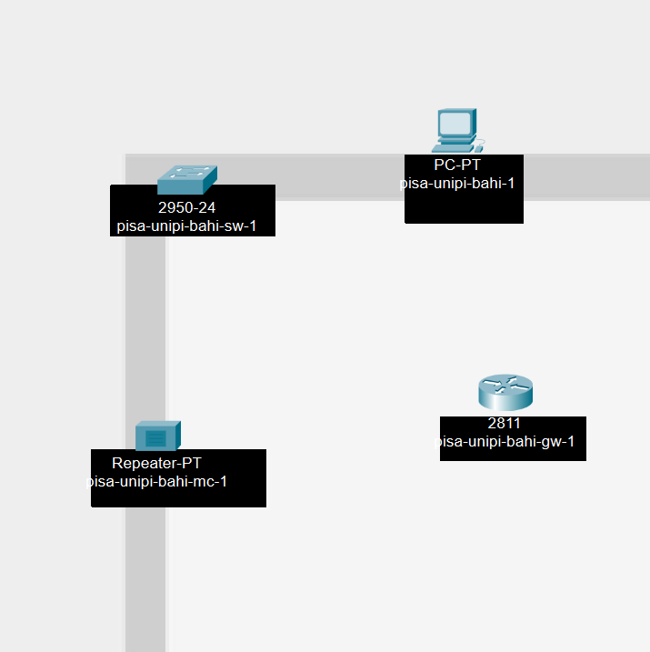
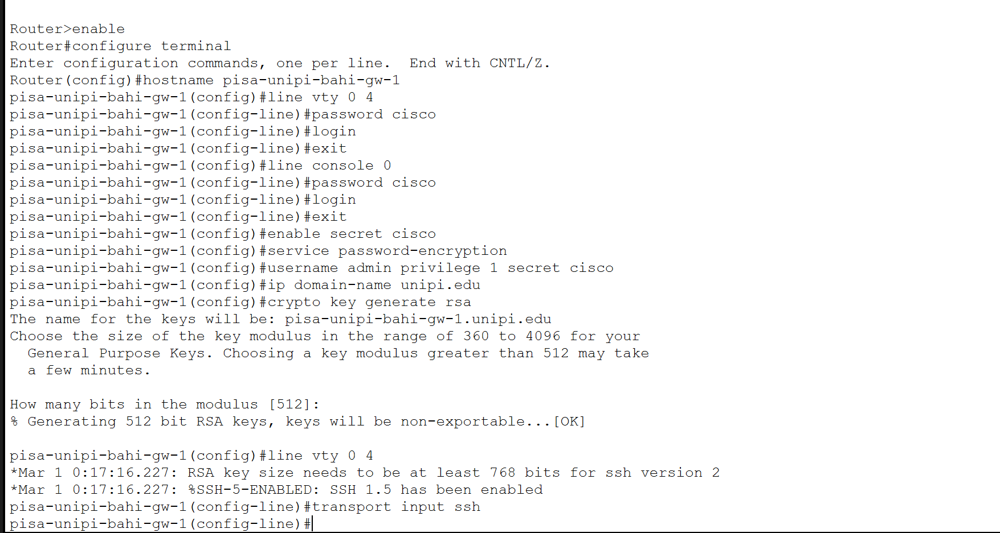
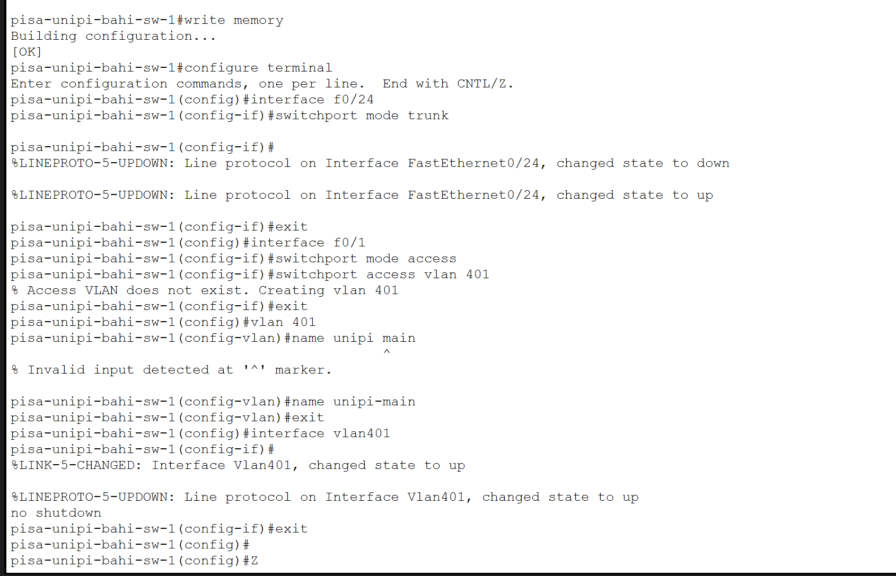
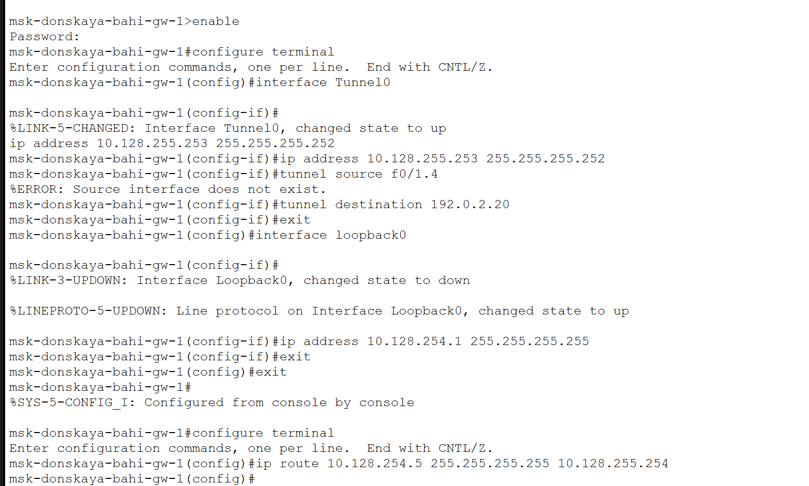

---
## Author
author:
  name: бахи сиди али темассини
  degrees: Student (3 курс)
  orcid: ""
  email: 1032234211@rudn.ru
  affiliation:
    - name: Российский университет дружбы народов
      country: Российская Федерация
      postal-code: 117198
      city: Москва
      address: ул. Миклухо-Маклая, д. 6

## Title
title: "Отчёт по лабораторной работе №16"
subtitle: "Администрирование локальных сетей"
license: "CC BY"
---

# Цель работы

Получение навыков настройки VPN-туннеля через незащищённое Интернетсоединение.

# Выполнение лабораторной работы

В рабочей области проекта была создана дополнительная площадка Университета г. Пиза. В логической схеме размещены маршрутизатор `pisa-unipi-bahi-gw-1`, коммутатор `pisa-unipi-bahi-sw-1`, персональный компьютер `PC-unipi-1` и устройство связи с сетью Интернет ([рис. @fig-1]).

{#fig-1 width=70%}

В физической рабочей области был создан город Pisa и размещён объект University of Pisa для последующего переноса сетевого оборудования в соответствии с модельными предположениями ([рис. @fig-2], [рис. @fig-3]).

{#fig-2 width=70%}

{#fig-3 width=70%}

После создания физической структуры оборудование сети Университета г. Пиза было размещено внутри здания University of Pisa ([рис. @fig-4]).

{#fig-4 width=70%}

На маршрутизаторе `pisa-unipi-bahi-gw-1` выполнена первоначальная настройка удалённого доступа. Были настроены консольные и VTY-линии, локальная учётная запись администратора, доменное имя `unipi.edu`, а также сгенерированы RSA-ключи для работы по протоколу SSH ([рис. @fig-5]).

{#fig-5 width=70%}

На коммутаторе `pisa-unipi-bahi-sw-1` выполнена аналогичная первоначальная настройка: настроены консольные и VTY-линии, локальный пользователь, доменное имя и параметры доступа по SSH ([рис. @fig-6]).

{#fig-6 width=70%}

На маршрутизаторе `pisa-unipi-bahi-gw-1` были настроены интерфейсы сети Университета г. Пиза. Для VLAN 401 создан подинтерфейс `FastEthernet0/0.401` с адресом `10.131.0.1/24`, а интерфейс `FastEthernet0/1` настроен для подключения к сети Интернет с адресом `192.0.2.20/24`. Также был добавлен маршрут по умолчанию через шлюз `192.0.2.1` ([рис. @fig-7]).

{#fig-7 width=70%}

На коммутаторе `pisa-unipi-bahi-sw-1` был настроен транковый порт `FastEthernet0/24`, создана VLAN 401 с именем `unipi-main`, а порт `FastEthernet0/1` назначен в данную VLAN для подключения пользовательского устройства ([рис. @fig-8]).

{#fig-8 width=70%}

На маршрутизаторе `msk-donskaya-bahi-gw-1` был создан интерфейс `Tunnel0` с адресом `10.128.255.253/30`. В качестве источника туннеля указан интерфейс `FastEthernet0/1.4`, а в качестве адреса назначения — `192.0.2.20`. Также был создан интерфейс `Loopback0` с адресом `10.128.254.1/32` и добавлен статический маршрут к удалённому loopback-интерфейсу маршрутизатора Pisa ([рис. @fig-9]).

{#fig-9 width=70%}

На маршрутизаторе `pisa-unipi-bahi-gw-1` был настроен интерфейс `Tunnel0` с адресом `10.128.255.254/30`, создан интерфейс `Loopback0` с адресом `10.128.254.5/32`, добавлен статический маршрут к удалённому loopback-интерфейсу и настроен процесс динамической маршрутизации OSPF с идентификатором маршрутизатора `10.128.254.5` ([рис. @fig-10]).

{#fig-10 width=70%}

После выполнения настроек была получена итоговая схема сети, включающая площадку Университета г. Пиза, подключение к сети Интернет и настроенный VPN-туннель между Москвой и Пизой ([рис. @fig-11]).

{#fig-11 width=70%}

# Выводы

В ходе работы была выполнена настройка площадки Университета г. Пиза, произведена настройка сетевого оборудования, создан GRE-туннель между сетью Университета г. Пиза и сетью «Донская», а также выполнена настройка маршрутизации с использованием OSPF.

# Контрольные вопросы

## Что такое VPN?

VPN (Virtual Private Network) — это технология создания защищённого логического соединения между удалёнными сетями или устройствами через общедоступную сеть. VPN позволяет передавать данные через виртуальный туннель, обеспечивая связность удалённых узлов как единой сети.

## В каких случаях следует использовать VPN?

VPN рекомендуется использовать в следующих случаях:

- для объединения удалённых локальных сетей через Интернет;
- для безопасного удалённого доступа пользователей к корпоративным ресурсам;
- для защиты передаваемых данных при работе через общедоступные сети;
- для организации взаимодействия между территориально распределёнными подразделениями организации;
- для построения защищённых каналов связи между маршрутизаторами и сетевыми устройствами.

## Как с помощью VPN обойти NAT?

VPN позволяет инкапсулировать исходные пакеты в специальные туннельные пакеты. Для устройств NAT весь VPN-трафик выглядит как обычный обмен между внешними IP-адресами конечных точек туннеля. После прохождения через NAT внешний пакет доставляется на удалённую сторону, где извлекается исходный пакет и передаётся в удалённую сеть. Благодаря туннелированию устройства в разных частных сетях могут обмениваться данными через NAT как через единое логическое соединение.
