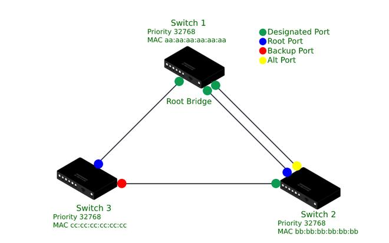
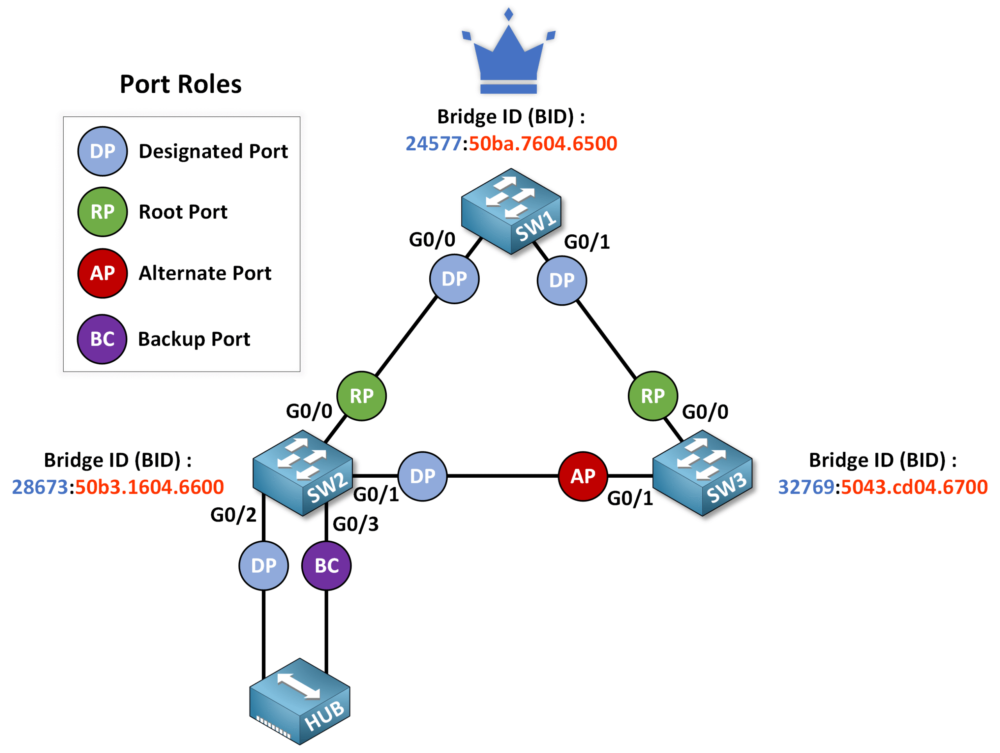
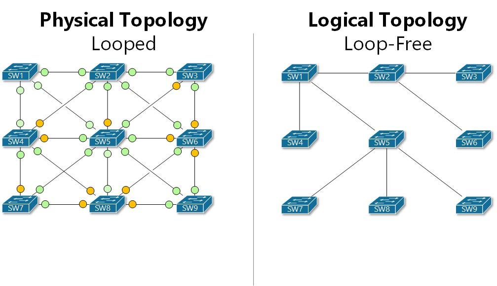
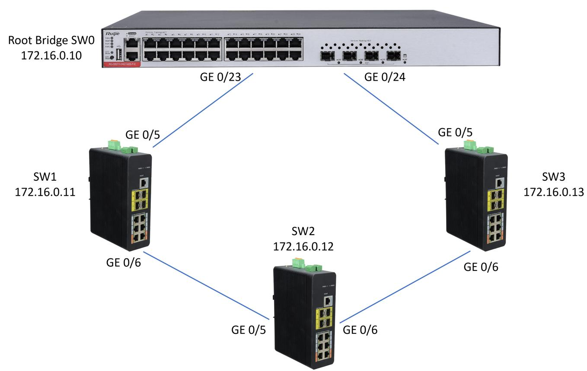
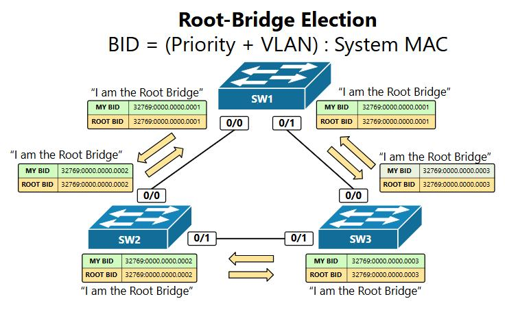

---
## Author
author:
  name: бахи сиди али темассини
  degrees: Student (3 курс)
  orcid: ""
  email: 1032234211@rudn.ru
  affiliation:
    - name: Российский университет дружбы народов
      country: Российская Федерация
      postal-code: 117198
      city: Москва
      address: ул. Миклухо-Маклая, д. 6

## Title
title: " Доклад на тему: Протокол быстрого связующего дерева (RSTP)"
subtitle: "Администрирование локальных сетей"
license: "CC BY"
date: today
date-format: "YYYY-MM-DD" # Example: 2025-09-06
---

# Титульный слайд

 Протокол быстрого связующего дерева (RSTP)

# Введение

- В современных сетях используются резервные соединения между коммутаторами.
- Наличие нескольких путей может привести к сетевым петлям (Loops).
- Петли вызывают перегрузку сети и дублирование данных.
- Для решения этой проблемы используется протокол RSTP.

# Что такое RSTP?

## RSTP (Rapid Spanning Tree Protocol)

- Протокол второго уровня модели OSI.
- Предназначен для предотвращения петель в Ethernet-сетях.
- Работает по стандарту IEEE 802.1w.
- Является улучшенной версией STP.

---

Пример топологии RSTP

 {#fig-1 width=70%}

---

 {#fig-1 width=70%}

# Цель RSTP

- Предотвращение сетевых петель.
- Поддержка резервных путей передачи данных.
- Обеспечение стабильной работы сети.
- Быстрое восстановление соединения при отказах.

---

 {#fig-1 width=70%}

---

 {#fig-1 width=70%}

# Принцип работы RSTP

RSTP выполняет следующие действия:

1. Выбор корневого коммутатора (Root Bridge).
2. Определение лучшего пути передачи данных.
3. Назначение ролей портам.
4. Быстрое переключение на резервный путь при сбое.

---

 {#fig-1 width=70%}

# Роли портов в RSTP

- **Root Port (RP)**  
  Лучший путь к корневому коммутатору.

- **Designated Port (DP)**  
  Основной порт для передачи данных.

- **Alternate Port**  
  Резервный путь к Root Bridge.

- **Backup Port**  
  Резервный порт внутри сегмента сети.

# Состояния портов

## RSTP использует три состояния:

- **Discarding**  
  Порт не передает данные.

- **Learning**  
  Изучение MAC-адресов.

- **Forwarding**  
  Полноценная передача данных.

# Разница между STP и RSTP

| STP | RSTP |
|-----|------|
| Медленная сходимость | Быстрая сходимость |
| 30–50 секунд | 1–6 секунд |
| Медленное восстановление | Быстрое восстановление |
| IEEE 802.1D | IEEE 802.1w |

# Преимущества и недостатки

## Преимущества

- Высокая скорость работы.
- Предотвращение сетевых петель.
- Поддержка резервных соединений.
- Повышение надежности сети.

## Недостатки

- Более сложная настройка.
- Возможны современные альтернативы.

# Практическое применение

RSTP применяется в:

- Корпоративных сетях.
- Дата-центрах.
- Сетях, где требуется высокая надежность и быстрое восстановление связи.

# Заключение

RSTP является важной технологией для повышения стабильности и 
надежности Ethernet-сетей. Благодаря быстрому восстановлению и 
предотвращению сетевых петель он широко используется в современных сетях.
